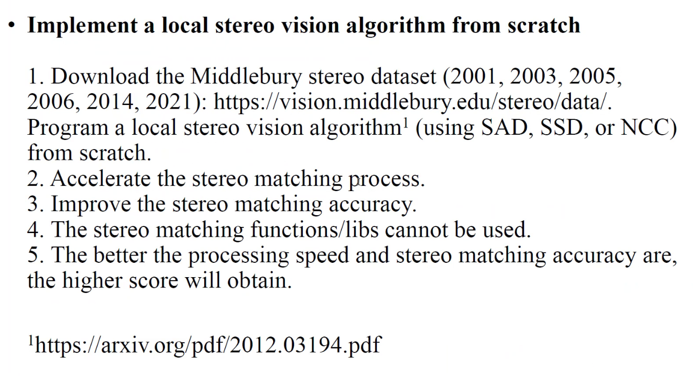
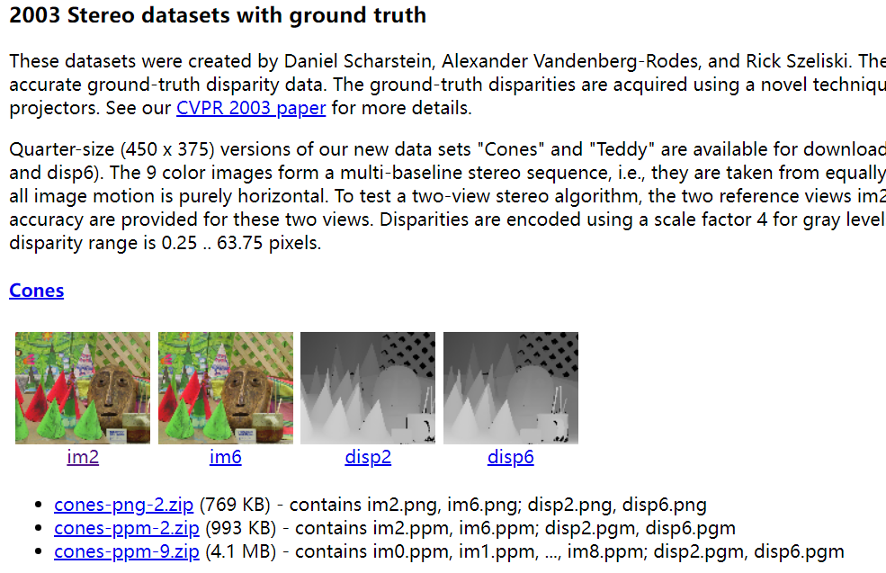

# HW--Stereo Camera

author：Yi Yang & Zhengpu Wang

时间：%DATE% %TIME%

## 线索

*这里写主要线索*

***

1.

2.

3.

4.

5.

<!---->

1.

&#x20;

## 笔记

*这里是主要的笔记内容*

***

内容

# Task:

1.  跑一下demo，看看效果

2.  数据集的图片已经是校正好的了，直接进行视差匹配就行

3.  视差匹配的任务就是匹配对应点

4.  寻找对应点的方法有局部、全局、半全局这种，上课讲过的方法

5.  基本的步骤就是读取两张图片，比如以左图为基准，遍历右图这一行来寻找代价最小的点，他们的距离就是视差。

6.  计算代价的范围也是从一个点，到一个框来聚合代价，也有许多方法，SAD，SSD，NCC,FBS.SGBM这些

7.  代价有许多种评估方法，绝对差，平方差这种，

8.  最后得到视差图以后，可以进行视差的改善，比如左右视差一致性检测，亚像素增强等

9.  还有深度方法的视差估计

10. 最后，就是需要评估我们的性能，也就是精度（去和标准答案对一波），还有花费的时间（计时）。需要对一些参数进行调优，比如框的大小，惩罚参数等等。目标就是做到精度和速度的平衡。

# 进度安排：

1.  ~~跑一下demo，看看效果~~  0522

2.  ~~先实现一个框架，读入两张图，基本方法遍历，匹配对应点，计算出视差图，然后对答案，计时间。~~

3.  然后就是在视差匹配方法上多实现几个，

    1.  ~~AD~~

    2.  SD

    3.  ~~SAD~~

    4.  SSD

    5.  NCC

    6.  SGBM

    7.  FBS这看情况

    8.  深度视差估计，要试试的

4.  ~~视差改善，这两个可以做~~

    1.  ~~左右视差一致性检测~~

    2.  ~~亚像素增强~~

5.  ~~最后就调参吧，参数的大小，还有对算法的计算做一些优化~~

6.  ~~写报告~~

7.  ~~做ppt~~

突然发现R.Fan的指导已经非常清晰了。感谢儒戈，让我理清楚了。

# 参考资料

**重要性从高到低排序**

1.  [真实场景的双目立体匹配（Stereo Matching）获取深度图详解 - 一度逍遥 - 博客园 (cnblogs.com)](https://www.cnblogs.com/riddick/p/8486223.html "真实场景的双目立体匹配（Stereo Matching）获取深度图详解 - 一度逍遥 - 博客园 (cnblogs.com)")

2.  [(78条消息) 【码上实战】【立体匹配系列】经典SGM：（1）框架与类设计\_李迎松\~的博客-CSDN博客\_sgm立体匹配](https://ethanli.blog.csdn.net/article/details/105065660 "(78条消息) 【码上实战】【立体匹配系列】经典SGM：（1）框架与类设计_李迎松\~的博客-CSDN博客_sgm立体匹配") **（宝藏）**

3.  [初识立体匹配算法 - 简书 (jianshu.com)](https://www.jianshu.com/p/b5ee34507166 "初识立体匹配算法 - 简书 (jianshu.com)")

4.  [SGBM算法详解（一） - 简书 (jianshu.com)](https://www.jianshu.com/p/07b499ae5c7d "SGBM算法详解（一） - 简书 (jianshu.com)")

5.  [(79条消息) 最详细、最完整的相机标定讲解\_卍卐没想到的博客-CSDN博客\_相机标定](https://blog.csdn.net/a083614/article/details/78579163 "(79条消息) 最详细、最完整的相机标定讲解_卍卐没想到的博客-CSDN博客_相机标定")

6.  [(77条消息) Stereo Matching文献笔记之（九）：经典算法Semi-Global Matching（SGM）之神奇的HMI代价计算\~\_王嗣钧的博客-CSDN博客](https://blog.csdn.net/wsj998689aa/article/details/49464017 "(77条消息) Stereo Matching文献笔记之（九）：经典算法Semi-Global Matching（SGM）之神奇的HMI代价计算\~_王嗣钧的博客-CSDN博客")

7.  [一文读懂经典双目稠密匹配算法SGM - 知乎 (zhihu.com)](https://zhuanlan.zhihu.com/p/49272032 "一文读懂经典双目稠密匹配算法SGM - 知乎 (zhihu.com)")

8.  [(76条消息) 【OpenCV】双目测距（双目标定、双目校正和立体匹配）\_子非鱼\_cw的博客-CSDN博客\_双目校正](https://blog.csdn.net/wangchao7281/article/details/52506691?spm=1001.2101.3001.6661.1\&utm_medium=distribute.pc_relevant_t0.none-task-blog-2\~default\~CTRLIST\~default-1-52506691-blog-105277054.pc_relevant_scanpaymentv1\&depth_1-utm_source=distribute.pc_relevant_t0.none-task-blog-2\~default\~CTRLIST\~default-1-52506691-blog-105277054.pc_relevant_scanpaymentv1\&utm_relevant_index=1 "(76条消息) 【OpenCV】双目测距（双目标定、双目校正和立体匹配）_子非鱼_cw的博客-CSDN博客_双目校正")

9.  [(76条消息) OpenCV 自带示例sample中的双目校正stereo\_calib.cpp 安装与解读\_Wildcraner的博客-CSDN博客](https://blog.csdn.net/weixin_46195203/article/details/118176733 "(76条消息) OpenCV 自带示例sample中的双目校正stereo_calib.cpp 安装与解读_Wildcraner的博客-CSDN博客")

10. [(76条消息) \[学习笔记-opencv篇\]ubuntu系统下运行opencv自带双目标定+立体匹配程序\_warningm\_dm的博客-CSDN博客](https://blog.csdn.net/warningm_dm/article/details/105277054?spm=1001.2101.3001.6650.1\&utm_medium=distribute.pc_relevant.none-task-blog-2\~default\~CTRLIST\~default-1-105277054-blog-104802492.pc_relevant_default\&depth_1-utm_source=distribute.pc_relevant.none-task-blog-2\~default\~CTRLIST\~default-1-105277054-blog-104802492.pc_relevant_default\&utm_relevant_index=2 "(76条消息) \[学习笔记-opencv篇]ubuntu系统下运行opencv自带双目标定+立体匹配程序_warningm_dm的博客-CSDN博客")

11. [Stereo Matching | Papers With Code](https://paperswithcode.com/task/stereo-matching-1 "Stereo Matching | Papers With Code")

# 数据集网站

[vision.middlebury.edu/stereo/data](https://vision.middlebury.edu/stereo/data/ "vision.middlebury.edu/stereo/data")

[The KITTI Vision Benchmark Suite (cvlibs.net)](http://www.cvlibs.net/datasets/kitti/eval_scene_flow.php?benchmark=stereo "The KITTI Vision Benchmark Suite (cvlibs.net)")

R.Fan用的这个图：

洒家先用这个图试试水。目标：**干翻R.Fan!**

日志：

[2022.05.22：轰轰烈烈的开始了，搭环境，跑demo](https://www.wolai.com/tnvLbRLPxFWS1DBLAAda32.md "2022.05.22：轰轰烈烈的开始了，搭环境，跑demo")

[2022.05.28-29：手搓完整框架，麻雀虽小，任重道远](https://www.wolai.com/72cxWc1yiBBVSGq4tthYW.md "2022.05.28-29：手搓完整框架，麻雀虽小，任重道远")

[2022.05.30 : SGBM调研，有点难度的哈哈](https://www.wolai.com/hrZATBJpmymmobfqpR9pF3.md "2022.05.30 : SGBM调研，有点难度的哈哈")

[2022.0531-0601 曙光-破晓](https://www.wolai.com/9jPCiCcTKaQQ7ckthTaWy7.md "2022.0531-0601 曙光-破晓")

[2022.0603 效果很棒，璞璞nb！](https://www.wolai.com/nJW79burxjXsnRqF1Btzk6.md "2022.0603 效果很棒，璞璞nb！")

[2022.0604  写报告，理解算法，优化算法](https://www.wolai.com/3W6UeZFdSyeiyi8SvTVhmN.md "2022.0604  写报告，理解算法，优化算法")

[2022.0605  继续写报告，理解算法，omp并行加速](https://www.wolai.com/j9LHajvXAYJHxGs4oUqbPd.md "2022.0605  继续写报告，理解算法，omp并行加速")

[2022.0608  光流估计，外参自整定](https://www.wolai.com/gH528e21CMvFw47kwXrkQT.md "2022.0608  光流估计，外参自整定")

[图像处理与机器视觉 lab6报告\_副本](https://www.wolai.com/opeE8rCXajtVaf3aHWmngu.md "图像处理与机器视觉 lab6报告_副本")

## 总结

*这里写总结*

***

*   重要内容总结

    1.

    2.

    3.
