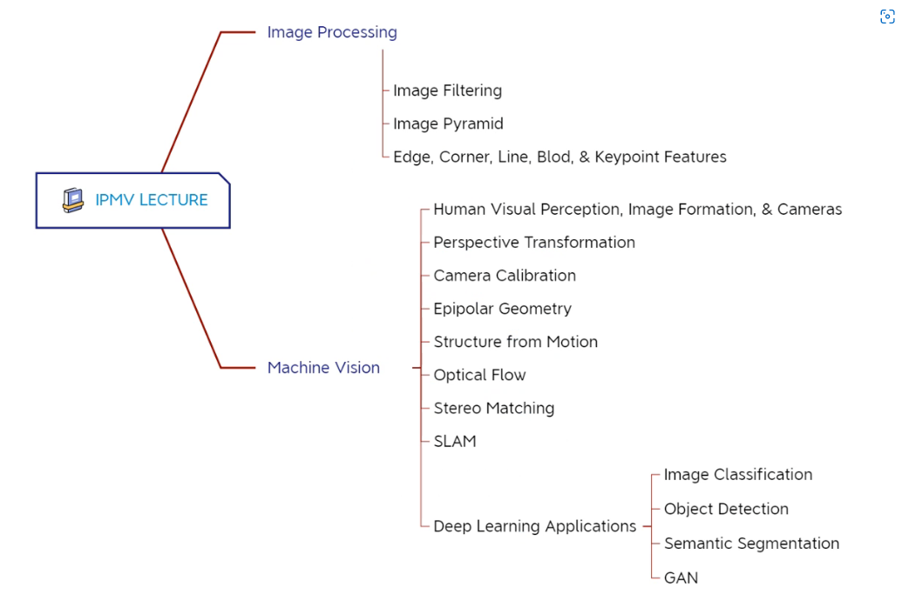

# IPMV-2022

**Image Processing & Machine Vision** &#x20;

Lecturer: [Rui Fan](https://www.ruirangerfan.com/ "Rui Fan")

Email: [rfan@tongji.edu.cn](mailto:rfan@tongji.edu.cn "rfan@tongji.edu.cn")

Teaching Support Assistants: Yi Feng & Shuai Su

范老师nb !&#x20;

author：Yi Yang & Zhengpu Wang

***

[HW--Stereo Camera](<HW--Stereo Camera/HW--Stereo Camera.md> "HW--Stereo Camera")

[Summary](Summary/Summary.md "Summary")

[Lecture 14 IPMV with Deep Learning](<Lecture 14 IPMV with Deep Lear/Lecture 14 IPMV with Deep Learning.md> "Lecture 14 IPMV with Deep Learning")

[Lecture 13 Sfm and SLAM ](<Lecture 13 Sfm and SLAM/Lecture 13 Sfm and SLAM.md> "Lecture 13 Sfm and SLAM ")

[Lecture 12 Motion 光流](<Lecture 12 Motion 光流/Lecture 12 Motion 光流.md> "Lecture 12 Motion 光流")

[Lecture 11 Stereo Matching](<Lecture 11 Stereo Matching/Lecture 11 Stereo Matching.md> "Lecture 11 Stereo Matching")

[Lecture 10 Interest Points](<Lecture 10 Interest Points/Lecture 10 Interest Points.md> "Lecture 10 Interest Points")

[Lecture 9 Edges & Lines](<Lecture 9 Edges & Lines/Lecture 9 Edges & Lines.md> "Lecture 9 Edges & Lines")

[Lecture 8 Image Pyramid 图像金字塔](<Lecture 8 Image Pyramid 图像金字塔/Lecture 8 Image Pyramid 图像金字塔.md> "Lecture 8 Image Pyramid 图像金字塔")

[Lecture 7 Image Filtering](<Lecture 7 Image Filtering/Lecture 7 Image Filtering.md> "Lecture 7 Image Filtering")

[Lecture 6 Epipolar Geometry（II)  对极几何](<Lecture 6 Epipolar Geometry（II/Lecture 6 Epipolar Geometry（II)  对极几何.md> "Lecture 6 Epipolar Geometry（II)  对极几何")

[Lecture 5 Epipolar Geometry（I)  对极几何](<Lecture 5 Epipolar Geometry（I)/Lecture 5 Epipolar Geometry（I)  对极几何.md> "Lecture 5 Epipolar Geometry（I)  对极几何")

[Lecture 4 Camera Calibration](<Lecture 4 Camera Calibration/Lecture 4 Camera Calibration.md> "Lecture 4 Camera Calibration")

[Lecture 3 Perspective Transformation](<Lecture 3 Perspective Transfor/Lecture 3 Perspective Transformation.md> "Lecture 3 Perspective Transformation")

[Lecture 2 Human Visual Perception,Cameras, & Images](<Lecture 2 Human Visual Percept/Lecture 2 Human Visual Perception,Cameras, & Image.md> "Lecture 2 Human Visual Perception,Cameras, & Images")

参考资料：

[什么是康奈尔笔记法？](https://www.zhihu.com/question/19652630/answer/115967657 "什么是康奈尔笔记法？")
