# Lecture 7 Image Filtering

## 目录

*   *   [笔记](#笔记)

*   [1 Prelininaries](#1-prelininaries)

    *   *   [1.1 convolution卷积](#11-convolution卷积)

        *   [1.2 Gradient梯度](#12-gradient梯度)

*   [2 Image filtering ](#2-image-filtering-)

    *   [Image translation with image kernels(convolutions)](#image-translation-with-image-kernelsconvolutions)

    *   [2.1 Laplacian filtering ](#21-laplacian-filtering-)

    *   [2.2 Image sharpening 锐化](#22-image-sharpening-锐化)

        *   [Gradient filtering 梯度滤波](#gradient-filtering-梯度滤波)

    *   [2.3 Box filtering (image blurring)](#23-box-filtering-image-blurring)

        *   [如何快速计算某个区域的像素点之和？Intergral image](#如何快速计算某个区域的像素点之和intergral-image)

    *   [2.4 Gaussian filtering](#24-gaussian-filtering)

    *   [2.5 Bilateral Filter 双边滤波](#25-bilateral-filter-双边滤波)

    *   [2.6 Median filtering中值滤波](#26-median-filtering中值滤波)

    *   [2.7 Morphological filters 形态滤波器](#27-morphological-filters-形态滤波器)

    *   [2.8 Convolutional Neural Network](#28-convolutional-neural-network)

    *   [总结](#总结)

## 笔记

*这里是主要的笔记内容*

***

内容

推荐阅读，脉络上比本文清晰一些。

[干货｜一文透彻理解：图像卷积、边缘提取和滤波去噪-极市开发者社区 (cvmart.net)](https://www.cvmart.net/community/detail/4692 "干货｜一文透彻理解：图像卷积、边缘提取和滤波去噪-极市开发者社区 (cvmart.net)")

# 1 Prelininaries

### 1.1 convolution卷积

在图像处理中，**kernel、卷积矩阵或mask**是用于**模糊、锐化、压纹、边缘检测**等的**小矩阵**。这是通过在**内核和图像**之间做一个**卷积**来实现的。一般的卷积表达式如下：

$$
g(x,y) =  \omega \* f(x,y) = \sum^{a}*{dx=-a} \sum^{b}*{dx=-b}w(dx,dy\_f(x-dx,y-dy)
$$

where $g(x,y)$是被滤波的图像，$f(x,y)$是原始图像，$ \omega  $是滤波核，其中每个元素被认为$-a \le dx \le a , -b \le dy \le b$

请注意，Convolution 和 Correlation是不同的。在深度学习的卷积神经网络（CNN,Convolutional neural network)，Convolutuion表述不准确，CNN用的实际上是Correlation。(P.S.看了一圈论文和百科，我居然没有找到CNN的卷积公式。。。)

Convolution 和 Correlation的不同

|                 | Convolution                                                | Correlation                                                |
| --------------- | ---------------------------------------------------------- | ---------------------------------------------------------- |
| Rotating Kernel | kernel旋转                                                   | kernel不旋转                                                  |
| Formula         | $G\[i,j]=\sum^{k}*{u=-k}\sum^{k}*{v=-k}H\[u,v]F\[i-u,j-v]$ | $G\[i,j]=\sum^{k}*{u=-k}\sum^{k}*{v=-k}H\[u,v]F\[i+u,j+v]$ |
| Notation        | $G = H \* F$                                               | $G = H \otimes F$                                          |

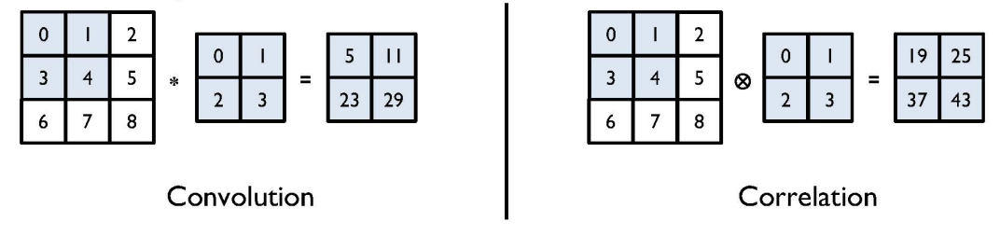

这里Convolution 的卷积核要做旋转，二阶旋转的方法是主副对角线上的元素分别对换位置。比如，0、3互换，2、1互换。

不同的卷积类型

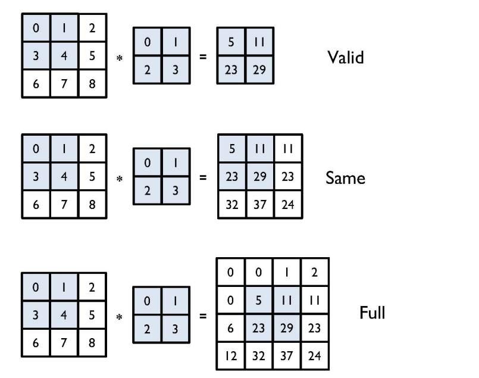

Same,Full怎么实现？

答：先补零再做卷积。Same，原矩阵在右边和底下分别补充一列、一行零。Full，四周不一圈零，变成5\*5的矩阵。&#x20;

### 1.2 Gradient梯度

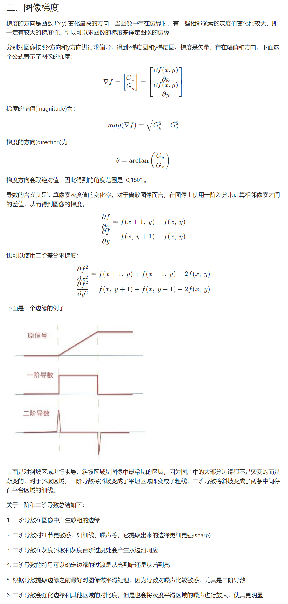

# 2 Image filtering&#x20;

## Image translation with image kernels(convolutions)

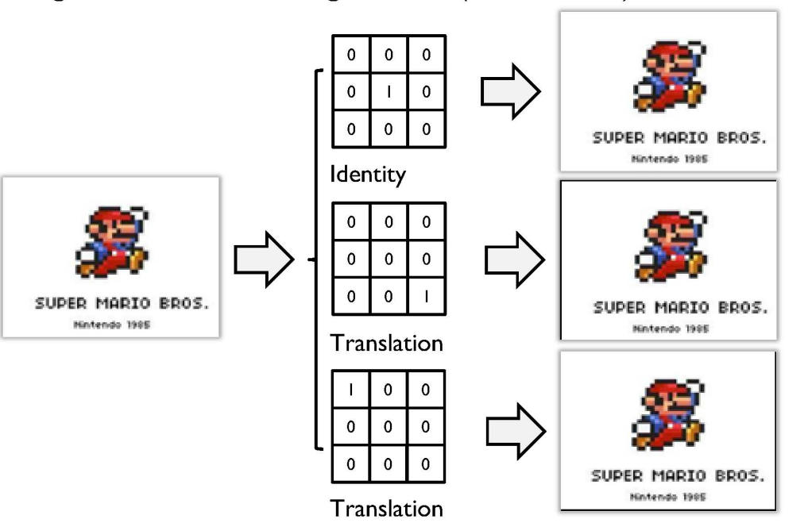

第二个卷积核，在左边和上边补了一圈零，所以出现黑边

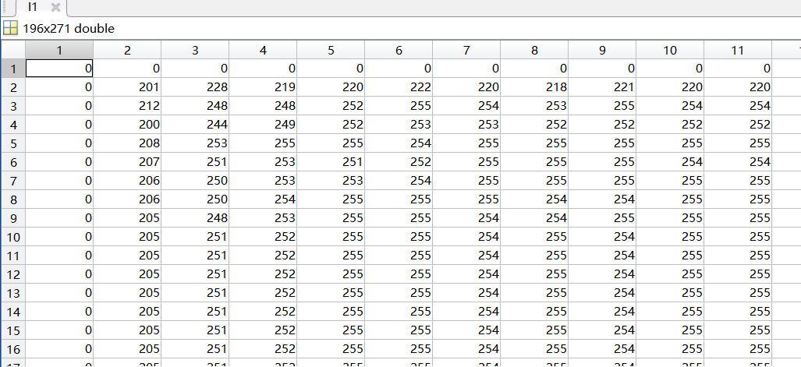

第三个卷积核，在右边和下边补了一圈零，出现黑边

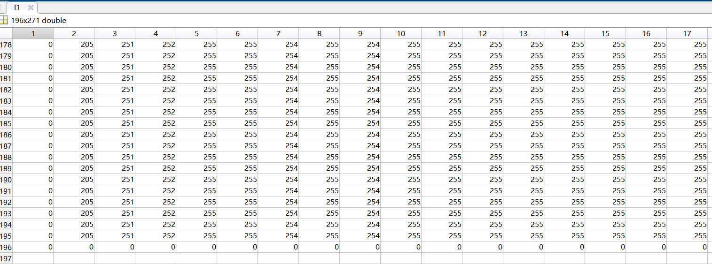

代码也很简单，

```matlab
%% 图像卷积
% 读入图像
image = imread("1.jpg");
% 彩图转灰度，
% 注：imread读入得到3维图像，而conv2支持2维卷积
image = rgb2gray(image);
% kernel 
kernel1 = [0 0 0;0 1 0;0 0 0 ];
% 卷积
image1 = conv2( image,kernel1,'same');
% 显示图像
imshow(uint8(image1));
```

## 2.1 Laplacian filtering&#x20;

原理：

$$
L(x,y) = \frac{\partial^2I}{\partial x^2} + \frac{\partial^2I}{\partial y^2}
$$

用途： ridge detection[脊检测](https://zh.wikipedia.org/wiki/%E8%84%8A%E6%A3%80%E6%B5%8B "脊检测")

> 一个双变量光滑函数的脊（或是称作为脊集合）是所有至少在一个维度中是局部最大值的点所形成的曲线的集合，就如同地理上山脊的概念。

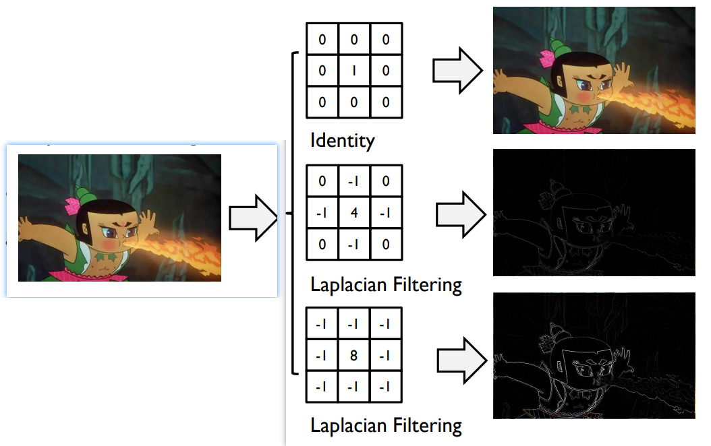

扩展阅读：

[Spatial Filters - Laplacian/Laplacian of Gaussian (ed.ac.uk)](https://homepages.inf.ed.ac.uk/rbf/HIPR2/log.htm "Spatial Filters - Laplacian/Laplacian of Gaussian (ed.ac.uk)")

## 2.2 Image sharpening 锐化

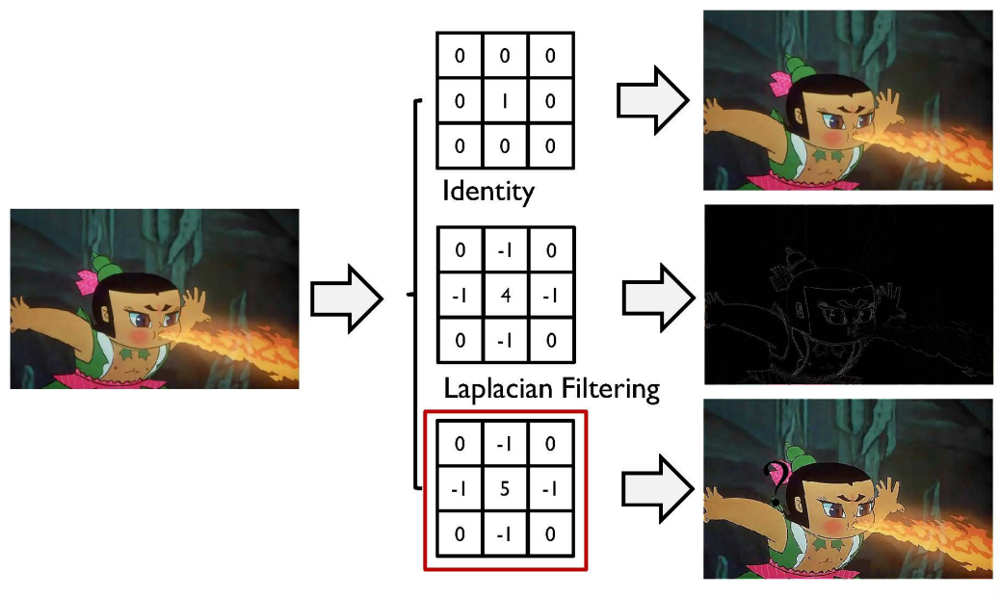

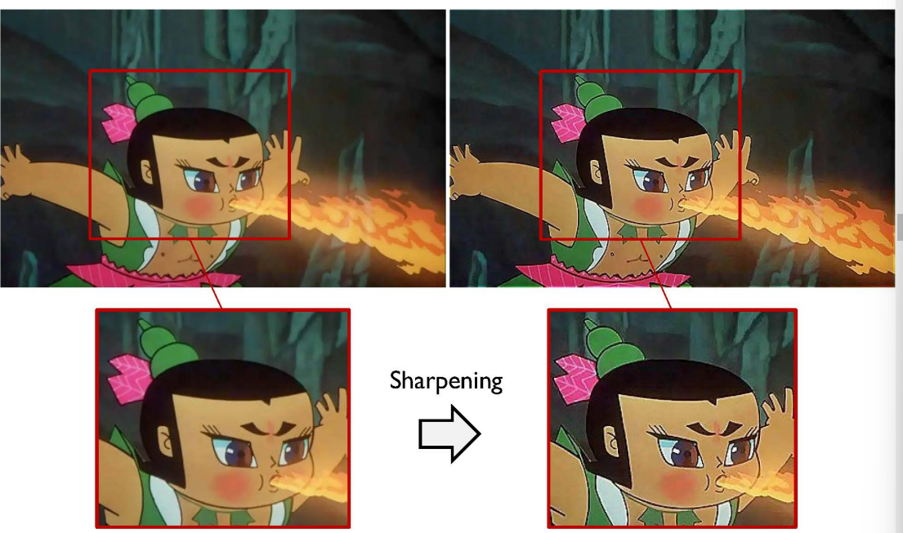

### Gradient filtering 梯度滤波

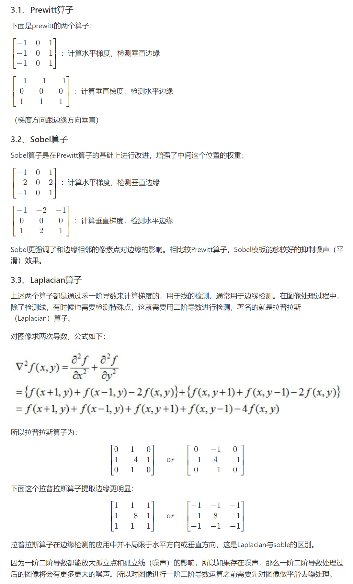

划重点：**（梯度方向跟边缘方向垂直）**

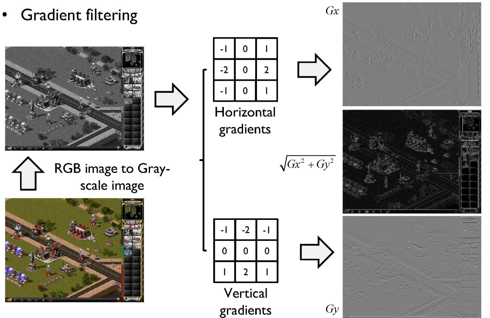

下图是我跑出来的结果

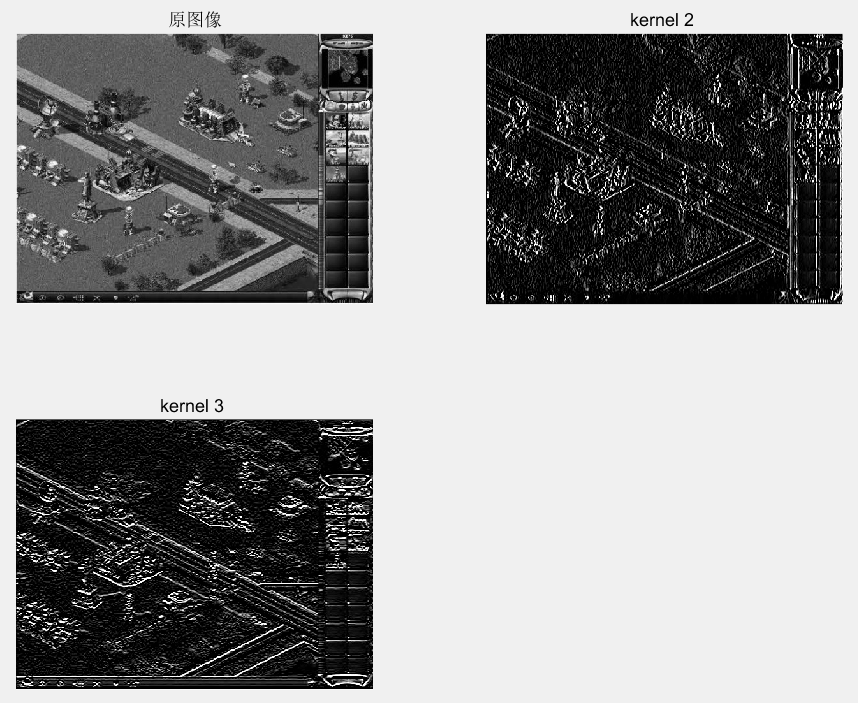

## 2.3 Box filtering (image blurring)

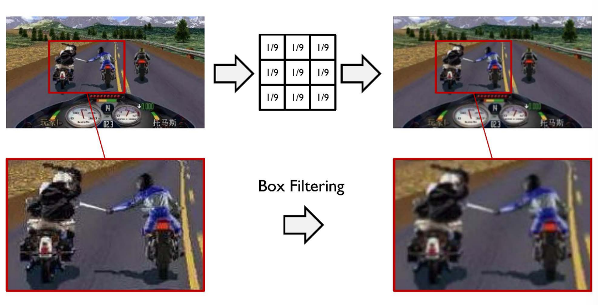

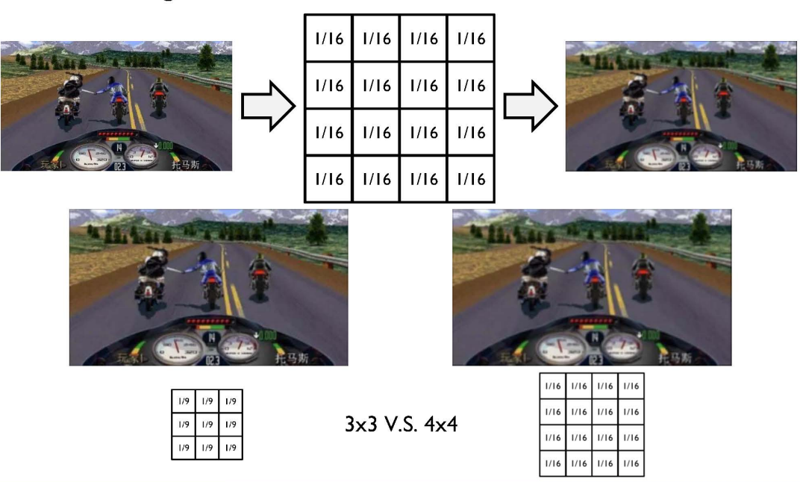

### 如何快速计算某个区域的像素点之和？Intergral image

> 积分图像，每一个像素点的灰度值等于在该像素点之前所有像素点灰度值之和。

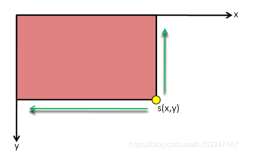

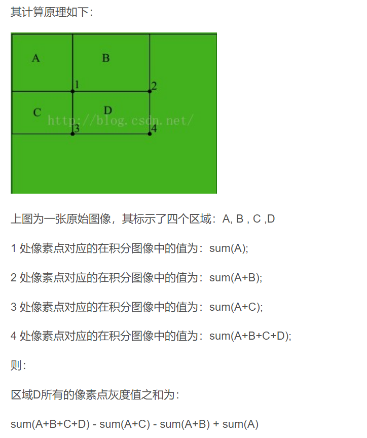

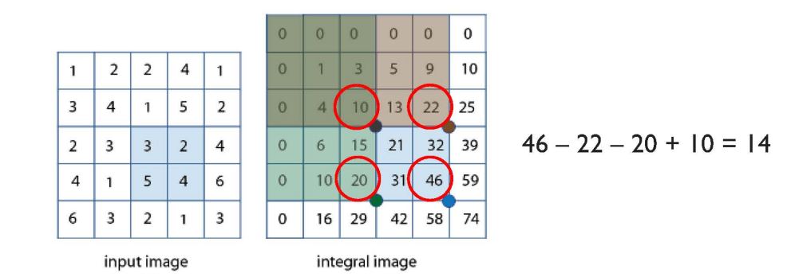

## 2.4 Gaussian filtering

> 高斯滤波就是对整幅图像进行**加权平均数**的过程，每一个像素点的值，都由其本身和邻域内的其他像素值经过加权平均后得到。高斯滤波时水平和垂直方向呈现高斯分布，**更突出了中心点在像素平滑后的权重。**

原理：

1-D : $G(x) =  \frac{1}{\sqrt {2 \pi \sigma ^2}}e^{- \frac{x^2}{2 \sigma ^2}}$

2-D:$G(x,y) =  \frac{1}{\sqrt {2 \pi \sigma ^2}}e^{- \frac{x^2+ y^2}{2 \sigma ^2}}$

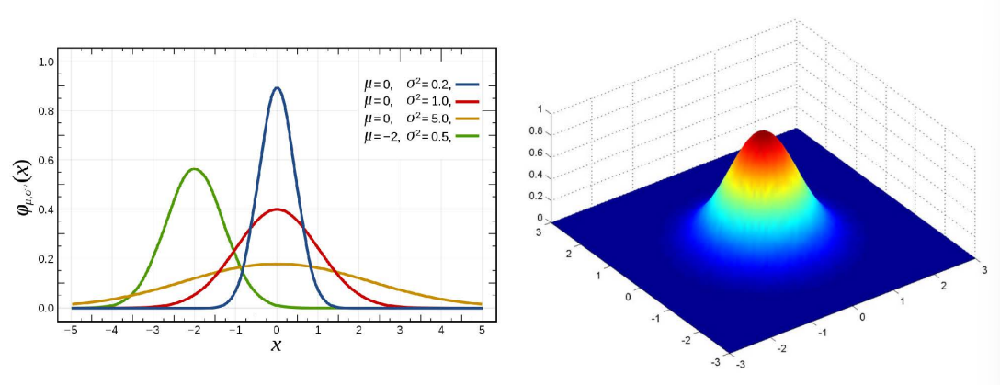

高斯函数常被用来**自适应**地为图像模糊滤波提供权值。

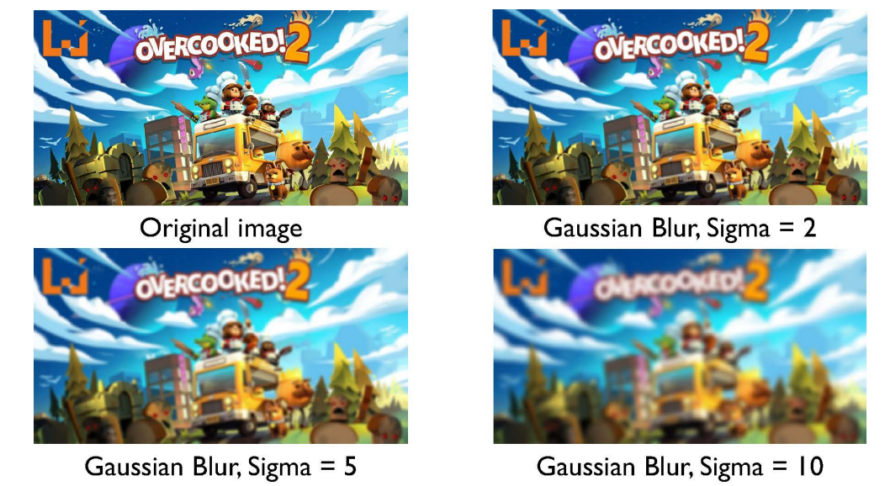

> 可以看到高斯核里的值符合高斯分布，中心的值最大，其他值根据距离中心元素的距离递减，**用高斯核对图像进行卷积运算，会使图像更模糊（平滑）**，而模糊的程度由高斯的标准方差 σ 决定， **σ 越大，平滑程度越大**。高斯滤波可以有效的从图像中去除高斯噪音。

高斯模糊无法保留边缘！！！

常见的高斯核（（高斯核的宽和高必须是奇数）

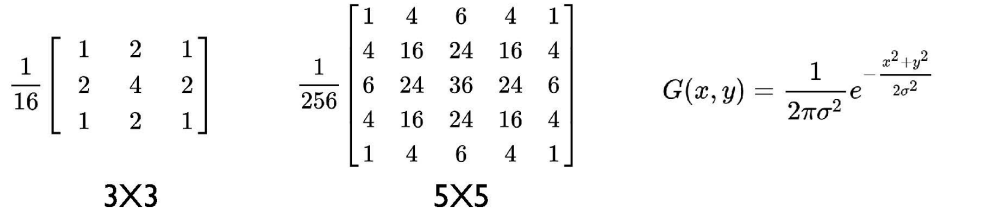

那么问题又来了，图像处理中需要频繁计算高斯函数，或者正余弦函数等，这些运算非常消耗资源，且每次都重新算是不是有点不合算（尤其是在算力受限的设备上）。所以常用 **查找表**（look-up table ） 来直接查表。

> 在计算机科学中，查找表（Lookup Table）是用简单的**查询操作**替换运行时计算的数组或者关联数组这样的数据结构。由于**从内存中提取数值**经常要**比复杂的计算速度快很多**，所以这样得到的**速度提升是很显著**的。经典例子就是 三角函数表，对数表，计算尺等。也会引入**线性插值**来减少查找表的大小，精度的损失对于三角函数等比较平滑的函数时可以接受的。

## 2.5 Bilateral Filter 双边滤波

双边滤波器是一个**非线性、保留边缘、减少噪声**的柔和图像滤波器。

它用邻近像素的加权平均数代替每个像素的亮度。

$$
w(i,j,k,l)=\exp \left(-{\frac {(i-k)^{2}+(j-l)^{2}}{2\sigma \_{d}^{2}}}-{\frac {|I(i,j)-I(k,l)|^{2}}{2\sigma \_{r}^{2}}}\right)
$$

$\sigma\_d$\* 和 \*$\sigma\_r$ 是柔化参数，$I(i,j) ，I(k,l)$是 原图像素点$(i,j),(k,l)$的亮度。

$$
{\displaystyle I\_{D}(i,j)={\frac {\sum \_{k,l}I(k,l)w(i,j,k,l)}{\sum \_{k,l}w(i,j,k,l)}},}
$$

$ I\_D  $是像素点$（i,j)$降噪后的亮度。

高斯滤波 v.s. 双边滤波

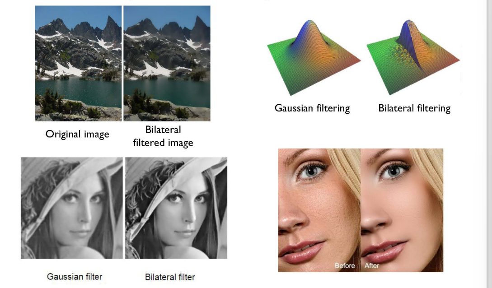

## 2.6 Median filtering中值滤波

中值滤波是一个非线性、数字化的滤波期数，常被用来图像去噪。

这种去噪是典型的预处理步骤，为了改善后续处理的结果。

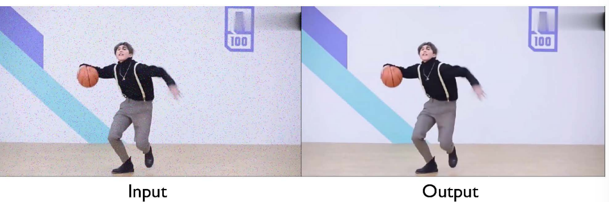

## 2.7 Morphological filters 形态滤波器

常用的形态滤波操作是 dilation 和 erosion . (膨胀、腐蚀？)

dilation 在物体边缘添加像素，erosion 在物体边缘移除像素。添加或移除的像素数量取决于用于处理图像的结构元素的大小和形状。

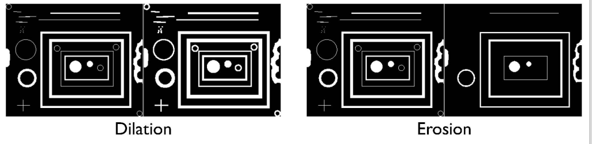

## 2.8 Convolutional Neural Network

卷积神经网络非常容易理解。就是把一张图片卷来卷去。

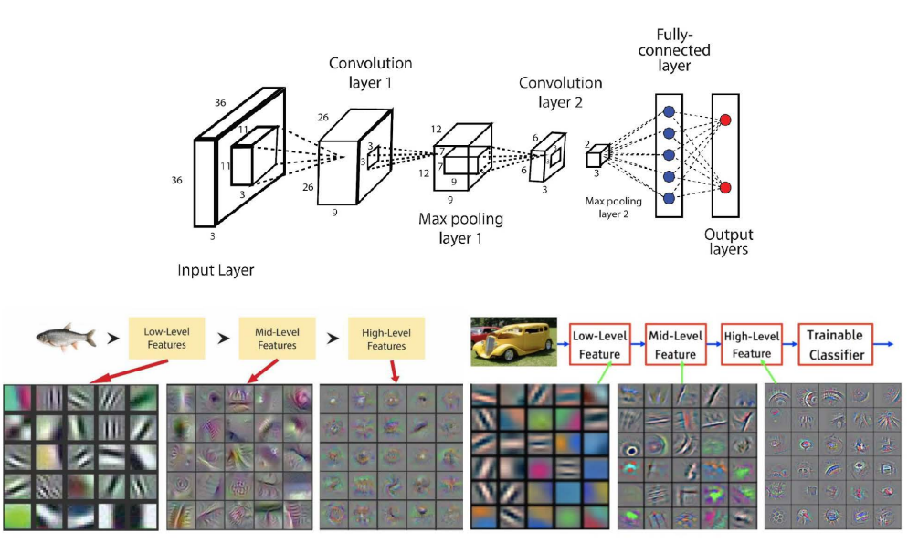

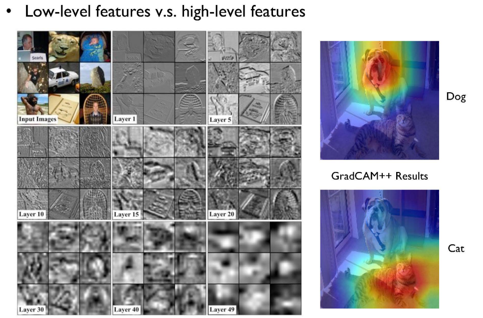

## 总结

*这里写总结*

***

*   重要内容总结

    1.

    2.

    3.
