# Lecture10\_Interest\_Points

## 目录

*   *   [线索](#线索)

    *   [笔记](#笔记)

*   [0. 大作业](#0-大作业)

*   [1 Preliminaries](#1-preliminaries)

    *   [1.1 Interest points](#11-interest-points)

    *   [1.2 Motion detection](#12-motion-detection)

    *   [1.3 Image Registration](#13-image-registration)

    *   [1.4 Video tracking](#14-video-tracking)

    *   [1.5 Image mosaicing 图像拼接](#15-image-mosaicing-图像拼接)

    *   [1.6 Panorama stitching 全景拼接](#16-panorama-stitching-全景拼接)

    *   [1.7 3D reconstruction 三维重建](#17-3d-reconstruction-三维重建)

*   [2 Corners](#2-corners)

    *   [2.1 corner detection](#21-corner-detection)

    *   [2.2 解释特征值:](#22-解释特征值)

    *   [2.3 Harris Corner Detector](#23-harris-corner-detector)

*   [3 Blobs 斑点检测](#3-blobs-斑点检测)

    *   [3.1 Laplacian of Gaussian (LoG)](#31-laplacian-of-gaussian-log)

    *   [3.2 Difference of Gaussian(DoG)](#32-difference-of-gaussiandog)

*   [4 Keypoints](#4-keypoints)

    *   [4.1 Keypoints detection](#41-keypoints-detection)

    *   [4.2 SIFT](#42-sift)

        *   [4.2.1尺度空间极值检测](#421尺度空间极值检测)

        *   [4.2.2 Orientation assignment 确定方向](#422-orientation-assignment-确定方向)

        *   [4.2.3 Keypoint matching](#423-keypoint-matching)

        *   [4.2.4 SIFT results](#424-sift-results)

*   [5 Homework](#5-homework)

*   [附：CV近20年的发展历程](#附cv近20年的发展历程)

    *   [总结](#总结)

## 线索

*这里写主要线索*

***

1.

2.

3.

4.

5.

<!---->

1.

## 笔记

*这里是主要的笔记内容*

***

author：Yi Yang & Zhengpu Wang

# 0. 大作业

大作业ddl ：18周，提交材料、答辩

提交材料：工程源码、技术报告、ppt

评分细则：完成度，工作量，题目难度

评分原则：

*   速度越快

*   精度越高

*   调的库越少

尽可能少用库，尽可能多手写实现

交作业：交两份，其中一份有信息，一份没个人信息（R. Fan要盲审）

成绩分布：

*   10 随堂

*   60 大作业

*   30 lrt打

补充：

比如双目视差，这两个函数方法，可以自己手搓出来，体现工作量，体现教学成果。

老师认为难度较高的：

# 1 Preliminaries

## 1.1 Interest points

*   “角点”和“兴趣点”这两个术语可以互换使用，是指具有局部二维结构的图像中的点状特征。

*   兴趣点检测是计算机视觉系统中用于提取特定特征和推断图像内容的一种方法。这种技术经常用于图像动作感应、图像配准、视频跟踪、图像拼接、全景图像拼接、三维重建等。

*   我们在前面的lectures中讨论过三维重建。利用一组对应关系(匹配兴趣点)估计旋转矩阵和平移矢量。

## 1.2 Motion detection

## 1.3 Image Registration

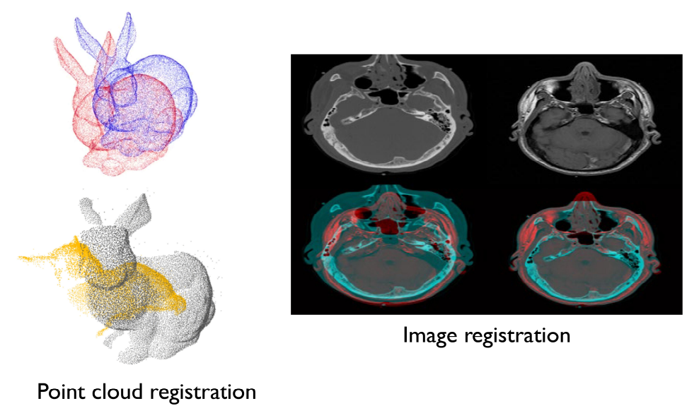

## 1.4 Video tracking

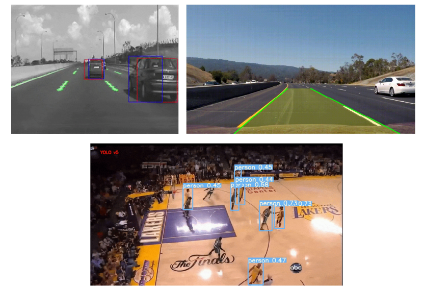

## 1.5 Image mosaicing 图像拼接

## 1.6 Panorama stitching 全景拼接

## 1.7 3D reconstruction 三维重建

# 2 Corners

## 2.1 corner detection

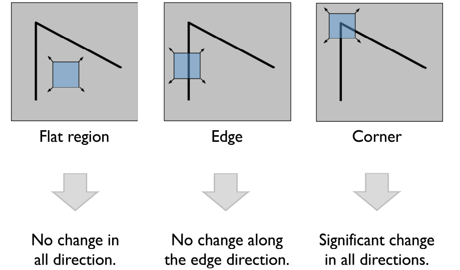

*   平面，无变化

*   边缘，无变化

*   角点，明显变化

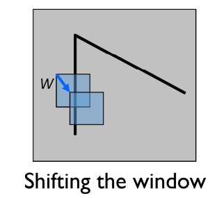

移动窗口W （$\Delta x,\Delta y$），窗口的像素会如何变化？

两个窗口做一个比较，SSD(sum of the squared differences )(SSD)

$$
E(\Delta x, \Delta y)=\sum\_{(x, y) \in W}(I(x+\Delta x, y+\Delta y)-I(x, y))^{2}
$$

泰勒展开得到

$$
I(x+\Delta x, y+\Delta y)=I(x, y)+\frac{\partial I}{\partial x} \Delta x+\frac{\partial I}{\partial y} \Delta y+  \text{higher-order terms}
$$

如果移动（u,v)非常小，则一阶近似可以表示I，

$$
I(x+\Delta x, y+\Delta y) \approx I(x, y)+\frac{\partial I}{\partial x} \Delta x+\frac{\partial I}{\partial y} \Delta y \approx I(x, y)+\left\[\begin{array}{ll}I\_{x} & I\_{y}\end{array}\right]\left\[\begin{array}{l}\Delta x \ \Delta y\end{array}\right]
$$

联立上式得，

$$
E(\Delta x, \Delta y)=\sum\_{(x, y) \in W}(I(x+\Delta x, y+\Delta y)-I(x, y))^{2} \\

\approx \sum\_{(x, y) \in W}( I(x, y)+\left\[\begin{array}{ll}I\_{x} & I\_{y}\end{array}\right]\left\[\begin{array}{l}\Delta x \ \Delta y\end{array}\right] -I(x, y))^{2} \\

\=\sum\_{(x, y) \in W} ( I(x, y)+ I\_{x}\Delta x + I\_{y}\Delta y  -I(x, y))^{2} \\

\= \sum\_{(x, y) \in W}(I\_x \Delta x + I\_y \Delta y)^2\\

\= \sum\_{(x, y) \in W}(I\_x^2 \Delta x^2 + 2I\_xI\_y\Delta x \Delta y+ I\_y^2 \Delta y^2)\\

\=A \Delta x^2 + 2B\Delta x\Delta y+C\Delta y^2

$$

这里，

$$
A=\sum\_{(x, y) \in W} I\_{x}^{2}, B=\sum\_{(x, y) \in W} I\_{x} I\_{y}, C=\sum\_{(x, y) \in W} I\_{y}^{2}
$$

曲面 E(u，v)的局部近似为二次型:

$$
\begin{aligned} E(\Delta x, \Delta y) & \approx A \Delta x^{2}+2 B \Delta x \Delta y+C \Delta y^{2} \ &=\left\[\begin{array}{ll}\Delta x & \Delta y\end{array}\right]\left\[\begin{array}{ll}A & B \ B & C\end{array}\right]\left\[\begin{array}{l}\Delta x \ \Delta y\end{array}\right] \ &=\left\[\begin{array}{ll}\Delta x & \Delta y\end{array}\right] \mathbf{H}\left\[\begin{array}{l}\Delta x \ \Delta y\end{array}\right] \end{aligned}
$$

这里，

$$
A=\sum\_{(x, y) \in W} I\_{x}^{2}, B=\sum\_{(x, y) \in W} I\_{x} I\_{y}, C=\sum\_{(x, y) \in W} I\_{y}^{2}
$$

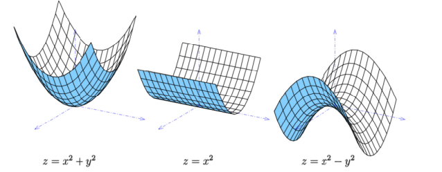

*   水平边缘 （$I\_x = 0$):

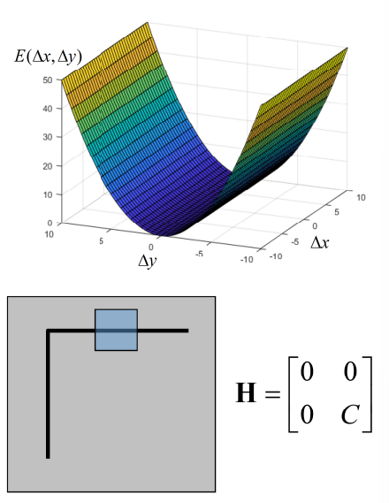

*   垂直边缘 （$I\_y = 0$):

*   普遍情况

H 的形状代表了附着点周围梯度的分布。

我们可以把 H 看作一个椭圆，其轴长由 h 的特征值决定，方向由 h 的特征向量决定。

$$
\mathbf{H}=\left\[\begin{array}{ll}A & B \ B & C\end{array}\right] \Longrightarrow \operatorname{det}(\lambda \mathbf{I}-\mathbf{H})=0 \Longrightarrow \lambda=\frac{1}{2}\left\[(A+C) \pm \sqrt{4 B^{2}+(A-C)^{2}}\right]
$$

> $\bm H$和 $\lambda$有什么属性？

$$
\lambda\_{1} \lambda\_{2}=A C-B^{2}=\operatorname{det}(\mathbf{H}) \\
\lambda\_{1}+\lambda\_{2}=A+C=\operatorname{trace}(\mathbf{H})
$$

## 2.2 解释特征值:

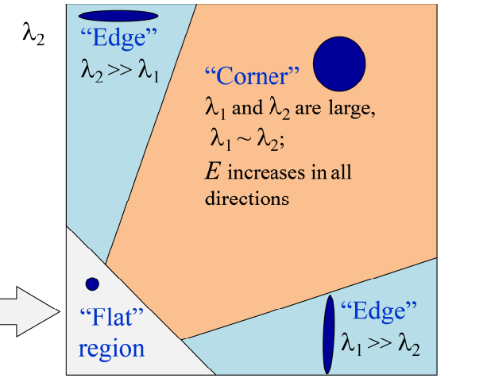

Edge:某一个方向变化幅度远大于另一个 方向，边缘

Flat:两个方向变化幅度都很小，比较平滑,$E$在所有方向几乎不变

Corner:两个方向变化幅度都比较大，$ \lambda\_1， \lambda\_2   $差不多，$E$在所有方向都会变大

## 2.3 Harris Corner Detector

1.  把彩图转换为灰度图

2.  计算水平和垂直方向的梯度（空间导数）

3.  构造结构张量

4.  计算Harris 响应

5.  非最大抑制

计算Harris 响应

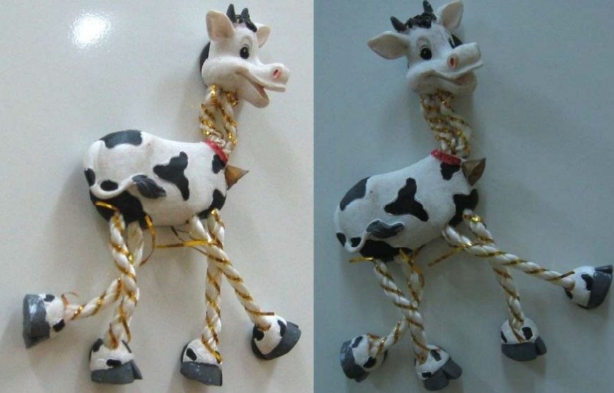

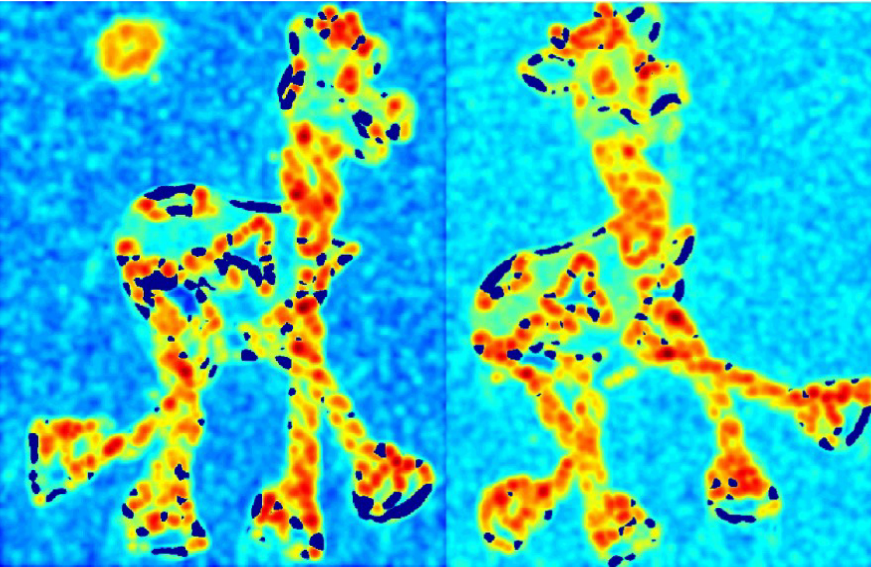

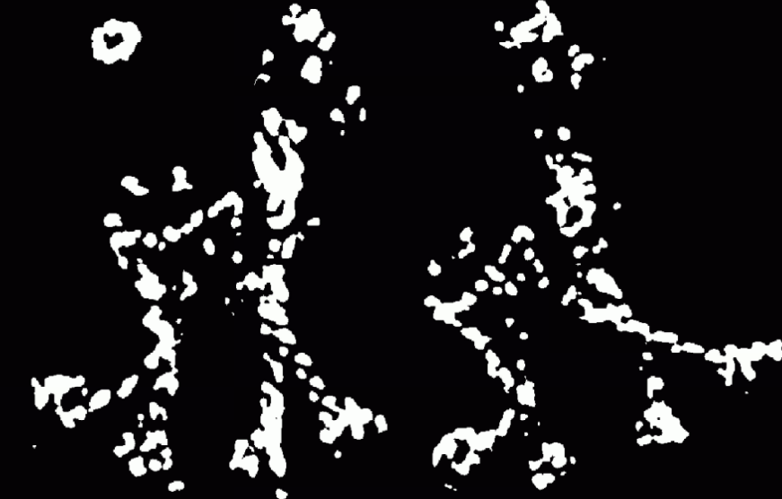

> 🍉角点检测抗图片旋转

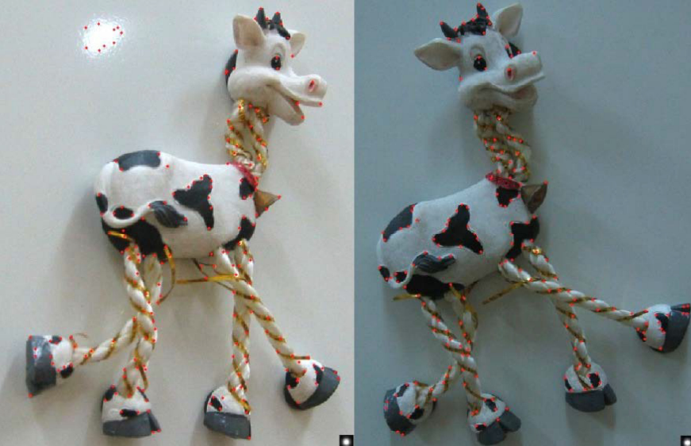

# 3 Blobs 斑点检测

Blobs detection

## 3.1 Laplacian of Gaussian (LoG)

首先介绍一个 blob detector.——Laplacian of Gaussian (LoG)

给定输入图片f(x,y) ，这个图片被高斯核卷积一遍，

$$
g(x,y,t) =  \frac{1}{2\pi t}e^{\frac{x^2+y^2}{2t
}}
$$

在一定比例的 t 给出一个比例的空间表示

$$
L(x,y;t) = g(x,y,t） \* f(x,y)
$$

然后对结果进行Laplacian 操作

$$
\nabla^{2} L=L\_{x x}+L\_{y y}
$$

通常对**暗斑产生强烈的正反应，对亮斑产生强烈的负反应**。为什么？

求完二阶偏导以后，亮点是Min，暗点是max

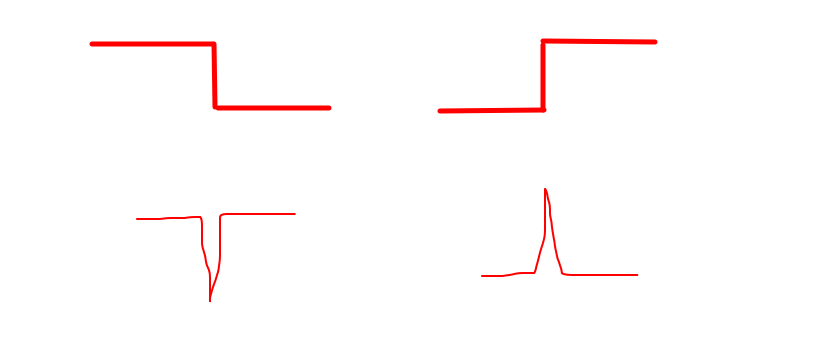

先高斯模糊，再求拉普拉斯二阶偏导，联立成一步

$$
\nabla^{2}(I \* G)=\nabla^{2} G \* I \Longrightarrow L o G(x, y)=-\frac{1}{\pi \sigma^{4}}\left\[1-\frac{x^{2}+y^{2}}{2 \sigma^{2}}\right] e^{-\frac{x^{2}+y^{2}}{2 \sigma^{2}}}
$$

例如，

## 3.2 Difference of Gaussian(DoG)

下面再介绍另一个斑点检测方法，Difference of Gaussian(DoG)

DoG 是一种特征增强算法，它将原始图像的一个高斯模糊版本从另一个模糊程度较低的原始图像中减去。

> 先高斯模糊，再原图减去

公式如下，

$$
\Gamma\_{\sigma, K \sigma}(x, y)=I \* \frac{1}{2 \pi \sigma^{2}} e^{-\frac{x^{2}+y^{2}}{2 \sigma^{2}}}-I \* \frac{1}{2 \pi K^{2} \sigma^{2}} e^{-\frac{x^{2}+y^{2}}{2 K^{2} \sigma^{2}}} \\
\Gamma\_{\sigma, K \sigma}(x, y)=I \*\left(\frac{1}{2 \pi \sigma^{2}} e^{-\frac{x^{2}+y^{2}}{2 \sigma^{2}}}-\frac{1}{2 \pi K^{2} \sigma^{2}} e^{-\frac{x^{2}+y^{2}}{2 K^{2} \sigma^{2}}}\right)
$$

这两个等式是等价的

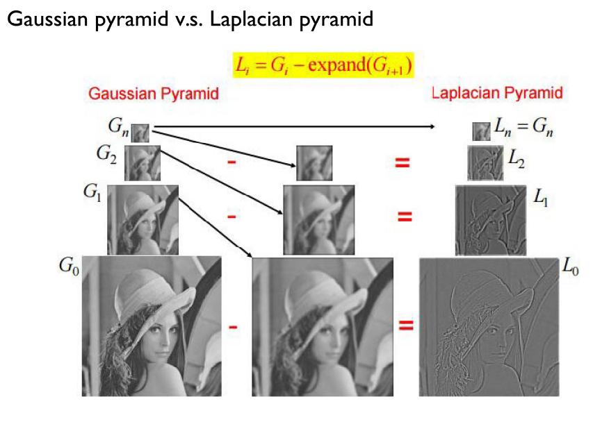

# 4 Keypoints

## 4.1 Keypoints detection

现有的关键点检测、描述和匹配算法通常分为三类:&#x20;

1.  稀疏到稀疏(S2S)&#x20;

2.  稠密到稠密(D2D)

3.  稀疏到稠密(S2D)。

传统的关键点检测器，如 SIFT、 SURF、 BRISK、 ORB 等，都是 S2S 方法，本节将主要讨论最经典的关键点检测器 SIFT-scaleinvariant Feature Transform。

D2D 和 S2D 方法通常是基于卷积神经网络开发的。我们将在 eccv22上组织一个相应的匹配竞赛: [https://avvision.xyz/ECCV22/](https://avvision.xyz/ECCV22/ "https://avvision.xyz/ECCV22/")

## 4.2 SIFT

### 4.2.1尺度空间极值检测

然而，在下面的例子中，如果我们使用角点检测，那么所有的**点都会被分类为边缘**而不是角点。很明显，我们不能用一样大的窗口去检测不同尺度的关键点。小角点是可以的，但是大角点，我们就需要更大的窗口去检测。

> 🍉角点检测抗旋转，不抗缩放

研究人员有一个想法，找到一个尺度，能给予局部最大的Harris反应，即**关键点在位置和尺度上都是局部最大。**

为此，使用了尺度空间滤波，我们可以从 blob 检测中借用一些概念。

LoG有一定开销，所以SIFT算法使用DoG，作为LoG的近似。DoG使用高斯滤波，用两个不同的$ \sigma  $，一个是$\sigma$，一个是$k\sigma$

> DOG和LOG是等价的，运算更简单

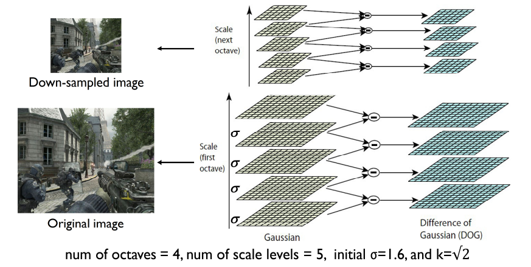

每层往上的倍数是根号2

极值点作为角点

一旦这个 DoG 被创建，图像就会搜索尺度和空间上的局部极值。例如，一个像素与其邻近的8个像素和下一个比例尺中的9个像素和上一个比例尺中的9个像素相比较。如果它是局部极值，则是一个潜在的关键点。这意味着关键点是在这个尺度上展现出来的。

### 4.2.2 Orientation assignment 确定方向

每个关键点分配一个方向以实现图像旋转的不变性，并根据尺度在关键点位置附近取一个邻域，计算该区域的梯度大小和方向。

> 考虑到图片旋转的问题，所以要考虑梯度的方向。

*   特征点附近一个16x16的邻域被创建了

*   被分为4x4的16个子块

*   每个子块，都有一个8方向的方向直方图

*   所以总共右8x16=128个值可用。关键点描述形式作为一个向量存在

### 4.2.3 Keypoint matching

Hamming距离，又称字符串距离，为两个等长串中不一样的值的数目。

### 4.2.4 SIFT results

# 5 Homework

Read these materials:

[http://www.cs.cmu.edu/\~16385/s17/Slides/6.2\_Harris\_Corner\_Detector.pdf](http://www.cs.cmu.edu/\~16385/s17/Slides/6.2_Harris_Corner_Detector.pdf "http://www.cs.cmu.edu/\~16385/s17/Slides/6.2_Harris_Corner_Detector.pdf")

[https://www.cse.psu.edu/\~rtc12/CSE486/lecture06.pdf](https://www.cse.psu.edu/\~rtc12/CSE486/lecture06.pdf "https://www.cse.psu.edu/\~rtc12/CSE486/lecture06.pdf")

[https://pdfs.semanticscholar.org/19d1/c9a4546d840269ef534f6c1c8e3798ce81ac.pdf](https://pdfs.semanticscholar.org/19d1/c9a4546d840269ef534f6c1c8e3798ce81ac.pdf "https://pdfs.semanticscholar.org/19d1/c9a4546d840269ef534f6c1c8e3798ce81ac.pdf")

# 附：CV近20年的发展历程

*   05-12年，传统：SIFT,SURF,BRISK,ORB,

*   12-20年，发展：CNN

*   20\~，当前：Transformer

## 总结

*这里写总结*

***

*   重要内容总结

    1.

    2.

    3.
