# Lecture11\_Stereo\_Matching

## 目录

*   *   [线索](#线索)

    *   [笔记](#笔记)

*   [1 Preliminaries](#1-preliminaries)

    *   [1.1 Triangulation 三角化](#11-triangulation-三角化)

    *   [1.2 Stereo rectification 双目立体匹配](#12-stereo-rectification-双目立体匹配)

        *   [1.2.1双目相机系统校正](#121双目相机系统校正)

        *   [1.2.2视差和深度的关系](#122视差和深度的关系)

*   [2 Stereo matching 视差匹配](#2-stereo-matching-视差匹配)

    *   [2.1视差匹配方法](#21视差匹配方法)

    *   [2.2视差匹配步骤](#22视差匹配步骤)

        *   [2.2.1基本方法：选一个点，逐像素匹配](#221基本方法选一个点逐像素匹配)

            *   [STEP1 左右图像分别找到两个点，画Cost-Disparity图(视差-代价图)](#step1-左右图像分别找到两个点画cost-disparity图视差-代价图)

            *   [STEP2 左图点保持不动，右图点往左移一个长度，再次计算Cost-Disparity](#step2-左图点保持不动右图点往左移一个长度再次计算cost-disparity)

            *   [STEPn 右图的点不断向左滑动，计算Cost-Disparity，找到cost最小的点，对应最佳视差](#stepn-右图的点不断向左滑动计算cost-disparity找到cost最小的点对应最佳视差)

        *   [2.2.2进阶方法：选一个框，匹配更大的区域](#222进阶方法选一个框匹配更大的区域)

        *   [2.2.3 cost 计算](#223-cost-计算)

            *   [A. 逐像素匹配](#a-逐像素匹配)

            *   [B. 方框聚合: SAD/SSD](#b-方框聚合-sadssd)

            *   [C. 归一化互相关：NCC，抗干扰](#c-归一化互相关ncc抗干扰)

            *   [D. 自适应代价聚合:FBS](#d-自适应代价聚合fbs)

            *   [Question:怎么优化c\_{SSD}](#question怎么优化c_ssd)

*   [\$\$
    c\_{SSD}(\bm p,d) =  \sum\_{q\in \mathscr{N}\_p}(i\_L(\bm q) - i\_R(\bm q- \bm d))^2
    \\](#c_ssdbm-pd---sum_qin-mathscrn_pi_lbm-q---i_rbm-q--bm-d2)

*   [\\](#)

*   [3 Disparity Optimization 视差优化](#3-disparity-optimization-视差优化)

    *   [3.1马尔科夫链（MRF)](#31马尔科夫链mrf)

    *   [3.2能量函数](#32能量函数)

    *   [3.3 SGM : Semi-global matching](#33-sgm--semi-global-matching)

*   [4 Disparity Refinement 视差改善](#4-disparity-refinement-视差改善)

    *   [4.1左右视差一致性检测](#41左右视差一致性检测)

    *   [4.2亚像素增强](#42亚像素增强)

*   [5 Deep Stereo Matching 深度视差匹配](#5-deep-stereo-matching-深度视差匹配)

    *   [5.1深度视差匹配方法](#51深度视差匹配方法)

    *   [5.2 CNN，卷积神经网络的使用](#52-cnn卷积神经网络的使用)

    *   [5.3扩展：机器学习](#53扩展机器学习)

*   [6 Performance Evaluation 性能评估](#6-performance-evaluation-性能评估)

    *   [6.1 Root mean squared (RMS) error eRMS: 均方根误差](#61-root-mean-squared-rms-error-erms-均方根误差)

    *   [6.2 Percentage of error pixels(PEP) ePEP(tolerance:\delta\_d pixels](#62-percentage-of-error-pixelspep-epeptolerancedelta_d-pixels)

    *   [ 6.3 millions of disparity evaluations per second](#-63-millions-of-disparity-evaluations-per-second)

*   [7 Maybe](#7-maybe)

    *   [总结](#总结)

## 线索

*这里写主要线索*

***

1.

2.

3.

4.

5.

<!---->

1.

## 笔记

*这一个*Lecture的内容十分的丰富，可以当作两个Lecture来看。

（怎么还不学？快学！！）

***

author：Yi Yang & Zhengpu Wang

# 1 Preliminaries

## 1.1 Triangulation 三角化

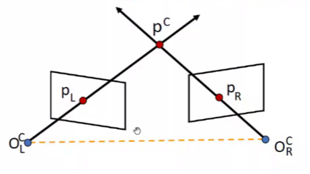

*   在计算机视觉三角测量中，指的是在三维空间中的**一个点投影到两幅或两幅以上的图像上，确定对应点**的过程。

*   为了解决这个问题，有必要知道摄像机投影函数从三维到二维的参数，最简单的情况是用**摄像机内参矩阵**表示。

## 1.2 Stereo rectification 双目立体匹配

### 1.2.1双目相机系统校正

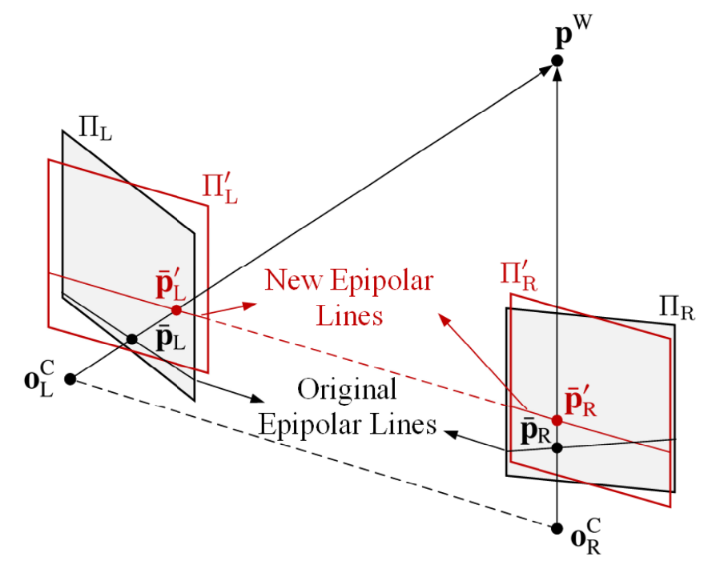

经过校正以后，得到最基本的双目相机立体系统。

> 怎么校正的？忘了的同学赶快去3.1双目相机校正步骤复习一下

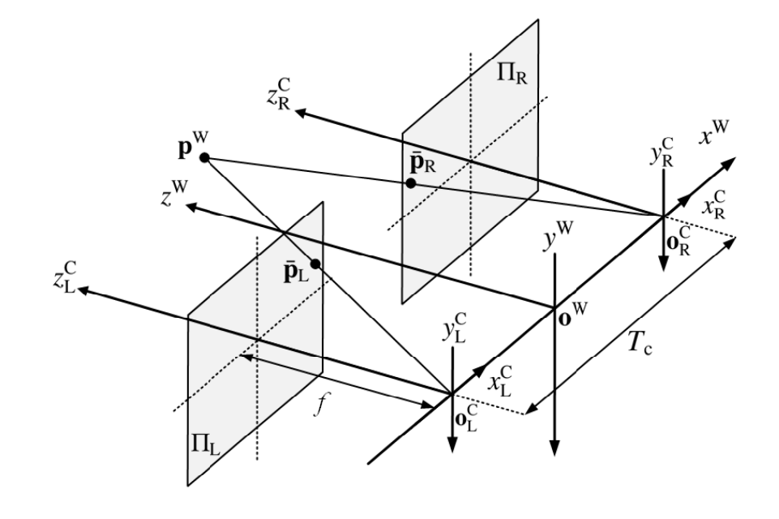

### 1.2.2视差和深度的关系

同样地，也是Lecture3 的内容。

一对左右平面对应的点有以下关系

$$
\bm p\_L = \left\[\begin{array}{} u\_L \ v\_L \ \end{array}\right] = \left\[\begin{array}{} f \frac{x^{\mathrm{W}}+T\_{c} / 2}{z^{\mathrm{W}}} + u\_o\\\ f \frac{y^W}{z^W} + v\_o \ \end{array}\right] \， \ \bm p\_R = \left\[\begin{array}{} u\_R \ v\_R \ \end{array}\right] = \left\[\begin{array}{} f \frac{x^{\mathrm{W}}-T\_{c} / 2}{z^{\mathrm{W}}} + u\_o\\\ f \frac{y^W}{z^W} + v\_o \ \end{array}\right]
$$

视差和深度的关系：成反比。

$$
d= u\_L - u\_R = f\frac{Tc}{z^W}
$$

# 2 Stereo matching 视差匹配

**任务：匹配对应点**

## 2.1视差匹配方法

*   传统视差估计方法，完全数学建模的方法

    *   局部算法，左图中选个框，右图中选一系列框来匹配。最好的视差匹配是左右框不同最小的那一组

    *   全局方法，设计一个能量方程，优化迭代，得到一个能量最小的一组或可能性最大的一组。常基于马尔科夫链优化方法

    *   半全局方法（Semi-global matching (SGM)），对图像进行全方位的代价聚合来逼近 MRF（马尔科夫链） 推理，极大地提高了视差估计的准确性和效率。

*   深度学习方法

    *   全监督

    *   自监督/无监督

## 2.2视差匹配步骤

视差d是一个随机变量，有N个可能的离散状态，每一个d对应一个匹配代价cost c.因此视差匹配方法就形式化为匹配代价cost计算问题。

左图为基准，不断移动右图对应点，画出视差-代价图。找cost最小值所在的点，就是最佳视差。

*   cost怎么算？

    *   灰度值，$I(m,n) \in N(0,255)$

    *   同一个点可能在两幅图中的灰度值差不多

    *   可以自然地设计出这两种代价衡量方式

        *   绝对差$  cost = |I\_L - I\_R| $

        *   平方差$  cost = |I\_L - I\_R|^2 $

*   左图基准，右图找点是往左去匹配。（因为左眼看到的内容，在右眼看来是比较偏左的）

传统的视差匹配算法一般包括四个主要步骤：

1.  代价计算，

2.  代价聚合，

3.  视差优化，

4.  视差改善。

### 2.2.1基本方法：选一个点，逐像素匹配

#### STEP1 左右图像分别找到两个点，画Cost-Disparity图(视差-代价图)

#### STEP2 左图点保持不动，右图点往左移一个长度，再次计算Cost-Disparity

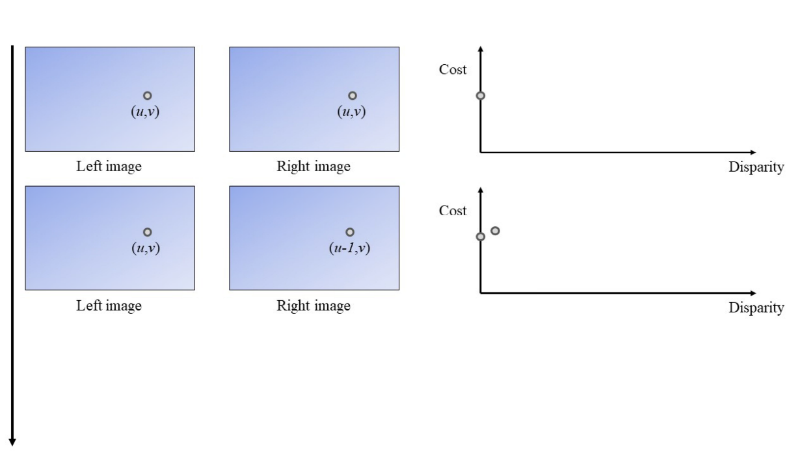

#### STEPn 右图的点不断向左滑动，计算Cost-Disparity，找到cost最小的点，对应最佳视差

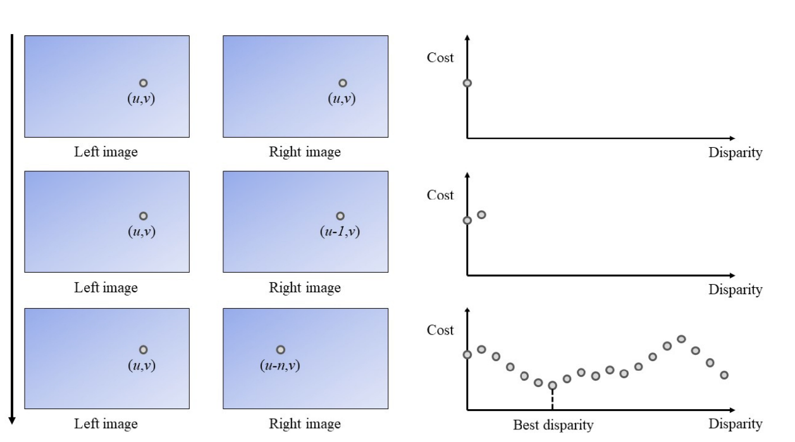

### 2.2.2进阶方法：选一个框，匹配更大的区域

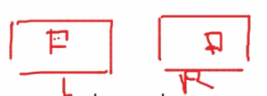

和选一个点类似，只不过从一个点一个点匹配，变成一个区域一个区域匹配。通常选的是矩形框

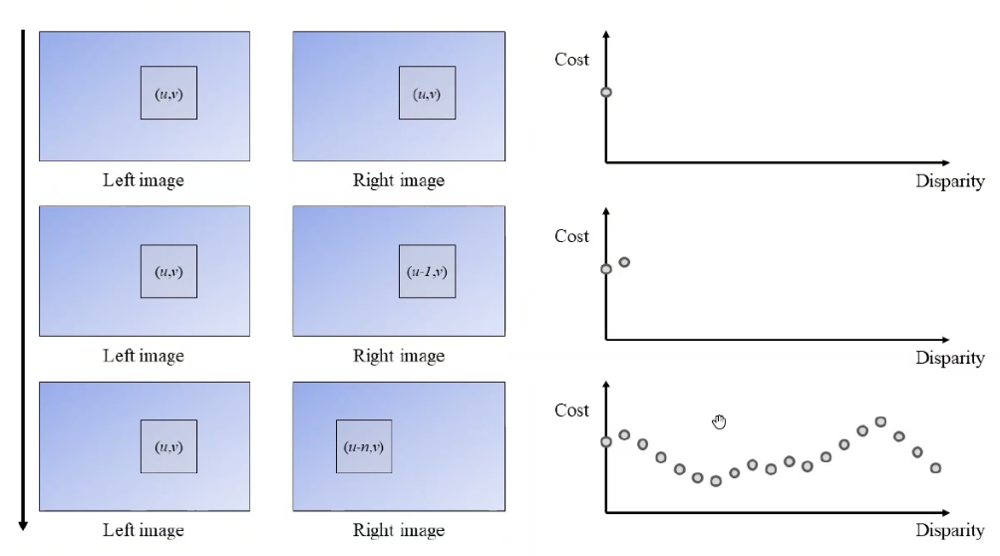

> 一个大的区域，都认为匹配得更准，这样更可靠。同样，会使得计算量增大，算法效率下降。所以这个 support region 的大小是需要精心挑选的，**在精度和速度之间做平衡**。

### 2.2.3 cost 计算

#### A. 逐像素匹配

左右图像一般用灰度图，绝对差$ c\_{AD}  $、平方差$c\_{SD}$这样计算：

$$
c\_{AD}(\bm p,d) = |i\_L(\bm p) - i\_R(\bm p- \bm d)|,\\
c\_{SD}(\bm p,d) = (i\_L(\bm p) - i\_R(\bm p- \bm d))^2,

$$

这里 $ \bm d = \[d,0]^T  $,$i\_L(\bm p)$代表左图$\bm p = \[u,v]^T$点的像素亮度，$i\_R(\bm p - \bm d)$代表右图$\bm p - \bm  d = \[u-d,v]^T$点的像素亮度。

为了最小化错误匹配，像素级的偏差通常被聚合起来，**计算一块区域里所有像素的代价**。如何计算聚合区域里的代价，有以下三种方法。

#### B. 方框聚合: SAD/SSD

$$
c\_{agg}(\bm p,d)=w(\bm p,d) \* C(\bm p,d),
$$

这块区域的中心在$\bm p =\[u,v]^T$，对应的视差是$d$,$c\_{agg}$代表聚合代价，$ w  $是一个kernel代表这个区域，$ C  $表示包含支持区域内所有像素的像素级匹配代价的邻域，$c\_{agg}$可以通过计算$w$和$C$的卷积得到。更大的匹配区域会提高视差 匹配的准确性，但是会显著提高算法花费的时间。

当卷积过程是一个均匀方框滤波（uniform box filtering，指$w$所有的元素都为1）时，$c\_{AD}$和$c\_{SD}$的聚合形式可以写为， sum of absolute difference (SAD) 和 the sum of squared difference (SSD).

$$
c\_{SAD}(\bm p,d) = \sum\_{q\in \mathscr{N}*p}|i\_L(\bm q) - i\_R(\bm q- \bm d)|,\\
c*{SSD}(\bm p,d) =  \sum\_{q\in \mathscr{N}\_p}(i\_L(\bm q) - i\_R(\bm q- \bm d))^2,

$$

这里$\mathscr{N}\_p$就是$\bm p$要匹配的区域（support region, or neighborhood system).

> 一个大的区域，通常匹配得更准，这样更可靠。同样，会使得计算量增大，算法效率下降。所以这个 support region 的大小是需要精心挑选的，**在精度和速度之间做平衡**。

#### C. 归一化互相关：NCC，抗干扰

尽管SSD、SGD计算效率很高，但是对图像亮度区别（或亮度噪声）非常敏感，如两个相机的位置不同，拍到的同一区域的亮度可能不同（位置、角度不同，太阳光的散射、反射情况也不一样）。这种情况下，一些其它的代价计算方法就比较流行，比如normalized cross-correlation (NCC)，**抗干扰能力**比较强。NCC代价方程如下：

$$
c\_{NCC}(\bm p,d) =\frac{1}{n\sigma\_L\sigma\_R } \sum\_{q\in \mathscr{N}\_p}(i\_L(\bm q) - \mu\_L)(i\_R(\bm q- \bm d)-\mu\_R)
$$

&#x20;这里,

$$
\sigma\_L=\sqrt{\sum\_{q\in \mathscr{N}*p}(i\_L(\bm q) - \mu\_L)^2/n},\\
\sigma\_R=\sqrt{\sum*{q\in \mathscr{N}\_p}(i\_R(\bm q - \bm d) - \mu\_R)^2/n},
$$

$\mu\_L,\mu\_R$代表左右图像框里面像素亮度的均值，$\sigma\_L,\sigma\_R$代表左右图像框像素亮度的标准差，n代表每个图像框像素的数量。

> 📌NCC代价$c\_{NCC}\in \[-1,1]$反映了给定一对左右图像框的相似度，$c\_{NCC}$越高，代表匹配得越好。

> NCC表现得比SAD和SSD表现得更好，它可以通过类似SAD/SSD的方法进行优化。

#### D. 自适应代价聚合:FBS

除了通过均匀方框滤波（uniform box filtering）聚合代价以外，许多自适应的代价聚合策略被用来提高视差估计准确度。其中最著名的一个方法是， fast bilateral stereo (FBS)，通常过程如下：

$$
c\_{\mathrm{agg}}(\mathbf{p}, d)=\frac{\sum\_{\mathbf{q} \in \mathscr{N}*{\mathbf{q}}} \omega*{d}(\mathbf{q}) \omega\_{r}(\mathbf{q}) c(\mathbf{q}, d)}{\sum\_{\mathbf{q} \in \mathscr{N}*{\mathbf{q}}} \omega*{d}(\mathbf{q}) \omega\_{r}(\mathbf{q})},
$$

这里 \*\* \*\*$\omega\_{d},$$\omega\_{r}$**基于空间距离和颜色相似度自适应调整**。cost $c$ 是在一个矩形框里面进行自适应聚合来得到$c\_{agg}$

详见这篇论文Fast bilateral stereo ([https://arxiv.org/pdf/1807.02044.pdf](https://arxiv.org/pdf/1807.02044.pdf "https://arxiv.org/pdf/1807.02044.pdf"))

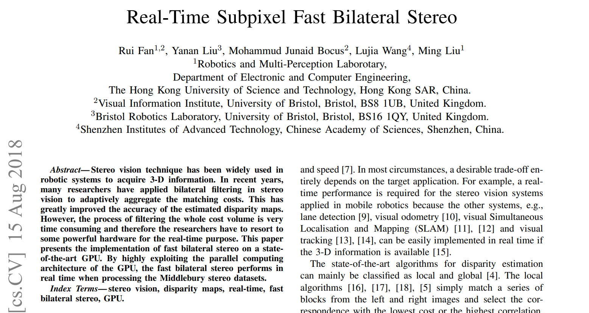

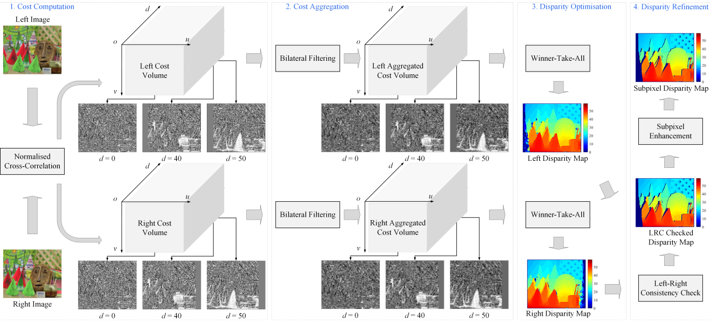

#### Question:怎么优化c\_{SSD}

把$c\_{SSD}$写开，得到

$$
c\_{SSD}(\bm p,d) =  \sum\_{q\in \mathscr{N}\_p}(i\_L(\bm q) - i\_R(\bm q- \bm d))^2
\\
==

\sum\_{q\in \mathscr{N}\_p}(i\_L^2(\bm q) - 2i\_L(\bm q)i\_R(\bm q- \bm d) + i\_R^2(\bm q- \bm d))

# \\

\sum\_{q\in \mathscr{N}*p}i\_L^2(\bm q) - 2\sum*{q\in \mathscr{N}*p}i\_L(\bm q)i\_R(\bm q- \bm d) +\sum*{q\in \mathscr{N}\_p} i\_R^2(\bm q- \bm d)
$$

由于以左图为基准点，所以$i\_L(\bm q)$是不变的，进而$\sum\_{q\in \mathscr{N}*p}i\_L^2(\bm q) 、2\sum*{q\in \mathscr{N}\_p}i\_L(\bm q)$都是常量，可以提前计算好保存。这样需要计算的只有$i\_R(\bm q- \bm d)$。可以大幅提高优化速度。其他的也一样，这是一种编程意识。

> $u\_L ,u\_R$ 这些可以提前算出来的量，就提前算出来存好，**look-up table**，减少重复计算，大幅提升效率。

# 3 Disparity Optimization 视差优化

**局部算法**简单地选择视差，根据左右图**最小的区别**或**最高的相关度**代价作为**最好视差**，属于**Winner-Take-All** (WTA)赢家通吃原则。

## 3.1马尔科夫链（MRF)

不同于局部算法使用WTA原则，**全局算法把像素邻域**也计算在内，如graph cuts (GC)和 belief propagation (BP)。这类算法通常会采用**马尔科夫链（MRF)** 作为几何模型。图形$\mathscr{G}=(\mathscr{P},\mathscr{E})$(花体 $G = (P, E )$)是一组由边$\mathscr{E}$连接起来的顶点$\mathscr{P}$，这里$\mathscr{P}={\bm p\_{11},\bm p\_{11},···,\bm p\_{mn} }$，$\mathscr{E} = {(\bm p\_{ij},\bm p\_{st}) | \bm p\_{ij},\bm p\_{st}\in\mathscr{P}$,分享同一个顶点的两个边被称为一对邻接边。由于MRF被认为是没有方向的，所以这里认为$ (\bm p\_{ij},\bm p\_{st})  $和$ (\bm p\_{st},\bm p\_{ij})  $是相同的边。$\mathscr{N}*{ij}={\bm p*{1p\_{ij}},\bm p\_{2p\_{ij}},···,\bm p\_{kp\_{ij}} |\bm p\_{p\_{ij}} \in \mathscr{P} }$是$\bm p\_{ij}$的邻域系统。

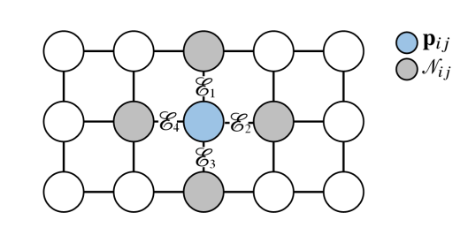

对于立体视觉问题，$\mathscr{P}$是一个 m × n 像素的视差图像，$\bm p\_{ij}$是$(i，j)$位置的顶点(或节点) ，节点视差值为 $d\_{ij}$.

由于考虑的候选对象越多，推断真正的视差就越难，因此只考虑邻近 $\bm p\_{ij}$ 的节点进行视差匹配。这也被称为成对MRF( pairwise MRF).$\bm p\_{ij}$ **的视差总是与其邻近节点有很强的相关性**，但是它和视差图中的任何其他随机节点的连接就比较不直接。（while it is linked implicitly to any other random nodes in thedisparity map）

## 3.2能量函数

寻找最佳视差可以通过最小化下列能量函数来实现,

$$
E(\bm p) = \sum\_{\bm p\_{ij}\in \mathscr{P}}D(\bm p\_{ij},q\_{\bm p\_{ij}}) + \sum\_{\bm q\_{\bm p\_{ij}}\in \mathscr{N}*{ij}}V(\bm p*{ij},\bm q\_{\bm p\_{ij}})
$$

这里 $D(·),V(·)$是两个能量函数，$D(·)$反应了匹配代价，$V(·)$确定来自邻域的聚合。在MRF模型中，自适应$V(·)$的构造非常重要，**因为不连续区域的亮度通常与其邻近区域的亮度有很大差异**。然而上面函数最小化的计算复杂度很高，给实时任务带来很大挑战。然后SGM出现了。

## 3.3 SGM : Semi-global matching

SGM能量函数如下：

$$
E (\bm D ) = \sum \_ { p } ( c (\bm  p , d \_ {\bm p } ) \\+ \sum \_ {\bm q \in \mathscr{N}*{\bm p} } \lambda \_ { 1 } \delta ( |d \_ { \bm p } - d \_ {\bm q }|=1 ) \\+ \sum \_ {\bm  q \in \mathscr{N}*{\bm p} }  \lambda \_ { 2 } \delta ( |d \_ { \bm p } - d \_ { \bm q }|>1 )
$$

这里$  \bm D  $是视差图，$c$是匹配代价，$\bm q$ 是$\bm p$ 的邻域 $\mathscr{N}\_{\bm p}$里面的一个像素。$ \lambda\_1  $惩罚邻域像素里某个视差的像素，比如 1个像素。$\lambda\_2$惩罚邻域像素里大于某个视差的像素，比如大于 1个像素。$\delta(·)$如果参数为真则返回1否则返回0.

# 4 Disparity Refinement 视差改善

视差改善过程通常包括几个**后处理**步骤，如**左右视差一致性检测**（left-and-right disparity consistency check (LRDCC),）和**亚像素增强**（subpixel enhancement）。

## 4.1左右视差一致性检测

左右视差一致性检测可以移除绝大部分遮挡区域（比如**左眼能看到，右眼看不到**的，**只在一个图里出现的区域**）

$$
\mathscr{I}*{left}(\bm p) = \mathscr{I}*{right}(\bm p - \[\mathscr{I}\_{left}(\bm p),0]^T)
$$

这里$\mathscr{I}*{left}，\mathscr{I}*{right}$表示左右视差图。

深蓝色区域就是遮挡区域，视差给零。

一致性检测指用左视差图和右视差图进行对照，看两个同名点是否能否相互匹配（视差值之差的绝对值是否小于一个阈值），如果超过阈值，则一致性检查不通过，对应位置判定为遮挡区域，把对应位置的视差变为无效值。一致性检查通常分为内部型和外部型两种，内部型是通过左图的代价数组来推算右图的代价数组，从而计算右图的视差图。

> 右图$ ( i , j )  $视差为$ d  $的代价 = 左图$( i , j + d )$视差为$d$的代价

## 4.2亚像素增强

三维几何重建中，**大于一个像素的视差误差**可能会导致**重建结果不可忽视的差异**。因此，**亚像素增强**可以简单地通过在初始计算出的**视差-代价图里插值**提高视差图像的解析度，使得视差图像变得更加**平滑**。

$$
\mathscr{I}*{subpixel}(\bm p) = \mathscr{I}*{left}(\bm p) + \frac{c(\bm p,d-1) - c(\bm p,d+1)}{2c(\bm p,d-1) + 2c(\bm p,d+1) -4c(\bm p,d)}
$$

这里的$\mathscr{I}*{left}$、$\mathscr{I}*{subpixel}$表示的是原始的和亚像素的视差图。

可以看出，亚像素增强以后，视差图变得更加平滑。图中最大的那个脸，甚至能看到嘴巴。

# 5 Deep Stereo Matching 深度视差匹配

## 5.1深度视差匹配方法

*   深度视差匹配方法可以分为监督，无监督/自监督。

*   监督算法需要大量的人工标注数据(真值标记) ，而无监督和自监督算法则不需要。

*   无监督和自监督是深度视差匹配的未来。（我觉得：不止，是ML的未来）

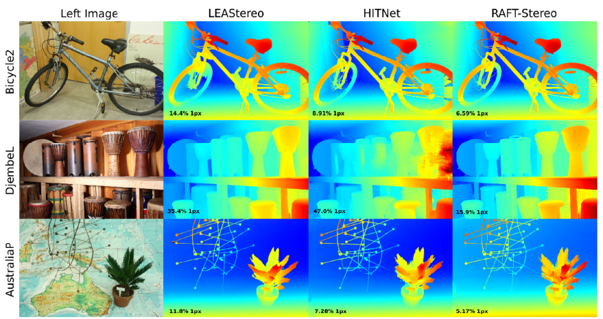

可以看出深度视差匹配效果非常不错啊。

## 5.2 CNN，卷积神经网络的使用

随着机器/深度学习技术的发展，**CNN**(Convolutional Neural Network，卷积神经网络)已经成为视差估计的主要方法。如下图所示，它由一个卷积层 L1和七个完全连接层 L2-L8组成。

这个 CNN 的输入是两个9 × 9像素的灰度图像框框。L1由32个5x5x1的卷积核组成，L2和 l3各有200个神经元。在 L3之后，将两个200维特征向量连接成一个400维特征向量并通过 L4-L7层。层 L 8将 L 7的输出映射成两个实数，然后通过一个softmax函数产生两个类的分布: a)好匹配和 b)坏匹配。

最后，利用计算机视觉的**代价聚合和视差优化/改善技术**生成最终的视差图像。虽然这种方法已经达到了最先进的精度，但是它受到所使用的匹配代价聚合技术的限制，并且可能在**遮挡区域或纹理较少/反射区域**产生错误的预测。

实际上就是用这个网络，来代替cost function

虽然前面提到的基于 CNN 的视差估计方法效果很不错，但是它们往往含有大量的可学习参数，从而导致处理时间过长。因此，目前基于 CNN 的视差估计算法在自动驾驶中还没有得到实际应用。我们相信，随着嵌入式计算技术（边缘计算）的进步，这些方法将被应用于更多的实际应用中。

## 5.3扩展：机器学习

> 李宏毅：机器学习，就是一个函数。我们要做的就是寻找这么一个函数。

详见[机器学习-李宏毅-2022/2021](https://www.wolai.com/bZxSBGe6rNECbmHacryy5D "机器学习-李宏毅-2022/2021")课程：[1机器学习相关概念](https://www.wolai.com/wwDYD1A39k5muR1wekMK8n.md "1机器学习相关概念")

> 如何手写一个CNN?

<https://www.wolai.com/jzE8b26SMKzBq5UMpX4mtN>

# 6 Performance Evaluation 性能评估

如上所述，视差估计的**速度和精度**是两个关键的性能，它们总是相互对立的，如何在提高精度的同时拥有不俗的速度，从而达到一种较好的平衡，是关键。所以立体视觉算法**性能评价**通常涉及这两个性质。

*   $e\_{RMS} ,e\_{PEP}$评估精度

    $ D\_E  $估计的视差，$D\_G$正确的视差,

*   $M\_{de/s}$评估效率

    图像尺寸、最大视差大小 比时间

## 6.1 Root mean squared (RMS) error eRMS: 均方根误差

$$
e\_{RMS}=\sqrt{\frac{1}{N}\sum \_{\bm p \in \mathscr{P}} |\bm D\_E(\bm p) - \bm D\_G(\bm p)|^2  }
$$

## 6.2 Percentage of error pixels(PEP) ePEP(tolerance:\delta\_d pixels

$$
e\_{PEP}={\frac{1}{N}\sum \_{\bm p \in \mathscr{P}} \delta (|\bm D\_E(\bm p) - \bm D\_G(\bm p)| > \delta\_d)  }\times 100%
$$

其中$\bm D\_{E}$和$\bm D\_{G}$ 分别代表估计的和真实的视差; $N$ 代表用于评价的视差总数; $\delta\_d$ 代表宽容度。

## &#x20;6.3 millions of disparity evaluations per second

这是一种描述算法效率的通用方法，即每秒数百万次的视差估计，如下所示:

$$
Mde/s=\frac{u\_{max}v\_{max}d\_{max}}{t}10^{-6}
$$

然而，视差估计算法的速度通常会随着平台的不同而不同，并且利用并行计算可以大大提高视差估计的速度。

# 7 Maybe

后续呢，也许可以自己手写方程，来进行视差估计，性能评估，也可以尝试搭个网络看看效果。

*   尝试手写方程

*   尝试搭个网络

## 总结

*这里写总结*

***

*   重要内容总结

    1.

    2.

    3.
