# Lecture12\_Motion\_光流

## 目录

*   *   [线索](#线索)

    *   [笔记](#笔记)

*   [0 Starter](#0-starter)

*   [1 Optical Flow Theory](#1-optical-flow-theory)

    *   [1.1 Mathematics](#11-mathematics)

    *   [1.2 Aperture problem 孔径问题](#12-aperture-problem-孔径问题)

*   [2 Lucas-Kanade method](#2-lucas-kanade-method)

    *   [2.1 Lucas-Kanade method](#21-lucas-kanade-method)

*   [3 FlowNet](#3-flownet)

    *   [3.1 FlowNets](#31-flownets)

    *   [3.2 FlowNetCorr](#32-flownetcorr)

    *   [3.3 Optical flow applications](#33-optical-flow-applications)

*   [4 Scene Flow (2D to 3D)](#4-scene-flow-2d-to-3d)

*   [Homework](#homework)

    *   [总结](#总结)

## 线索

*这里写主要线索*

***

1.

2.

3.

4.

5.

<!---->

1.

## 笔记

*这里是主要的笔记内容*

***

author：Yi Yang & Zhengpu Wang

# 0 Starter

下学期范睿老师会开一门`深度学习`，面向大四上

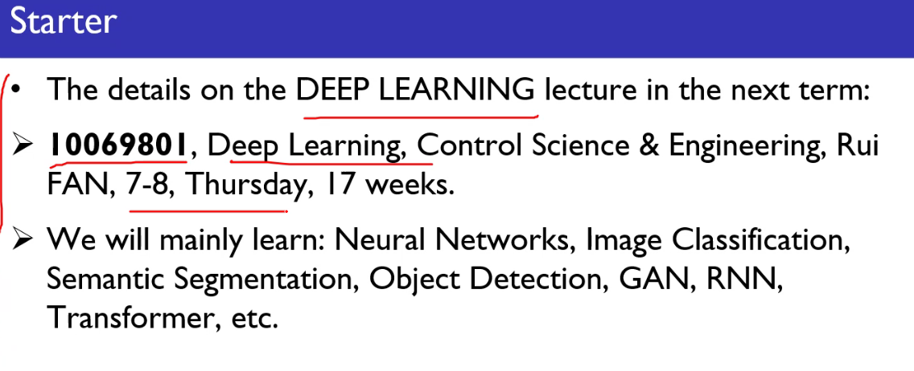

# 1 Optical Flow Theory

光流可视化

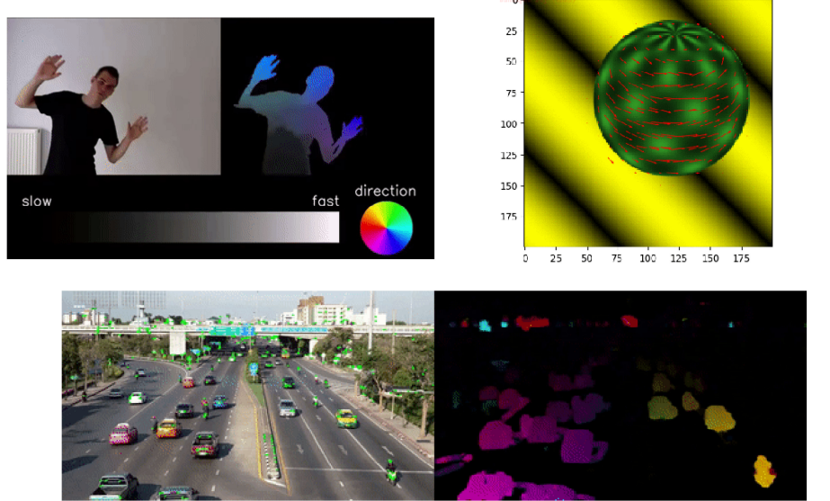

*   光流是由于观察者和场景之间的相对情感而引起的视觉场景中物体、表面和边缘的明显运动模式。

*   光流也可以定义为图像中亮度图案移动的可视化速度分布。

*   机器人专家也使用光流这个术语，包括图像处理和导航控制的相关技术，包括动作感应、对象分割、接触时间信息、扩展计算的焦点、亮度、运动补偿编码和立体视差测量。

*   光流估计是一个二维的研究问题。

## 1.1 Mathematics

光流估计方法尝试在两个图像（t 和 t+$\Delta t$）在每个元素位置进行移动的一个计算。

**亮度恒定性约束**：

$$
I(x,y,t) = I(x+\Delta x ,y+\Delta y ,t+\Delta t)
$$

假设移动很小，泰勒展开，

$$
\begin{aligned} I(x+\Delta x, y+\Delta y, t+\Delta t) \approx & I(x, y, t) \ &+\frac{\partial I}{\partial x} \Delta x+\frac{\partial I}{\partial y} \Delta y+\frac{\partial I}{\partial t} \Delta t \ &+\text { higher-order terms } \end{aligned}
$$

> 深度学习里面，Vx,Vy一般用的是距离，但是传统的推导Vx,Vy指的是速度。为什么？

> 因为距离训练起来要容易得多，另一方面已知采样频率可以推算出来速度。

线性化，忽略高阶项，

$$
\frac{\partial I}{\partial x} \Delta x+\frac{\partial I}{\partial y} \Delta y+\frac{\partial I}{\partial t} \Delta t=0
$$

或者，都除以$\Delta t$,

$$
\frac{\partial I}{\partial x} \frac{\Delta x}{\Delta t}+\frac{\partial I}{\partial y} \frac{\Delta y}{\Delta t}+\frac{\partial I}{\partial t} \frac{\Delta t}{\Delta t}=0
$$

得，

$$
\frac{\partial I}{\partial x}V\_x+\frac{\partial I}{\partial y} V\_y+\frac{\partial I}{\partial t} =0
$$

则，$(V\_x,V\_y)$就是光流(推导可见，光流实际上是速度)

重写为，

$$
I\_xV\_x + I\_yV\_y=-I\_t \text{ or } \nabla I \cdot \vec{V} = -I\_t
$$

这是一个由两个未知数组成的方程，不能以这种方式求解。这就是所谓的光流算法的**孔径问题**。

要解这个方程需要另一组等式，由一些额外的约束给定。

所有的光流估计方法都引入了额外的条件来估计实际的光流。

## 1.2 Aperture problem 孔径问题

孔径问题，只看左边的小孔，猜它的运动方向？

实际上有多种运动方向，都可以带来这种运动效果

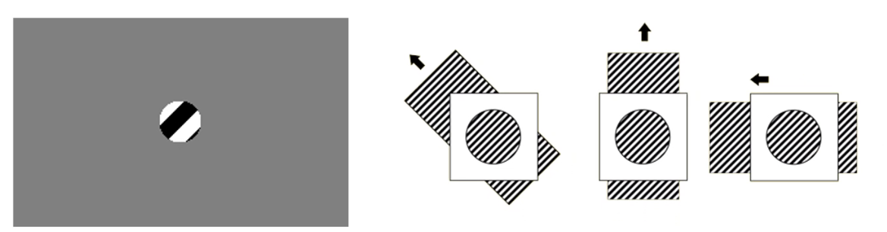

详见这个网站：[https://elvers.us/perception/aperture/](https://elvers.us/perception/aperture/ "https://elvers.us/perception/aperture/")

# 2 Lucas-Kanade method

在计算机视觉中，Lucas-Kanade 方法是 BruceD.Lucas 和 Takeo Kanade 发展的一种广泛应用的光流估计微分方法。

该方法假定光流在所考虑像素的局部邻域内基本不变，并用最小二乘法求解该邻域内所有像素的基本光流方程。

Lucas-Kanade 方法通过合并邻近像素的信息，可以解决光流方程固有的模糊性问题。

它对图像噪声的敏感性也低于逐像素方法。

$$
I\_xV\_x + I\_yV\_y=-I\_t
$$

Lucas-Kanade方法假定图像内容在两个邻近瞬间(帧)之间的位移很小，并且在点 p 的邻域内近似恒定。

因此，可以假定对于以 p 为中心的窗口内的所有像素，光流方程都成立，即局部图像流(速度)向量($V\_x,V\_y$)必须满足

$$
I\_x(\bm q\_1)V\_x + I\_y(\bm q\_1)V\_y=-I\_t(\bm q\_1) \\
I\_x(\bm q\_2)V\_x + I\_y(\bm q\_2)V\_y=-I\_t(\bm q\_2) \\

.\\.\\.\\
I\_x(\bm q\_n)V\_x + I\_y(\bm q\_n)V\_y=-I\_t(\bm q\_n) \\
$$

这里，$\bm q$是一个窗口内的像素

将这些等式改写为矩阵的形式$\bm A \bm v  = \bm b$

$$
\mathbf{A}=\left\[\begin{array}{cc}I\_{x}\left(q\_{1}\right) & I\_{y}\left(q\_{1}\right) \ I\_{x}\left(q\_{2}\right) & I\_{y}\left(q\_{2}\right) \ \vdots & \vdots \ I\_{x}\left(q\_{n}\right) & I\_{y}\left(q\_{n}\right)\end{array}\right] \quad \mathbf{v}=\left\[\begin{array}{c}V\_{x} \ V\_{y}\end{array}\right] \quad \mathbf{b}=\left\[\begin{array}{c}-I\_{t}\left(q\_{1}\right) \ -I\_{t}\left(q\_{2}\right) \ \vdots \ -I\_{t}\left(q\_{n}\right)\end{array}\right]
$$

这个系统等式数目多于未知数数目，所以是over-determined.而Lucas-Kanada 方法取得一个折中，使用least-squares 原则。顾名思义，它解决一个2x2的系统

$$
\bm A^T \bm A \bm v = \bm A^T \bm b \\
\bm v =  (\bm A^T \bm A )^{-1}\bm A^T \bm b
$$

## 2.1 Lucas-Kanade method

$$
\left\[\begin{array}{l}V\_{x} \ V\_{y}\end{array}\right]=\left\[\begin{array}{cc}\sum\_{i} I\_{x}\left(q\_{i}\right)^{2} & \sum\_{i} I\_{x}\left(q\_{i}\right) I\_{y}\left(q\_{i}\right) \ \sum\_{i} I\_{y}\left(q\_{i}\right) I\_{x}\left(q\_{i}\right) & \sum\_{i} I\_{y}\left(q\_{i}\right)^{2}\end{array}\right]^{-1}\left\[\begin{array}{c}-\sum\_{i} I\_{x}\left(q\_{i}\right) I\_{t}\left(q\_{i}\right) \ -\sum\_{i} I\_{y}\left(q\_{i}\right) I\_{t}\left(q\_{i}\right)\end{array}\right]
$$

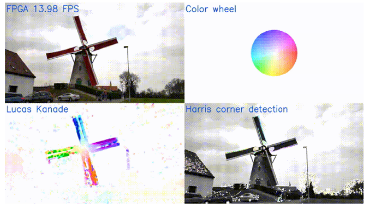

观察发现，可以找到动态物体

风车背景为什么也有光流？因为摄像机没有固定，背景在动

# 3 FlowNet

FlowNet架构在2015年被提出，是第一个预测光流的CNN.作者被CNN在分类、深度估计、语义分割等任务方面的巨大成功所激励。

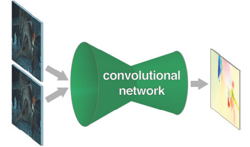

因为CNN确实很好用，下面介绍两种网络。

FlowNets 和 FlowNetCorr 模型都包含编码和解码部分，类似于U-Net 模型。编码器从两幅连续图像中抽取特征，解码器升级编码器特征图并且得到最终的光流预测。

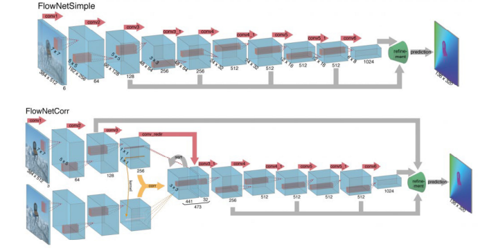

## 3.1 FlowNets

FlowNets(FlowNetSimple) 的输入是一连串两幅连续的图像。这些图像对被放在6通道的tensor，前三个属于第一张，后三个属于第二张。

编码器部分由几个卷积层和激活函数组成。这个模型允许网络决定如何操作两个固定的图像，并且为结果修正提供特征图。

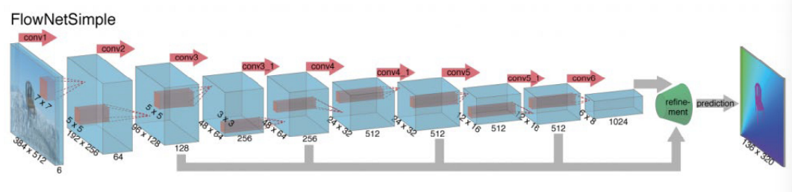

## 3.2 FlowNetCorr

FlowNetCorr模型同一时间只使用一张图作为输入，所以图片不需要固定。在这个网络中，作者使用共享权重的 CNN 的第一阶段分别从两个连续的图像中提取特征。下一步是分别从第一帧和第二帧合并计算出两个特征映射。为此，作者介绍了一种新的技术，称为相关层（Correlation），这是FlowNets 和FlowNetCorr之间主要的区别 。

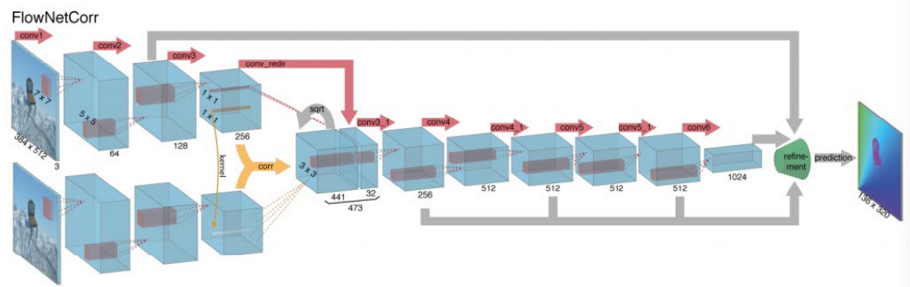

对于第一幅和第二幅特征图，以 X、 x2为中心的两个方块的相关公式分别定义为:

$$
\operatorname{corr}\left(\mathbf{x}*{1}, \mathbf{x}*{2}\right)=\sum\_{\mathbf{0} \in\[-k, k] \times\[-k, k]}\left\langle\mathbf{f}*{1}\left(\mathbf{x}*{1}+\mathbf{0}\right), \mathbf{f}*{2}\left(\mathbf{x}*{2}+\mathbf{0}\right)\right\rangle
$$

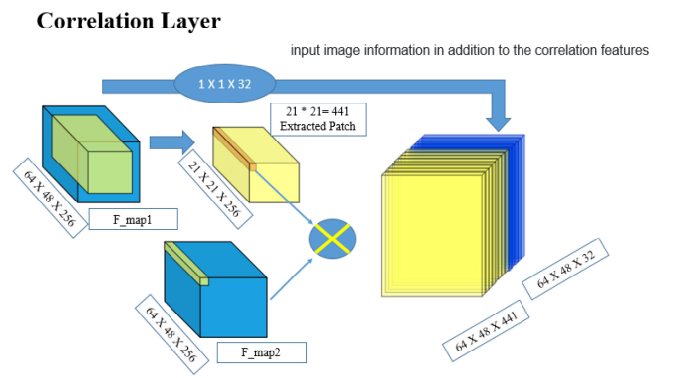

在做完两个特征图像匹配之后，相关结果向前传递给到剩下的卷积层进行高维特征提取。

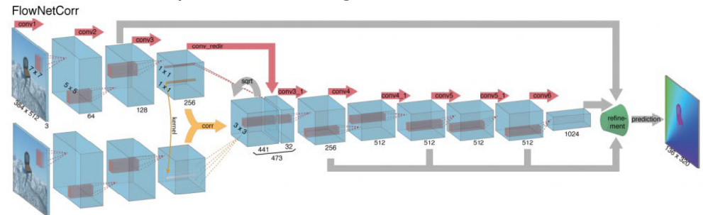

可训练的上卷积层用于解码器阶段的顶级编码器的光流输出。每个解码器阶段连接来自前一阶段的升级结果和来自相应编码器层的特征映射。使用编码器的数据有助于预测细节，就像在 U-Net 中所做的那样。

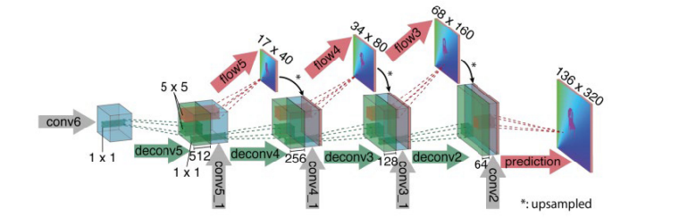

## 3.3 Optical flow applications

二维搜索方面的应用：

*   Direct SLAM

*   Multi-task learning(depth estimation,semantic segmentation,poseestimation,etc.)

*   Semi-supervised learning for other perception tasks

*   Flow2stereo

*   Motion tracking

*   Dynamic object detection

Multi-task learning (UnOS,CVPR'19)

")

Deep feature flow for video recognition (CVPR'17)

")

# 4 Scene Flow (2D to 3D)

场景流是场景中完全或部分移动的密集或半密集的3D 运动场。

在机器人技术中，它可以用于在需要预测周围物体运动的动态环境中进行自主导航或操作.此外，它还可以补充和改进最先进的 state-of-the-art Visual Odometry和 SLAM 算法，这些算法通常被认为可以在固定或准固定环境中工作。另一方面，它可以用于人-机器人或人-计算机交互，以及虚拟和增强现实。

Scene flow demo

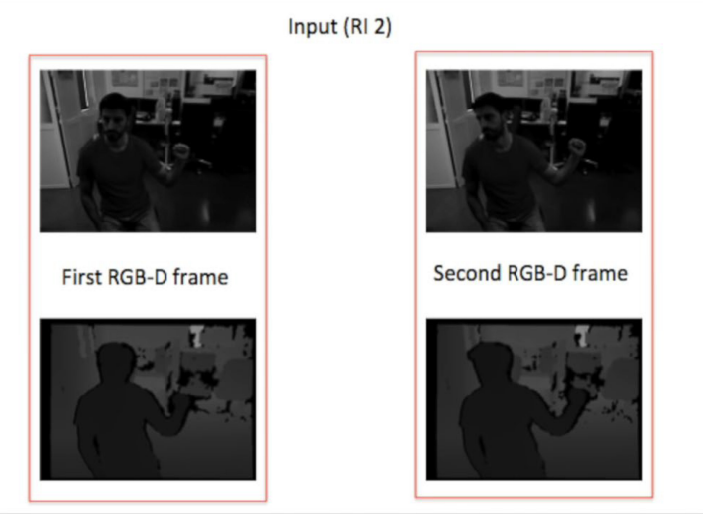

它结合了空间立体和时间约束，恢复3D 的移动向量

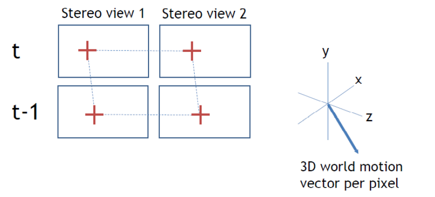

Scene flow demo

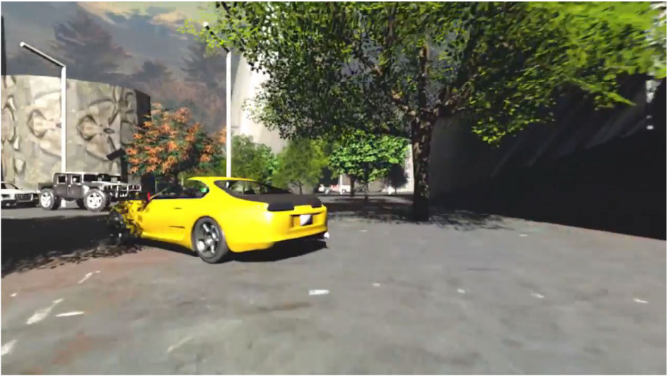

Scene flow demo

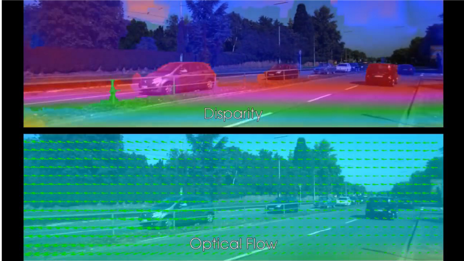

# Homework

Read these materials:

[http://16623.courses.cs.cmu.edu/slides/Lecture](http://16623.courses.cs.cmu.edu/slides/Lecture "http://16623.courses.cs.cmu.edu/slides/Lecture") 19.pdf (direct visualSLAM)

[https://www.sciencedirect.com/science/article/abs/pii/S0031320321000480](https://www.sciencedirect.com/science/article/abs/pii/S0031320321000480 "https://www.sciencedirect.com/science/article/abs/pii/S0031320321000480") (Optical flow and scene flow estimation:A survey)

## 总结

*这里写总结*

***

*   重要内容总结

    1.

    2.

    3.
