# Lecture 13 Sfm and SLAM&#x20;

## 目录

*   *   [线索](#线索)

    *   [笔记](#笔记)

*   [1 Introductory to SfM and SLAM](#1-introductory-to-sfm-and-slam)

*   [2 Structure from motion (SfM)](#2-structure-from-motion-sfm)

    *   [Step1 : 收集图像](#step1--收集图像)

    *   [Step2：检测特征点](#step2检测特征点)

    *   [Step3：匹配特征点](#step3匹配特征点)

    *   [Step4：使用RANSAC 移除离群点](#step4使用ransac-移除离群点)

    *   [Step5：估计相机姿态和特征点三维坐标](#step5估计相机姿态和特征点三维坐标)

    *   [Step6：优化相机姿态和特征点三维坐标](#step6优化相机姿态和特征点三维坐标)

*   [3 vSLAM](#3-vslam)

    *   [3.1 Visual Odometry and Loop Clouse blocks](#31-visual-odometry-and-loop-clouse-blocks)

    *   [3.2 Egomotion estimation自运动估计](#32-egomotion-estimation自运动估计)

    *   [3.3 Summary](#33-summary)

*   [Homework](#homework)

    *   [总结](#总结)

## 线索

*这里写主要线索*

***

1.

2.

3.

4.

5.

<!---->

1.

## 笔记

*这里是主要的笔记内容*

***

author：Yi Yang & Zhengpu Wang

# 1 Introductory to SfM and SLAM

即时定位与地图构建(SLAM，Simultaneous localization and mapping)是一个机器人应用，通常用于自动驾驶汽车、移动机器人和无人机，获取它们的位置并构建一个全局环境地图。

一个自动驾驶汽车系统由两个主要部分组成: 1)硬件(HW)和2)软件(SW)。

硬件: 汽车传感器和汽车底盘。&#x20;

软件: I)感知，2)定位映射，3)预测和路径规划; 4)控制。

汽车传感器包括摄像头、激光雷达、 IMU、 GPS 等。通常都是使用多个传感器的。

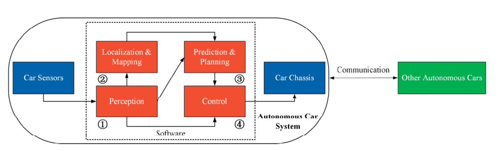

*   感知模块对原始传感器数据进行分析，输出汽车所使用的环境信息。定位与映射模块不仅可以估计车辆的位置，还可以建立和更新三维世界地图。

*   预测模块分析其他交通工具的运动模式，预测汽车的未来轨迹。

*   规划模块根据感知、定位和映射以及预测信息确定可能的安全车辆导航路线。

*   控制模块根据预测的轨迹和估计的车辆状态向油门、制动或转向扭矩发送适当的指令。

运动结构(SfM)是一种摄影测量距离成像技术，用于从可能与局部运动信号耦合的二维图像序列中估计三维结构。它在计算机视觉和生物视觉领域进行研究。在生物视觉中，SfM 是指人类(和其他生物)可以从运动物体或场景的投影二维(视网膜)运动场中恢复三维结构的现象。

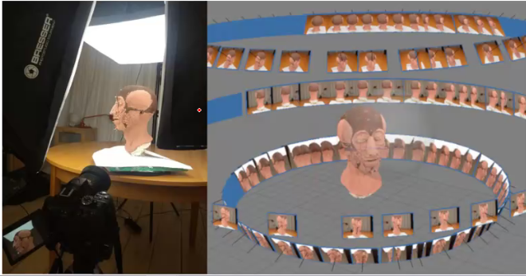

SfM 和 SLAM 都是十分综合的 CV 和机器人问题。所以同学最好复习一下之前Lecture中的数学部分。

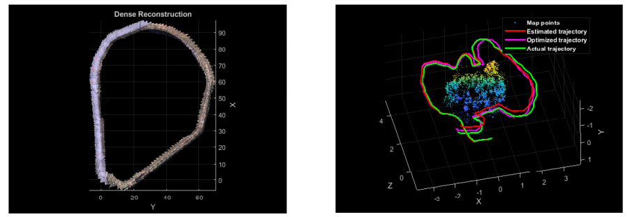

SfM和SLAM的区别

> 🥇Sfm : 侧重struction
>
> SLAM ： 侧重location ，评估真实轨迹和估计轨迹的相似度

# 2 Structure from motion (SfM)

SfM典型六步：

1.  收集图像

2.  检测特征点

3.  匹配特征点

4.  使用RANSAC 移除离群点

5.  估计相机姿态和特征点三维坐标

6.  优化相机姿态和特征点三维坐标

注：RANSAC来消除离群点 ， 避免离群点对最小二乘法拟合的影响

## Step1 : 收集图像

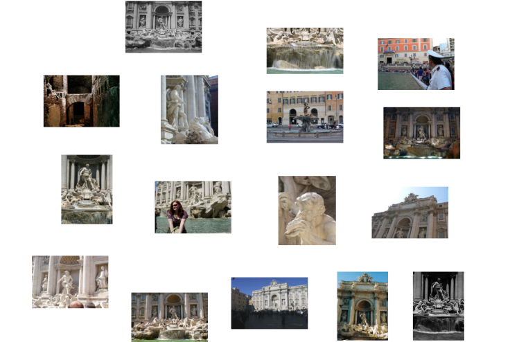

## Step2：检测特征点

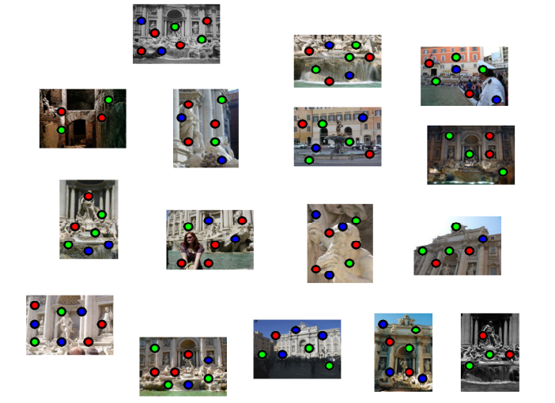

## Step3：匹配特征点

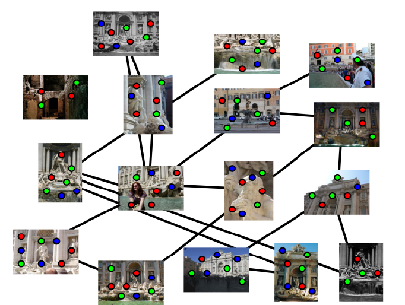

## Step4：使用RANSAC 移除离群点

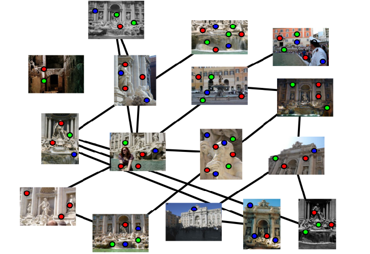

## Step5：估计相机姿态和特征点三维坐标

给定，带有n个固定3D点的m张图片

$$
\lambda\_{i j} \mathbf{x}*{i j}=\mathbf{P}*{i} \mathbf{X}\_{j}, i=1, \ldots, m ; j=1, \ldots n
$$

问题：根据 mn 对应项$\bm  X\_ij$估计 m个 投影矩阵 $\bm P\_i$ 和 n 个3D点 $\bm X\_j$

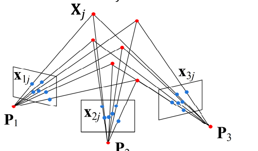

## Step6：优化相机姿态和特征点三维坐标

最小化：

$$
\sum\_{i=1}^{m} \sum\_{j=1}^{n} w\_{i j}\left|\mathbf{x}*{i j}-\frac{1}{\lambda*{i j}} \mathbf{P}*{i} \mathbf{X}*{j}\right|^{2}
$$

这里 w 是一个可见性标志

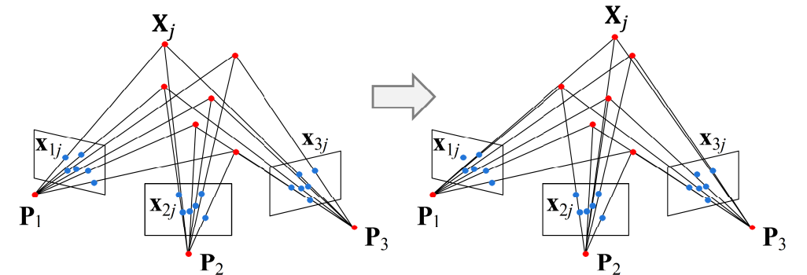

ETH Structure from Motion Dataset

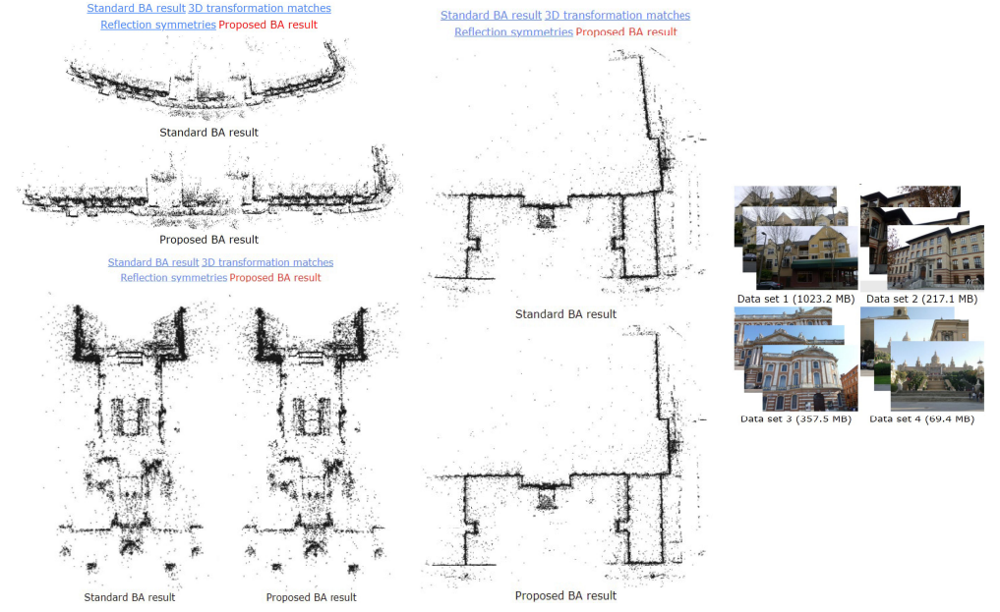

[https://cvg.ethz.ch/research/symmetries-in-sfm/](https://cvg.ethz.ch/research/symmetries-in-sfm/ "https://cvg.ethz.ch/research/symmetries-in-sfm/")

BigSFM:Reconstructing the World from Internet Photos

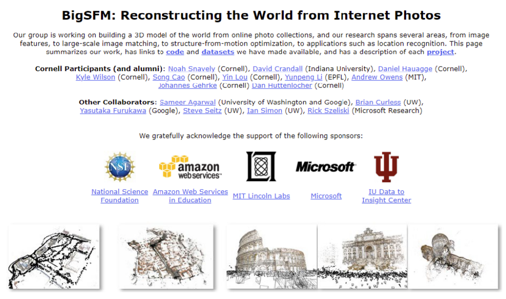

[https://www.cs.corncll.cdu/projccts/bigsfm/](https://www.cs.corncll.cdu/projccts/bigsfm/ "https://www.cs.corncll.cdu/projccts/bigsfm/")

# 3 vSLAM

## 3.1 Visual Odometry and Loop Clouse blocks

SLAM 的主要目标是获得机器人路径的全局一致估计。环境地图通常只是为了帮助本地化而保存的。

地图信息是利用视觉里程计和环路检测（Visual Odometry and Loop Clouse blocks）。当检测到一个环路闭合时，这个信息被用来减少贴图和姿态校正中的漂移。

闭环检测是 SLAM 除定位外的一个关键问题。

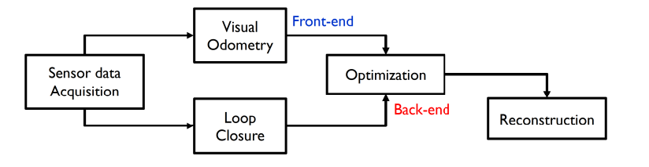

> 累计误差越来越大，通过检测回环点，做一些优化（把曲线拉上来）

视觉里程测量是视觉 SLAM 的主要组成部分之一，其他主要组成部分有环路聚合、后端优化和重构。

重构在经典的 SLAM 方法中似乎是不必要的，但是大多数应用程序需要一个密集的环境表示，这是由重建块提供的。

密集地图可用于导航、避障和机器人应用中的交互。

大多数现有的视觉里程测量方法基于以下6个步骤：

1.  获取输入图像: 使用单个相机，立体相机，或全方位相机。(Lecture 2)

2.  图像校正: 应用图像处理技术去除透镜失真等(Lecture4)&#x20;

3.  特征提取: 定义兴趣操作符，跨帧匹配特征并构建一个光流场。

4.  特征提取和相关性。(Lecture 03/05/06/12)

    *   使用相关性，而不是长期的特征跟踪，来建立两幅图像的对应关系。

    *   构造光流场(Lucas-Kanade 法)

&#x20;5\. 根据光流估计摄影机的运动。(Lecture 03/04/05/06)

*   方法1: 状态估计分布维护的卡尔曼滤波器。

*   方法2: 找出特征的几何和3D 属性，最小化基于两个相邻图像之间重新投影误差的代价函数。这可以通过数学最小化或随机抽样来完成。

6\. 定期重新填充跟踪点，以保持图像的覆盖率。(Lecture 10/I 1/12)

## 3.2 Egomotion estimation自运动估计

Egomotion 被定义为一个摄像机在一个环境中的3D 运动。自运动估计的过程就是计算变换矩阵. 在计算机视觉中，Egomotion 估计相机相对于刚性场景（rigid scene）的运动。VO 和Egomotion estimation通常是可以互换的。

KITTI Visual Odometry/SLAM Dataset

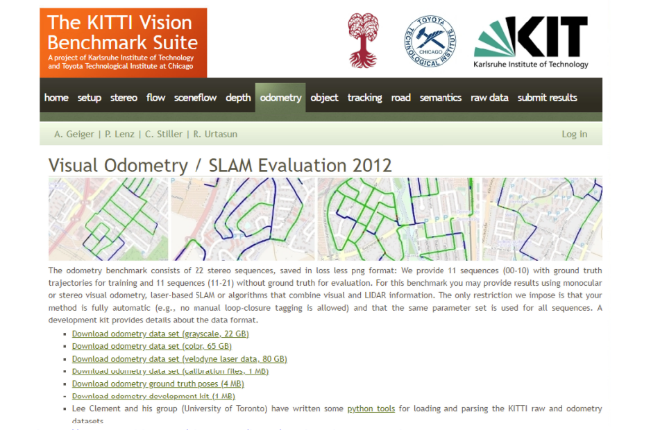

[http://www.cvlibs.net/datasets/kitti/eval\_odometry.php](http://www.cvlibs.net/datasets/kitti/eval_odometry.php "http://www.cvlibs.net/datasets/kitti/eval_odometry.php")

## 3.3 Summary

*   Structure from Motion(SfM)是从一组二维图像中估计场景的三维结构的过程。

*   Visual simultaneous localization and mapping (VSLAM)计算相机的位置和方向与其周围环境的关系，同时映射环境。

*   Visual Odometry (VO)是通过分析相关的摄像机图像来确定机器人的位置和方向的过程。它被广泛应用于各种机器人应用中。 VO 的目标是逐步恢复路径，逐姿态，并且只优化路径的最后 n 个姿势。

*   Egomotion被定义为一个摄像机在一个环境中的3D 运动。

> 🎉R.Fan : Sfm和SLAM的研究已经比较饱和了，很难出成果了。当然因为比较成熟了，所以是比较有用的。

# Homework

Read these materials:&#x20;

Structure from Motion (CVPR’16):&#x20;

[https://www.cv-foundation.org/openaccess/content\_cvpr\_2016/papers/Schonberger\_Structure-From-Motion\_Revisited\_CVPR\_2016\_paper.pdf](https://www.cv-foundation.org/openaccess/content_cvpr_2016/papers/Schonberger_Structure-From-Motion_Revisited_CVPR_2016_paper.pdf "https://www.cv-foundation.org/openaccess/content_cvpr_2016/papers/Schonberger_Structure-From-Motion_Revisited_CVPR_2016_paper.pdf")

&#x20;Review of visual odometry: [https://springerplus.springeropen.com/articles/10.1186/s40064-016-3573-7](https://springerplus.springeropen.com/articles/10.1186/s40064-016-3573-7 "https://springerplus.springeropen.com/articles/10.1186/s40064-016-3573-7")

## 总结

*这里写总结*

***

*   重要内容总结

    1.

    2.

    3.
