# Lecture14\_IPMV\_with\_Deep\_Learning

## 目录

*   *   [线索](#线索)

    *   [笔记](#笔记)

*   [1 Image classfication](#1-image-classfication)

    *   [1.1 什么是图像分类](#11-什么是图像分类)

    *   [1.2 数据驱动的技术](#12-数据驱动的技术)

    *   [1.3 materials ](#13-materials-)

*   [2 Object Detection](#2-object-detection)

    *   [2.1 什么是目标检测](#21-什么是目标检测)

    *   [2.2 Two-stage networks](#22-two-stage-networks)

    *   [2.3 Single-stage networks](#23-single-stage-networks)

    *   [2.4 materials](#24-materials)

*   [3 Semantic Segentation](#3-semantic-segentation)

    *   [3.1 什么是语义分割](#31-什么是语义分割)

    *   [3.2 Data-Fusion Semantic Segmentation](#32-data-fusion-semantic-segmentation)

    *   [3.3 materials](#33-materials)

*   [4 Generative Adversarial Network](#4-generative-adversarial-network)

    *   [4.1 什么是GAN](#41-什么是gan)

    *   [4.2 materials](#42-materials)

    *   [总结](#总结)

## 线索

本Lecture摆烂，贴图比较多。然后materials 是主要的部分，建议去看。

***

1.

2.

3.

4.

5.

<!---->

1.

## 笔记

*这里是主要的笔记内容*

***

author：Yi Yang & Zhengpu Wang

# 1 Image classfication

## 1.1 什么是图像分类

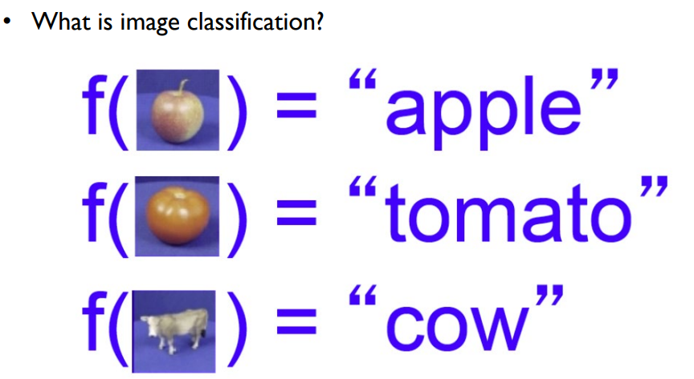

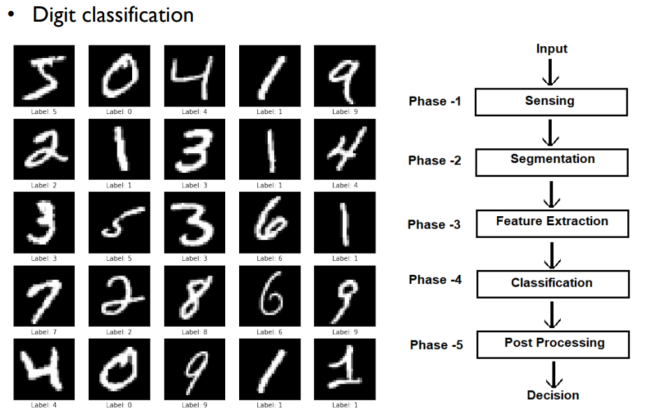

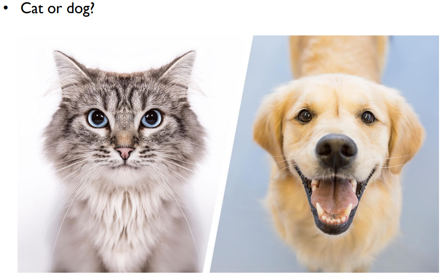

这两张图你来分类，怎么分？

传统图像处理，怎么处理？

先特征提取，再特征匹配

特征提取：霍夫变换，提取直线，处理1是比较容易的，但是  7,9,6,3这些有圆圈，不规则，所以不太好弄

猫狗分类，要写代码去识别眼睛，耳朵，鼻子

你手写的代码能用在其它猫狗身上吗？

背景不同，姿势不同，胖瘦不同，泛化能力很难保证

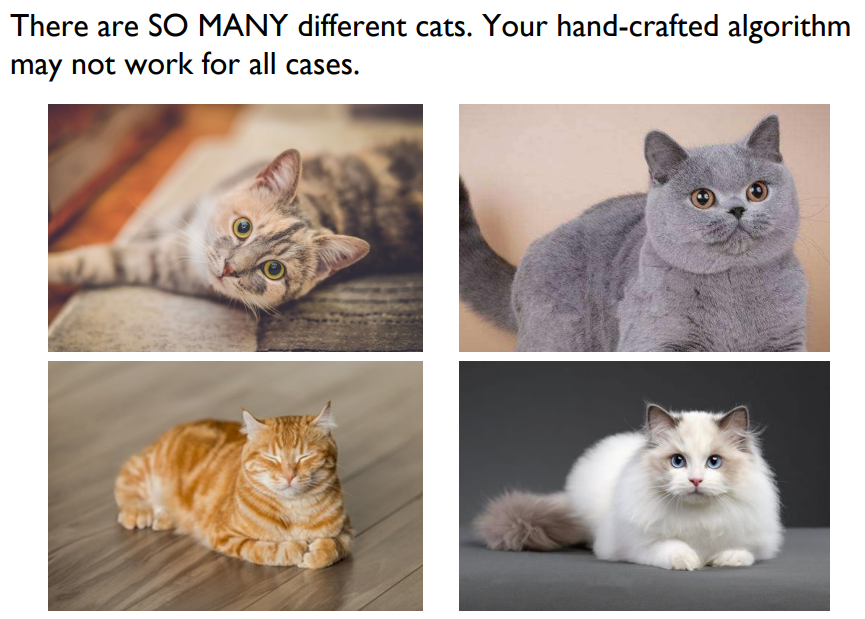

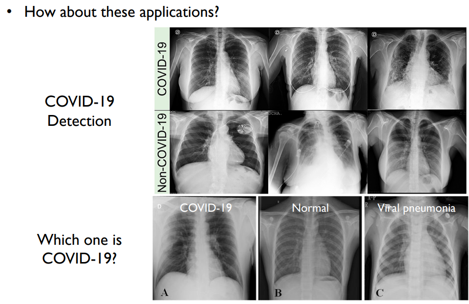

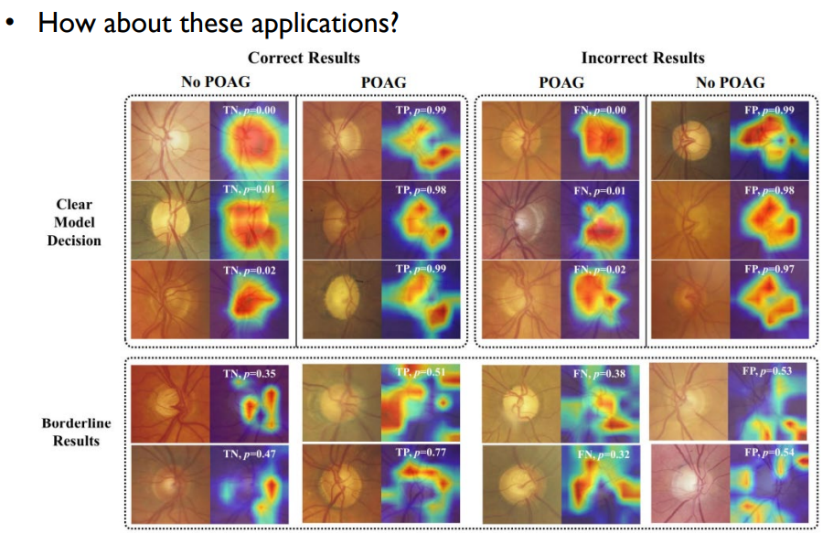

## 1.2 数据驱动的技术

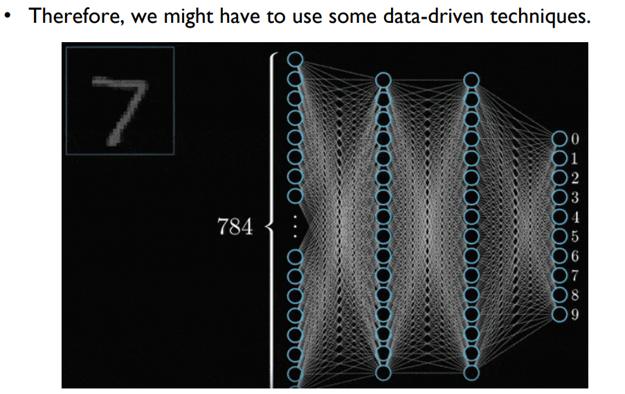

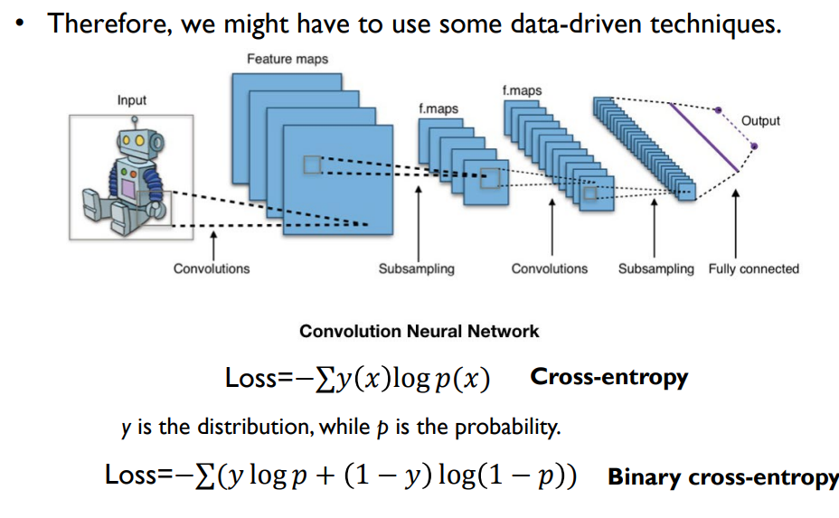

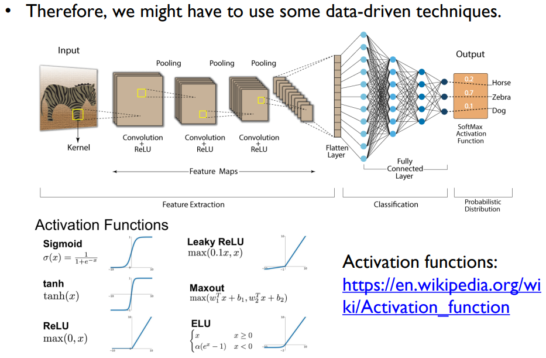

对 CNN 来说，下面两张照片几乎是一样的。CNNs不对不同特征的相对位置进行编码。对这些特性的组合进行编码需要较大的过滤器。例如，对“鼻子和嘴巴上方的眼睛”的信息进行编码需要大的过滤器。

> CNN 对位置鲁棒性很好，但也有可能造成误判

> 比如眼睛，鼻子，嘴巴 ，都有，但是打乱了位置。CNN看来一点问题没有的

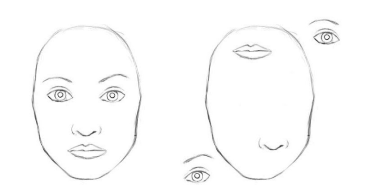

The Vision Transformer,or ViT,是一个图像分类模型，在图像的补丁上采用类似于转换器的架构。将图像分割成固定大小的片段，每个片段线性嵌入，添加位置嵌入，并将得到的矢量序列提供给标准的变压器编码器。

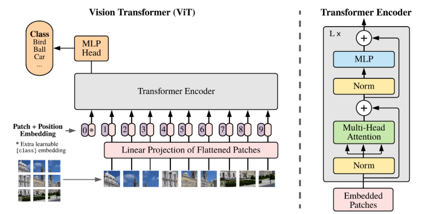

## 1.3 materials&#x20;

*   &#x20;Image classification tutorial:

    *   [https://www.cs.cornell.edu/courses/cs5670/2019sp/lectures/lec20\_image\_classification.pdf ](<https://www.cs.cornell.edu/courses/cs5670/2019sp/lectures/lec20_image_classification.pdf > "https://www.cs.cornell.edu/courses/cs5670/2019sp/lectures/lec20_image_classification.pdf ")

*   Vision Transformer:&#x20;

    *   [https://arxiv.org/pdf/2010.11929.pdf](https://arxiv.org/pdf/2010.11929.pdf "https://arxiv.org/pdf/2010.11929.pdf")&#x20;

*   Image classification with MATLAB:&#x20;

    *   [https://www.mathworks.com/products/image.html](https://www.mathworks.com/products/image.html "https://www.mathworks.com/products/image.html")&#x20;

*   Image classification with PyTorch:&#x20;

    *   [https://pytorch.org/tutorials/beginner/blitz/cifar10\_tutorial.html](https://pytorch.org/tutorials/beginner/blitz/cifar10_tutorial.html "https://pytorch.org/tutorials/beginner/blitz/cifar10_tutorial.html")&#x20;

*   ImageNet:

    *   &#x20;[https://www.image-net.org/](https://www.image-net.org/ "https://www.image-net.org/")

# 2 Object Detection

## 2.1 什么是目标检测

目标检测是一种计算机视觉技术，用于在图像或视频中定位物体的实例。目标检测算法通常利用机器学习或深度学习来产生有意义的结果。当人类看图像或视频时，我们可以在**瞬间识别和定位感兴趣的物体**。目标检测的目标是用计算机复制这种智能。

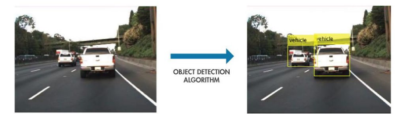

比如现在有一个训练好的分类网，怎么做物体检测？

让你去做，你有什么思路？

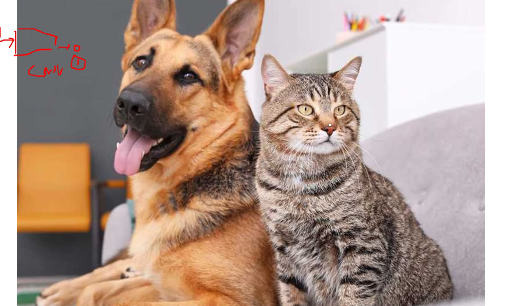

> 滑动窗口，比如用一个244x244的窗口去滑动，送到分类网里面。好的结果的位置就是物体的框。没毛病，是不是？事实上也是这么做的。

> 🧑‍🍳R.Fan 目标识别，卷的不行

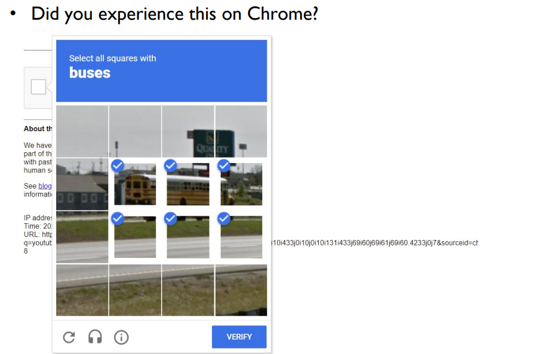

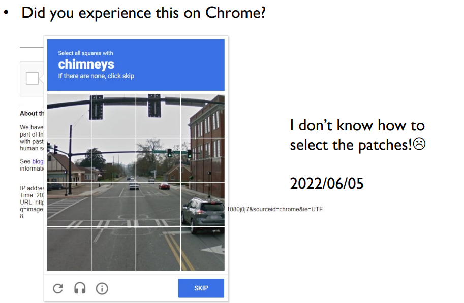

你可以从两个关键的方法中选择，使用深度学习来开始对象检测: >

*   创建并训练一个自定义object detector。要从头训练一个自定义object detector，你需要设计一个网络架构来学习感兴趣的对象的特性。您还需要编译一个非常大的标记数据集来训练 CNN。定制对象检测器的结果可以是显著的。也就是说，你需要在 CNN 中手动设置图层和重量，这需要大量的时间和训练数据。

*   使用经过预训练的 object detector。许多对象检测工作流使用深度学习杠杆转移学习，这种方法使您能够从预先训练的网络开始，然后为您的应用程序对其进行微调。这种方法可以提供更快的结果，因为对象探测器已经训练了数千，甚至数百万的图像。

无论你是创建一个定制的对象检测器还是使用一个预先训练好的对象检测器，你都需要决定使用哪种类型的目标检测网络: 两阶段网络还是单阶段网络。

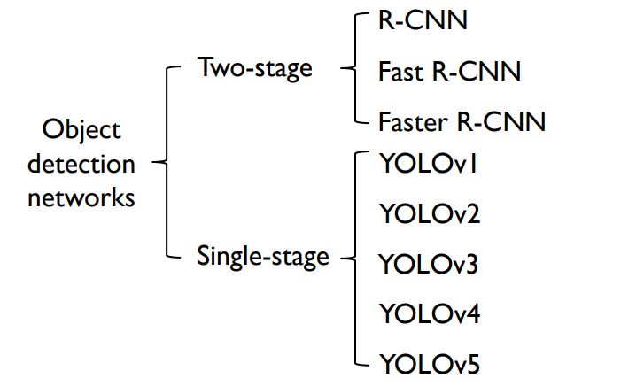

## 2.2 Two-stage networks

两阶段网络的初始阶段，如 R-CNN 及其变体，识别区域提案，或图像中可能包含一个对象的子集。第二阶段对建议区域内的对象进行分类。两阶段网络可以获得非常精确的目标检测结果，但是，它们通常比单阶段网络慢。

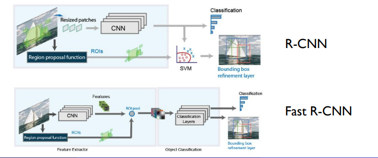

## 2.3 Single-stage networks

在像 YOLO 这样的单阶段网络中，CNN 使用锚框对整个图像中的区域进行网络预测，然后对预测进行解码，生成对象的最终边界框。单级网络可以比两级网络快得多，但它们可能达不到同样的精度水平，尤其是对于包含小对象的场景。

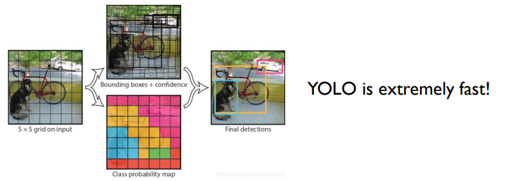

Object detection for autonomous driving

<https://www.youtube.com/watch?v=chzq2E75M84>

Object detection for parking violation detection

<https://sites.google.com/view/atg-pvd>

3D Object detection

<https://arxiv.org/pdf/1712.02294.pdf>

<https://arxiv.org/pdf/1807.02062.pdf>

## 2.4 materials

These materials can be used as reference:&#x20;

*   PyTorch tutorial:&#x20;

    *   [https://pytorch.org/tutorials/intermediate/torchvision\_tutorial.html](https://pytorch.org/tutorials/intermediate/torchvision_tutorial.html "https://pytorch.org/tutorials/intermediate/torchvision_tutorial.html")&#x20;

*   Deep learning-based object detection survey:&#x20;

    *   10.1109/TNNLS.2018.2876865&#x20;

*   3D object detection survey:&#x20;

    *   10.1016/j.patcog.2022.108796&#x20;

*   Video object detection survey:&#x20;

    *   10.1109/TNNLS.2021.3053249

# 3 Semantic Segentation

## 3.1 什么是语义分割

语义分割，或称为图像分割，是将图像中属于同一对象类的部分聚集在一起的任务。它是像素级预测的一种形式，因为图像中的每个像素都根据类别进行分类。

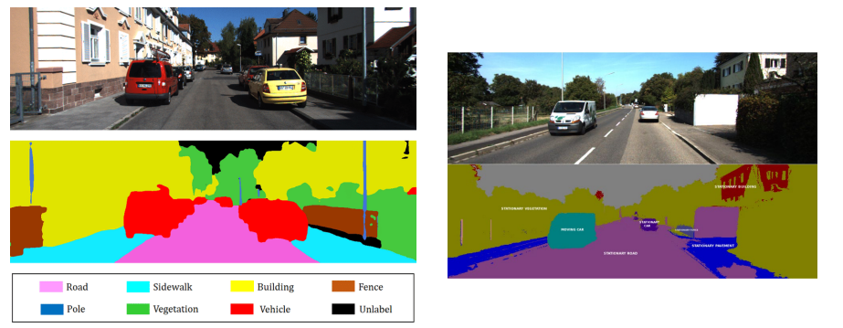

最先进的语义分割网络可以分为单模态和数据融合两类.

单模态网络只有一个输入;&#x20;

&#x20;数据融合模型有多个输入(通常是两种不同的模式)。

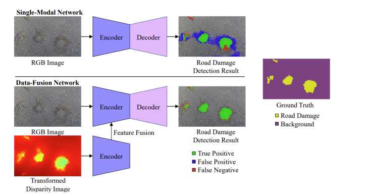

最先进的单模态网络包括 FCN、 U-Net、 DeepLabv3 + 、 PSPNet、 denseASPP、 GSCNN 等，今天我们将以 FCN 为例来了解语义分割网络是如何工作的。

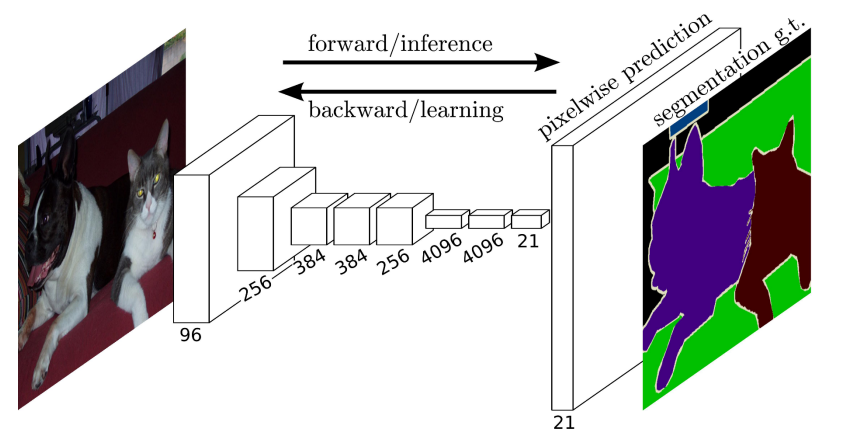

> R.Fan : Deeplabv3++ 鲁棒性最好

在分类中，传统的方法是缩小输入图像的大小，通过卷积层和完全连通(FC)层，输出输入图像的一个预测标签.

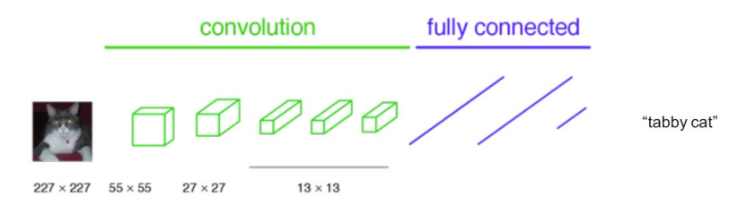

假设我们将 FC 层转换为 IX I 卷积层:

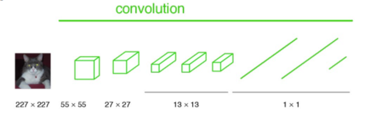

如果图像没有缩小，则输出不会是单个标签。相反，输出的大小小于输入图像(由于 max-pool)&#x20;

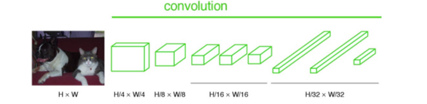

如果我们提高上面输出的样本，那么我们可以计算像素级的输出(标签贴图)如下:

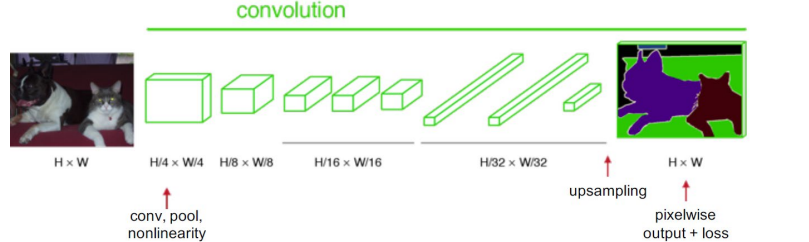

## 3.2 Data-Fusion Semantic Segmentation

数据融合网络有多个输入。结果比单模态网络的结果要好得多。我的团队致力于开发高效、准确的数据融合网络。以下架构被称为 SNE-RoadSeg:

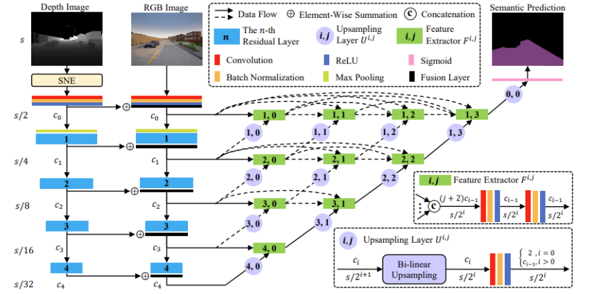

## 3.3 materials

These materials can be used as reference:&#x20;

*   PyTorch code:

    *   &#x20;[https://github.com/CSAILVision/semantic-segmentation-pytorch ](<https://github.com/CSAILVision/semantichttps://github.com/CSAILVision/semantic-segmentation-pytorch > "https://github.com/CSAILVision/semantic-segmentation-pytorch ")

*   Semantic segmentation survey:&#x20;

    *   [https://arxiv.org/pdf/2001.05566.pdf](https://arxiv.org/pdf/2001.05566.pdf "https://arxiv.org/pdf/2001.05566.pdf")&#x20;

*   SNE-RoadSeg:

    *   &#x20;[https://arxiv.org/pdf/2008.11351.pdf](https://arxiv.org/pdf/2008.11351.pdf "https://arxiv.org/pdf/2008.11351.pdf")&#x20;

*   SNE-RoadSeg+:

    *   &#x20;[https://arxiv.org/pdf/2107.14599.pd](https://arxiv.org/pdf/2107.14599.pd "https://arxiv.org/pdf/2107.14599.pd")

# 4 Generative Adversarial Network

## 4.1 什么是GAN

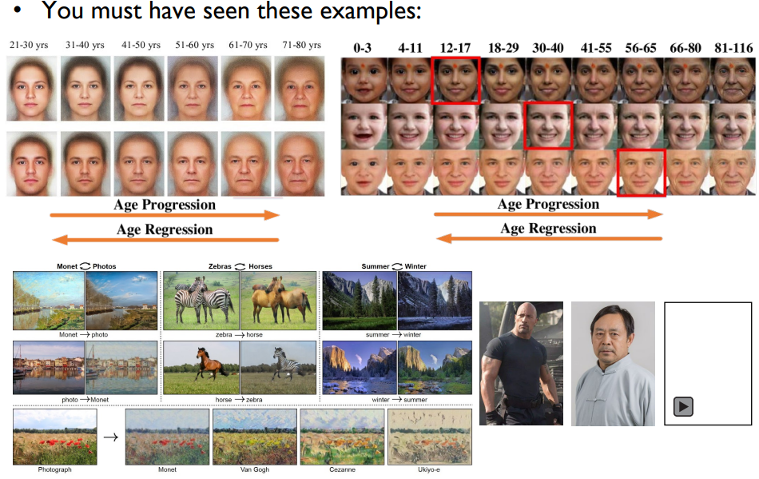

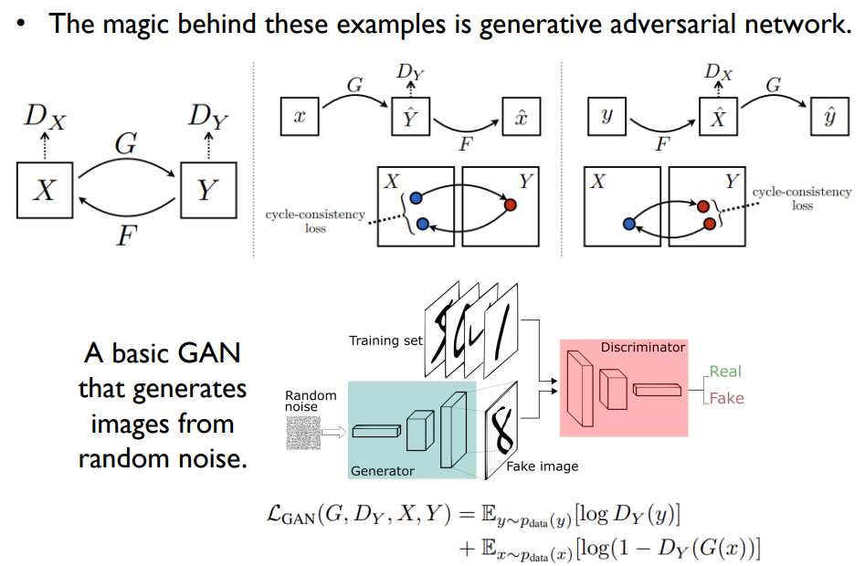

> GAN网络基本思想：一个生成器，一个辨别器。生成器的目标是生成假的图，让这个假的图越来越逼真；辨别器则是辨别真的图和假的图。两者不断地对抗。最终结果是辨别器可以很好的辨别真假， 生成器也可以生成十分逼真的图像。

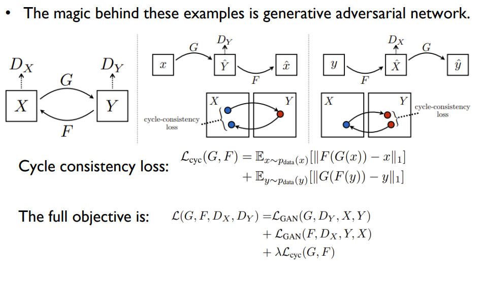

> CycleGAN: 经过G生成Y',经过F生成X'，用X'和Y'去和X和Y比较。使误差最小

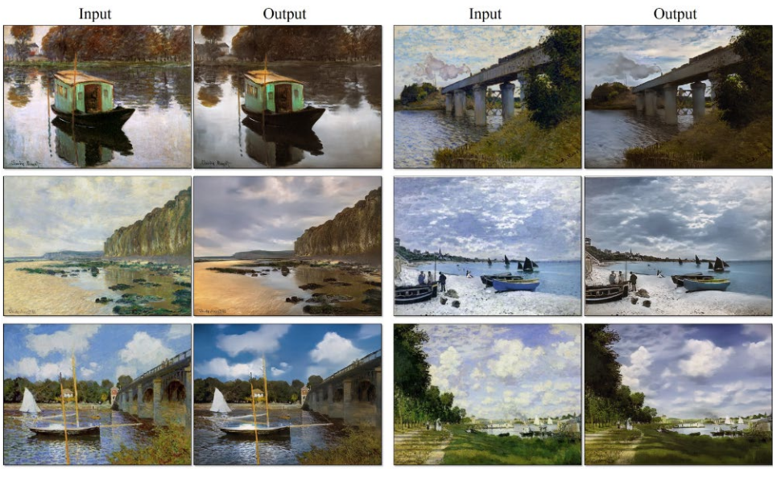

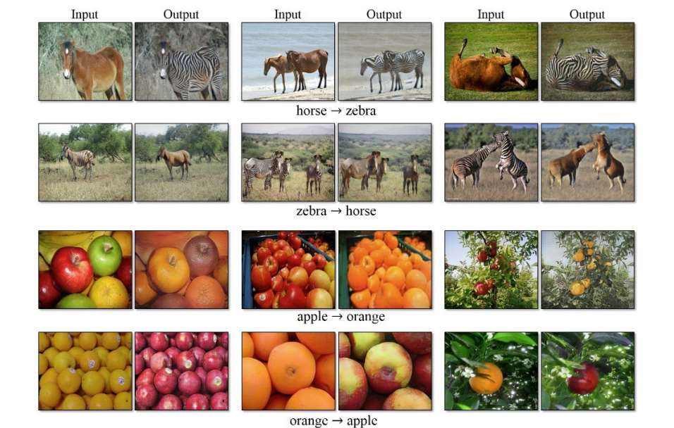

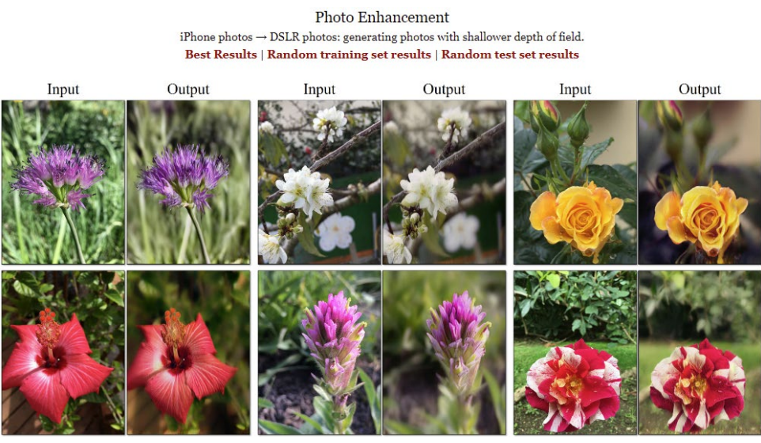

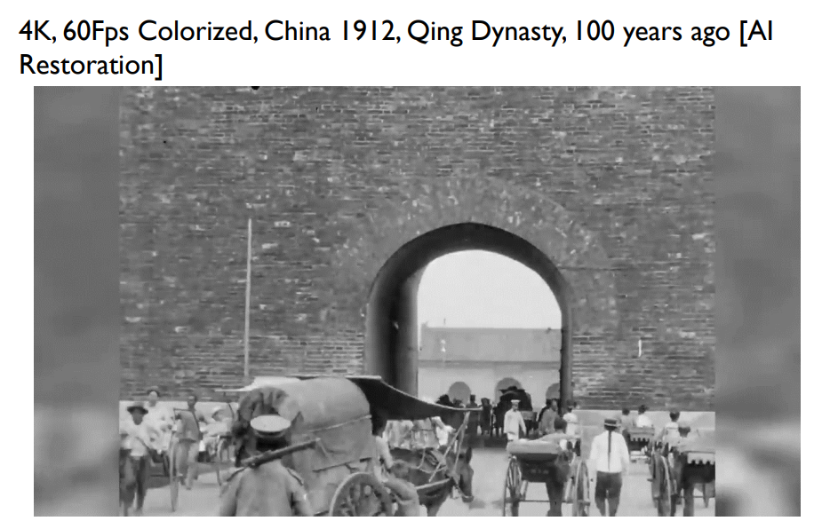

<https://www.youtube.com/watch?v=wFHlXIrL87k>

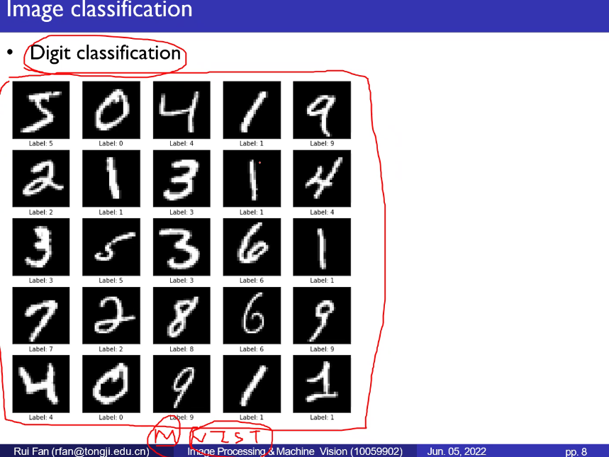

## 4.2 materials

*   CycleGAN:

    *   &#x20;[https://junyanz.github.io/CycleGAN/](https://junyanz.github.io/CycleGAN/ "https://junyanz.github.io/CycleGAN/")&#x20;

*   DCGAN:&#x20;

    *   [https://github.com/tensorflow/docs/blob/master/site/en/tutorials/generative/dcgan.ipynb ](<https://github.com/tensorflow/docs/blob/master/site/en/tutorials/generative/dcgan.ipynb > "https://github.com/tensorflow/docs/blob/master/site/en/tutorials/generative/dcgan.ipynb ")

*   GAN Survey:

    *   &#x20;[https://dl.acm.org/doi/abs/10.1145/3463475](https://dl.acm.org/doi/abs/10.1145/3463475 "https://dl.acm.org/doi/abs/10.1145/3463475")

## 总结

*这里写总结*

***

*   重要内容总结

    1.

    2.

    3.
