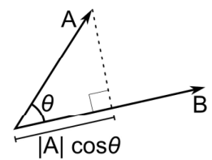
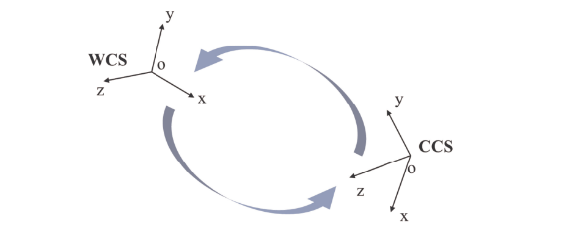
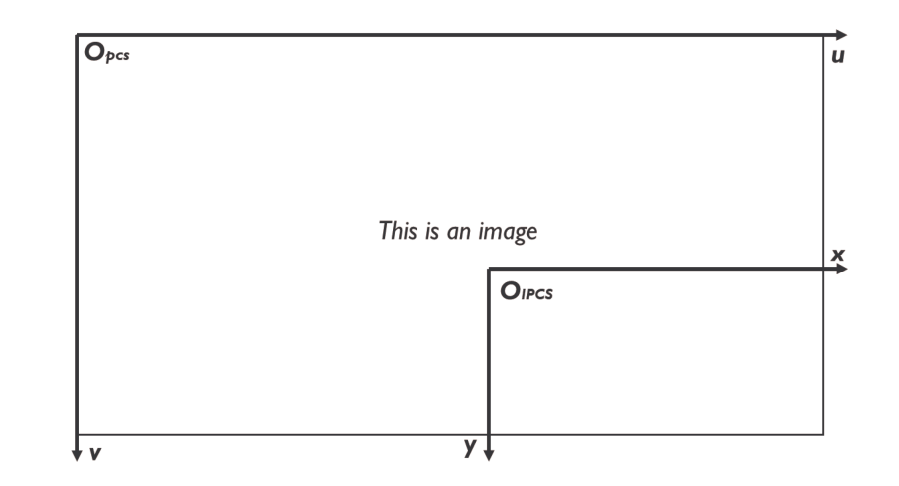
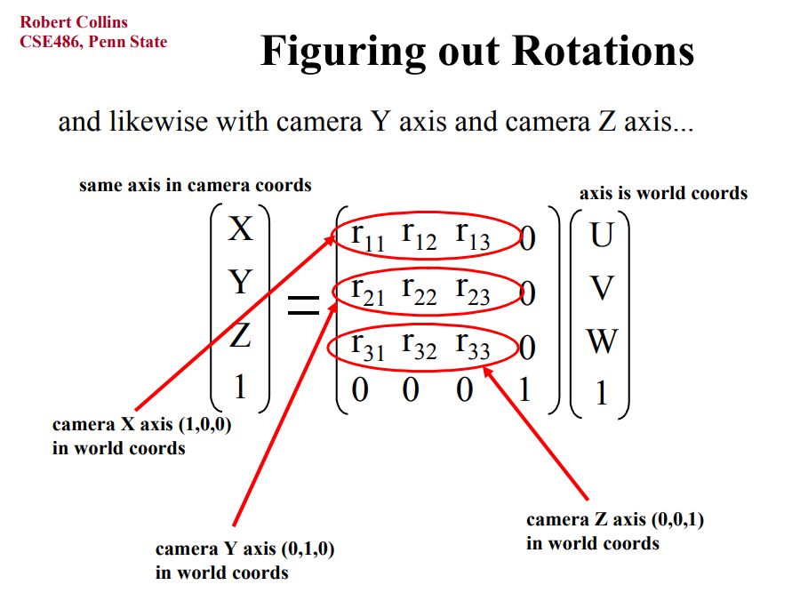

# Lecture 3 Perspective Transformation

## 目录

*   *   [线索](#线索)

    *   [笔记](#笔记)

*   [1. Preliminaries 线性代数预备知识](#1-preliminaries-线性代数预备知识)

    *   [1.1 向量点乘 dot pruduct](#11-向量点乘-dot-pruduct)

    *   [1.2 范数](#12-范数)

    *   [1.3向量叉乘 cross pruduct](#13向量叉乘-cross-pruduct)

    *   [1.4 反对称矩阵](#14-反对称矩阵)

    *   [1.５ 矩阵和向量求导](#1５-矩阵和向量求导)

        *   *   [向量求导](#向量求导)

            *   [矩阵求导](#矩阵求导)

    *   [1.６ 坐标变换](#1６-坐标变换)

        *   [1.6.1 点的旋转](#161-点的旋转)

        *   [1.6.2坐标系的旋转](#162坐标系的旋转)

            *   [二维旋转矩阵](#二维旋转矩阵)

            *   [三维旋转矩阵](#三维旋转矩阵)

*   [2.成像几何 Imaging Geometry 重点](#2成像几何-imaging-geometry-重点)

    *   [2.1 四个坐标系](#21-四个坐标系)

        *   *   [世界坐标系 WCS（world coordinate system）](#世界坐标系-wcsworld-coordinate-system)

            *   [相机坐标系 CCS（camera coordinate system）](#相机坐标系-ccscamera-coordinate-system)

            *   [图像平面坐标系 IPCS（image coordinate system）](#图像平面坐标系-ipcsimage-coordinate-system)

        *   [像素坐标系 PCS（pixel coordinate system）](#像素坐标系-pcspixel-coordinate-system)

        *   [我们的目标：来去自如](#我们的目标来去自如)

    *   [2.2 CCS to IPCS (相机坐标系到图像坐标系的透视变换)](#22-ccs-to-ipcs-相机坐标系到图像坐标系的透视变换)

    *   [2.3 WCS to CCS (世界坐标系到相机坐标系，刚体变换，旋转+平移)](#23-wcs-to-ccs-世界坐标系到相机坐标系刚体变换旋转平移)

*   [\$\$
    \bm P =
    \left\[\begin{array}
    {c | c}
    \bm R & \bm t \\\hline
    \bm 0^T & \bm 1\\
    \end{array}
    \right\]](#bm-p-leftbeginarrayc--cbm-r--bm-t-hlinebm-0t--bm-1endarrayright)

    *   [2.4 IPCS to PCS（图像坐标系到像素坐标系，通过内参矩阵Intrinsic matrix）](#24-ipcs-to-pcs图像坐标系到像素坐标系通过内参矩阵intrinsic-matrix)

*   [\$\$
    \left\[\begin{array}
    {ccc}
    u\_i\v\_i\1
    \end{array}
    \right\]](#leftbeginarraycccu_iv_i1endarrayright)

    *   [2.5是时候展现真正的技术了：从WCS世界坐标系到PCS像素坐标系的转换](#25是时候展现真正的技术了从wcs世界坐标系到pcs像素坐标系的转换)

*   [扩展阅读](#扩展阅读)

*   [总结](#总结)

## 线索

*这里写主要线索*

***

1.

2.

3.

4.

5.

<!---->

1.

## 笔记

*这里是主要的笔记内容*

***

author：Yi Yang & Zhengpu Wang

# 1. Preliminaries 线性代数预备知识

## 1.1 向量点乘 dot pruduct

$$
\boldsymbol a · \boldsymbol b \\=a\_1b\_1 + a\_2b\_2+a\_3b\_3 \\= ||\boldsymbol a||\_2||\boldsymbol b||\_2cos\theta\\=\sqrt{\boldsymbol a·\boldsymbol a}\sqrt{\boldsymbol b·\boldsymbol b}\cos \theta \\=\sqrt{\boldsymbol a^T \boldsymbol a}\sqrt{\boldsymbol b^T \boldsymbol b}\cos \theta
$$

## 1.2 范数

When $\boldsymbol a \in  \mathbb{R}^{n \times 1}$，

*   1-范数：向量元素绝对值之和 $||\boldsymbol a||*1=\sum*{k=1}^{n}|a\_k|$;

*   2-范数（欧几里得范数，常用计算向量长度）：向量元素绝对值的平方和再开方，$||\boldsymbol a||*2=\sqrt{\sum*{k=1}^{n}|a\_k|^2}$;

*   p-范数：向量元素绝对值的p次方和的1/p次幂 $||\boldsymbol a||*p=(\sum*{k=1}^{n}|a\_k|^p)^{1/p}$

    *   无穷范数 $\left||\bm a \right|| *\infin=\max\limits* i |a\_i|.\text{特别的，}\left||\bm a \right|| *{+\infin}=\max\limits* i |a\_i|,\left||\bm a \right|| *{-\infin}=\min\limits* i |a\_i|$

参考：

[(35 封私信 / 28 条消息) 0 范数、1 范数、2 范数有什么区别？ - 知乎 (zhihu.com)](https://www.zhihu.com/question/20473040?from=profile_question_card "(35 封私信 / 28 条消息) 0 范数、1 范数、2 范数有什么区别？ - 知乎 (zhihu.com)")

## 1.3向量叉乘 cross pruduct

$$
\boldsymbol a \times \boldsymbol b \\
\=|| \bm a||\_2|| \bm b||\_2\sin(\theta)\bm n
$$

## 1.4 反对称矩阵

$$

\[a]\_x=\left\[
\begin{array}
{ccc}
0 & -a\_3 & a\_2\\
a\_3 & 0 & -a\_1\\
\-a\_2 & a\_1 & 0\\
\end{array}
\right]
$$

## 1.５ 矩阵和向量求导

#### 向量求导

$ y=\[y\_1,y\_2,...,y\_m]^T  $and x is a scalar.

*   Vector-by-scalar:$\frac{\partial \bm y}{\partial x} =\[\frac{\partial y\_1}{\partial x},\frac{\partial y\_2}{\partial x},...,\frac{\partial y\_m}{\partial x}]^T$

*   Scalar-by-vector:$\frac{\partial x}{\partial \bm y} =\[\frac{\partial x}{\partial y\_1},\frac{\partial x}{\partial y\_2},...,\frac{\partial x}{\partial y\_m}]^T$

$y=\[y\_1,y\_2,...,y\_m]^T$and $x=\[x\_1,x\_2,...,x\_m]^T$

*   Vector-by-Vector:

$$

\left\[\begin{array}
{ccc}
\frac{\partial y\_1}{\partial x\_1} ,\frac{\partial y\_1}{\partial x\_2},...,\frac{\partial y\_1}{\partial x\_n}\\
\frac{\partial y\_2}{\partial x\_1} ,\frac{\partial y\_2}{\partial x\_2},...,\frac{\partial y\_2}{\partial x\_n}\\
......\\
\frac{\partial y\_m}{\partial x\_1} ,\frac{\partial y\_m}{\partial x\_2},...,\frac{\partial y\_m}{\partial x\_n}\\

\end{array}
\right]
$$

#### 矩阵求导

**Y**  = $\left\[\begin{array}
{ccc}
y\_{11} & y\_{12} & ...&  y\_{1n}\\
y\_{21} & y\_{22} & ...&  y\_{2n}\\
... & ...& ...&... \\
y\_{m1} & y\_{m2} & ...&  y\_{mn}\\
\end{array}
\right]$ is an mxn matrix.

Matrix-by-scalar: x is a scalar ,so \$
\frac{\partial \bm Y}{\partial x} =
\left\[\begin{array}
{ccc}
\frac{\partial y\_{11}}{\partial x} ,\frac{\partial y\_{12}}{\partial x},...,\frac{\partial y\_{1n}}{\partial x}\\
\frac{\partial y\_{21}}{\partial x} ,\frac{\partial y\_{22}}{\partial x},...,\frac{\partial y\_{2n}}{\partial x}\\
......\\
\frac{\partial y\_{m1}}{\partial x} ,\frac{\partial y\_{m2}}{\partial x},...,\frac{\partial y\_{mn}}{\partial x}\\

\end{array}
\right]  \$

## 1.６ 坐标变换

### 1.6.1 点的旋转

### 1.6.2坐标系的旋转

下面这个页面可以当作先验或补充知识，写的很好，可以加深理解。然后再看下面的内容。&#x20;

[附：坐标变换的理解](附：坐标变换的理解/附：坐标变换的理解.md "附：坐标变换的理解")

#### 二维旋转矩阵

附：推导方法2

#### 三维旋转矩阵

*   绕x轴旋转

$$
R\_x(\theta)=\left\[\begin{array}
{ccc}
1 & 0 & 0\\
0 & cos\theta & -sin\theta\\
0 & sin\theta & cos\theta\\

\end{array}
\right]
$$

*   绕y轴旋转

$$
R\_y(\theta)=\left\[\begin{array}
{ccc}
cos\theta & 0 & sin\theta\\
0 & 1 & 0\\
\-sin\theta & 0 & cos\theta\\

\end{array}
\right]
$$

*   绕z轴旋转

$$
R\_z(\theta)=\left\[\begin{array}
{ccc}
cos\theta & -sin\theta & 0\\
sin\theta &　cos\theta & 0\\
0 & 0 & 1\\

\end{array}
\right]
$$

*   旋转矩阵的性质

> 三维正交阵

$\bm R \bm R^T = \bm I \\
\bm R^T \bm R  = \bm I \\
{\bm R}^{-1} = {\bm R}^{T}\\
|\det (\bm R)|=\bm 1, \text {where I is an identity matrix }$

# 2.成像几何 Imaging Geometry 重点

结合R.Fan 和 Robert CollinsCSE486,Penn State 的ppt

[lecture12.pdf](file/lecture12_w1g-csSEl4.pdf)

还有这个

<https://www.cnblogs.com/jimchen1218/p/12992918.html>

## 2.1 四个坐标系

#### 世界坐标系 WCS（world coordinate system）

> 世界坐标系（world coordinate system）的原点可以放在任何地方，世界的尽头，宇宙的中心，曹县等等

#### 相机坐标系 CCS（camera coordinate system）

> 相机坐标系（camera coordinate system）的原点通常放在光心（或相机中心）。

*   Z 轴是光轴

*   图像平面坐落在距光心 焦距f 处

#### 图像平面坐标系 IPCS（image coordinate system）

3维到2维。

类似于小孔成像模型，（上图为了方便观察，把图像放在了光心前面，实际上成像应该在后面，如下图）

### 像素坐标系 PCS（pixel coordinate system）

像素，可以理解为1 pixel=dx mm ，即相机成像可以表示的最小精度。

像素坐标系和图像坐标系都是在图像平面上，区别在于原点和单位长度不一样。像素坐标系单位是 pixel ，图像坐标系 单位是mm.

### 我们的目标：来去自如

前向：用一个数学模型来描述3D世界中的一个点在2D像素坐标系中的位置。

反向：通过一个点在像素坐标系的坐标，反推出这个点在3D真实世界中的位置&#x20;

## 2.2 CCS to IPCS (相机坐标系到图像坐标系的透视变换)

根据简单的相似三角形规则，就可以推出：

$$
x=f \frac{x^C}{Z^C}\\
y=f \frac{y^C}{Z^C}\\
$$

这样就可以将CCS的点转换到IPCS，需要注意的是

> **实际的深度**$Z^C$**并不是已知的**，所以实际上相机坐标系里的图像是在光轴的射线上，可以自由滑动的。$Z^C$**需要双目相机测量或者机器学习估计深度得到。**

引入齐次坐标，用一个3D的点$(x^`,y^`,z^\`)$，来表示2D的点$(x,y,)$（通过增加一个虚构的点）

Note:$ (x,y) = (x,y,1)=(2x,2y,2)=(kx,ky,k)  $for 任意不为0的k

R.Fan的思路，放在引用页面了

[R.Fan讲CCS to IPCS](<R.Fan讲CCS to IPCS/R.Fan讲CCS to IPCS.md> "R.Fan讲CCS to IPCS")

## 2.3 WCS to CCS (世界坐标系到相机坐标系，刚体变换，旋转+平移)

世界坐标系上的一个点$\bm {p\_i^W} = \[x\_i^W,y\_i^W,z\_i^W]^T$转换到相机坐标系的一个点$\bm {p\_i^C} = \[x\_i^C,y\_i^C,z\_i^C]^T$,通过以下变换 （**旋转+平移** ）

$$
\bm p\_i^C = \bm R \bm p\_i^W + \bm t
$$

如果转换多次，则需要

$$
\bm p\_i^C =\bm R\_3( \bm R\_2(\bm R\_1 \bm p\_i^W + \bm t\_1) + \bm t\_2)+\bm t\_3  ...
$$

这样运算起来不是很方便，所以引入齐次矩阵$\bm P$,$ \widetilde{\bm p}  $是$\bm p$的齐次坐标

$$
\widetilde{\bm p}\_i^C = \bm P \widetilde{\bm p}\_i^W
$$

where

$$
\bm P =
\left\[\begin{array}
{c | c}
\bm R & \bm t \\\hline
\bm 0^T & \bm 1\\
\end{array}
\right]
=======

\left\[\begin{array}
{ccc|c}
r\_{11} & r\_{12} & r\_{13} & t\_x\\
r\_{21} & r\_{22} & r\_{23} & t\_y\\
r\_{31} & r\_{32} & r\_{33} & t\_z\\\hline
0      & 0      & 0      & 1\\
\end{array}
\right]
$$

## 2.4 IPCS to PCS（图像坐标系到像素坐标系，通过内参矩阵Intrinsic matrix）

> 图像坐标系的原点通常情况下是成像平面的中点，单位是mm，属于物理单位。而像素坐标系的单位是pixel，我们平常描述一个像素点都是几行几列。

*   内参矩阵$\bm K$(3 x 3 矩阵)常被用来联系图像平面坐标系$(x,y)$和像素坐标系$(u,v)$

*   镜头畸变并不存在在透视的相机模型，所以图像坐标系和像素坐标系可以用以下公式转换

$$
u\_i=u\_o+s\_x x\_i\\
v\_i=v\_o+s\_y y\_i\\
$$

$\bm p\_o=\[u\_o,v\_o]^T$是图像中心，$s\_x,s\_y$分别是pixels per mm，

结合下面这个图更好理解，1pixel=dx mm，$s\_x = 1/dx$pixel/mm

我们现在得到了两个等式，

$$
u\_i=u\_o+s\_x x\_i\text{ and, }v\_i=v\_o+s\_y y\_i  \\
$$

$$
x\_i=f \frac{x\_i^C}{Z\_i^C}\text{ and, }y\_i=f \frac{y\_i^C}{Z\_i^C}\\
$$

联立这两个等式，我们得到，

$$
\left\[\begin{array}
{ccc}
u\_i\v\_i\1
\end{array}
\right]
=======

\frac{1}{z\_i^C}
\left\[\begin{array}
{ccc}\
f\_x & 0 & u\_o \\
0 & f\_y & v\_o \\
0 & 0   & 1   \\
\end{array}
\right]\
\left\[\begin{array}
{ccc}
x\_i^C\y\_i^C\z\_i^C
\end{array}
\right]

$$

*   这里$\widetilde{\bm p}=\[\bm p^T,1]^T=\[u\_i,v\_i,1]^T$是$\bm p=\[u\_i,v\_i]^T$的齐次坐标

*   $u\_o,v\_o,f,s\_x,s\_y$是5个内参，有的课本会说$u\_o,v\_o,f\_x,f\_y$4个内参

定睛一看，这就是**相机坐标系到像素坐标系**的关系。可以写为：

$$
\widetilde{\bm p} = \frac {1}{z\_i^C}\bm K \bm p^C
$$

$\bm K$是内参矩阵：

$$
\bm K =
\left\[\begin{array}
{ccc}\
f\_x & 0 & u\_o \\
0 & f\_y & v\_o \\
0 & 0   & 1   \\
\end{array}
\right]\
$$

## 2.5是时候展现真正的技术了：从WCS世界坐标系到PCS像素坐标系的转换

由2.4知**相机坐标系到像素坐标系**的关系

$$
\widetilde{\bm p} = \frac {1}{z\_i^C}\bm K \bm p^C
$$

考虑**世界坐标系到相机坐标系**的关系

$$
\bm p\_i^C = \bm R \bm p\_i^W + \bm t
$$

我们可以很容易得出世界坐标系和像素坐标系的关系

$$
\bm p\_i^W=\bm R^{-1}(\bm K^{-1}\bm z\_i^C\widetilde{\bm p} - \bm t)
$$

感觉还挺nb的，不是吗？3D坐标和像素坐标随便换。哎，就是玩！

# 扩展阅读

比如这张图，Rtrain 第一行，\[0 0 1] .意思是 camera x axis 是在世界坐标系的z axis 方向。其实第一行就是camera x axis 相对于世界坐标系 x,y,z axis 的方向余弦。

# 总结

*这里写总结*

***

*   重要内容总结

    1.

    2.

    3.

\left\[\begin{array}
{ccc} &#x20;
f\_x & 0 & u\_o \\\\
0 & f\_y & v\_o \\\\
0 & 0   & 1   \\\\
\end{array}&#x20;
\right] &#x20;
