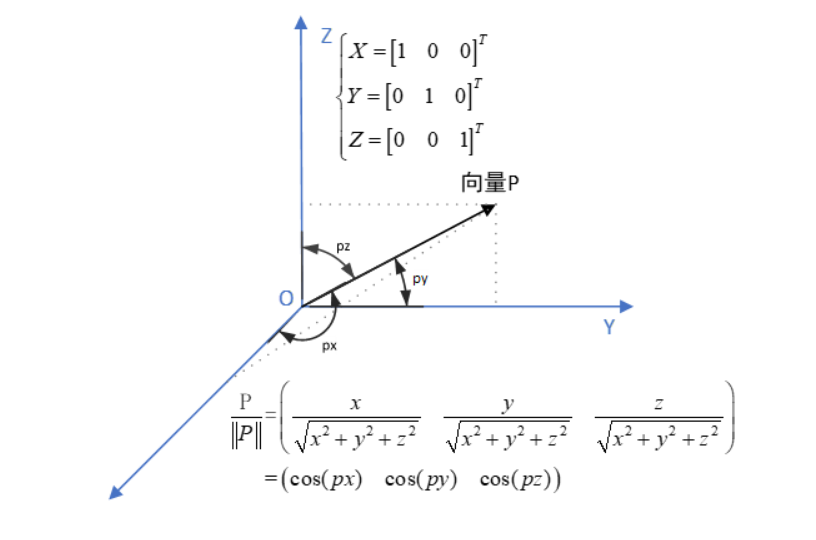
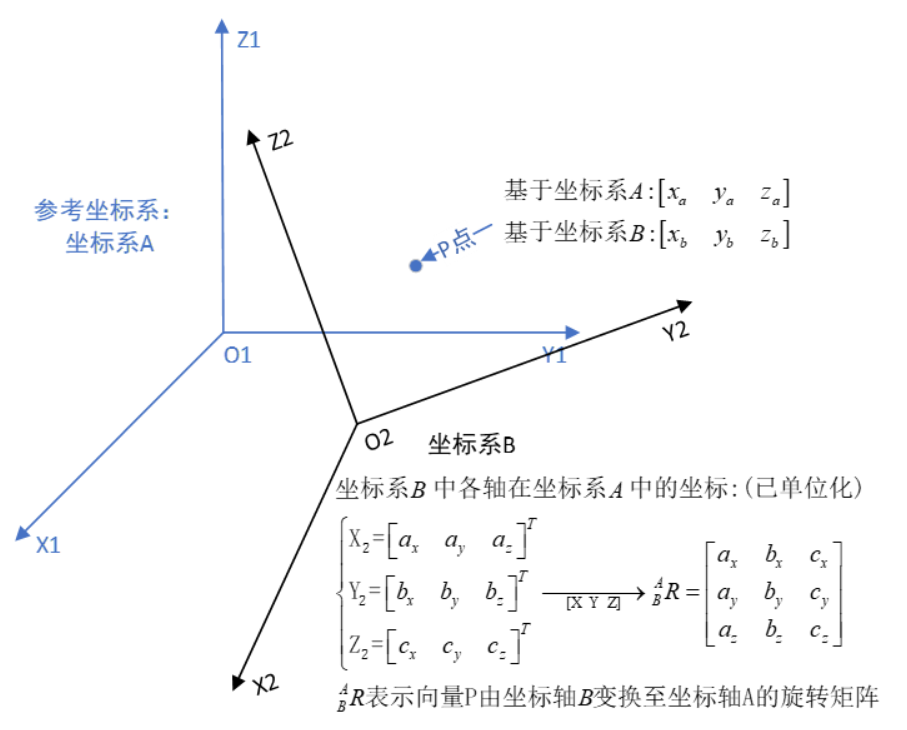
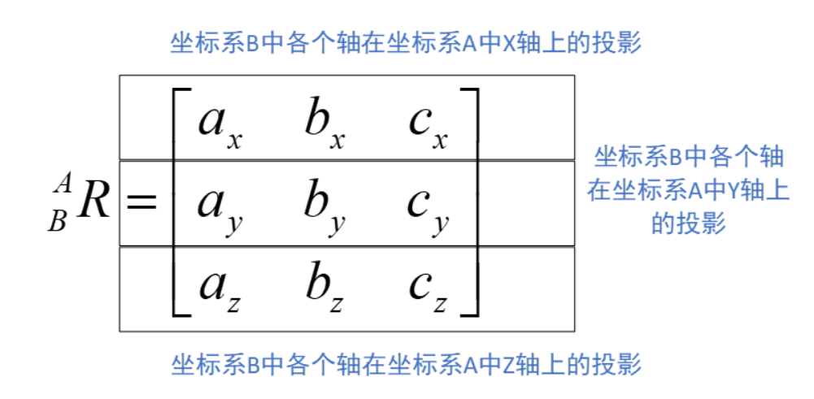
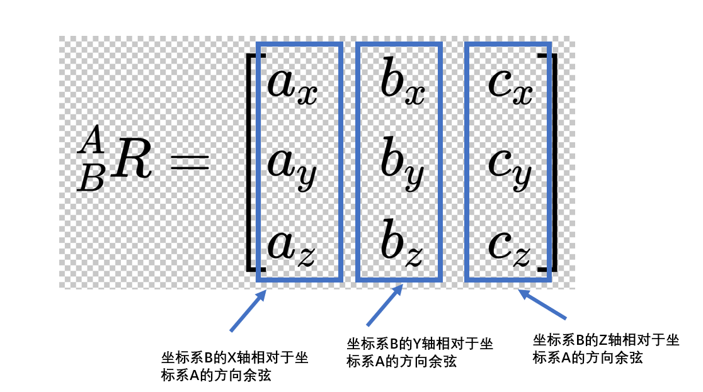
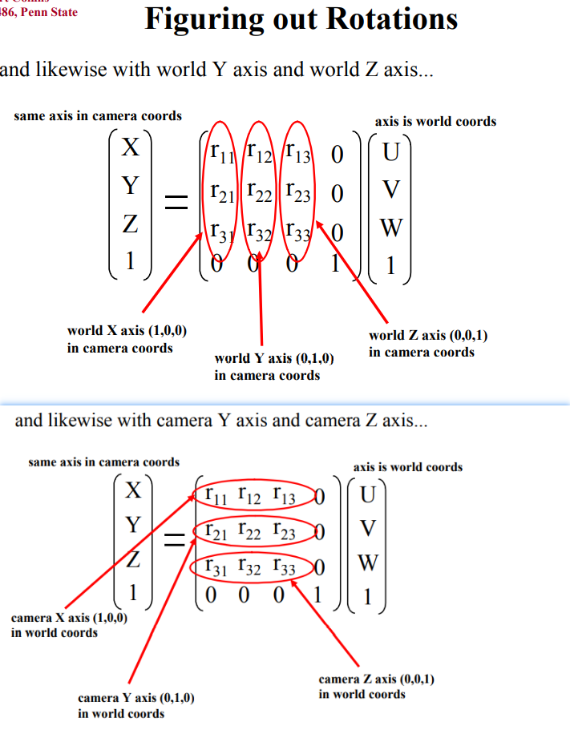
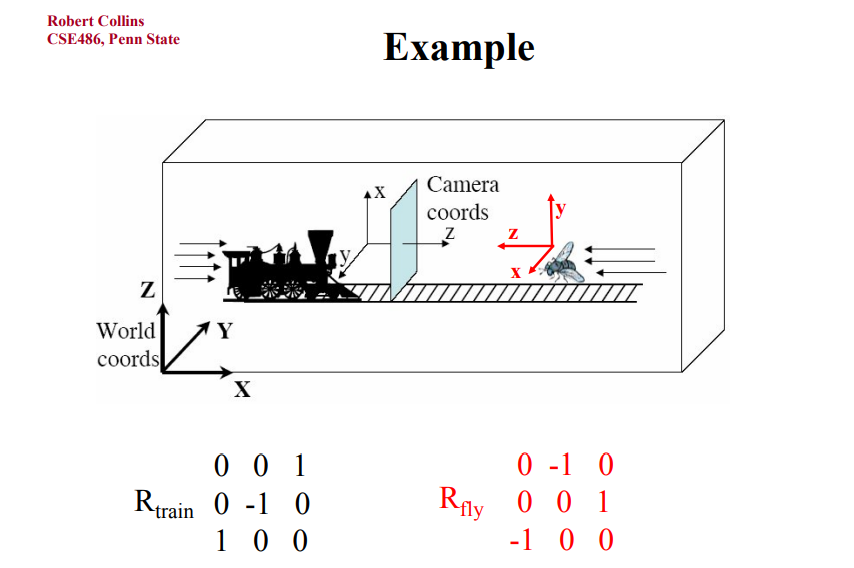

# 附：坐标变换的理解

[(61条消息) 坐标变换最通俗易懂的解释（推到+图解）\_肥肥胖胖是太阳的博客-CSDN博客\_坐标变换](https://blog.csdn.net/weixin_45590473/article/details/122848202 "(61条消息) 坐标变换最通俗易懂的解释（推到+图解）_肥肥胖胖是太阳的博客-CSDN博客_坐标变换")

#### 坐标的由来：

向量坐标的计算无非就是投影，向量p在这个坐标系X,Y,Z轴上的投影就是向量的坐标。如果一般这三个轴的方向用三个单位向量来表示。所以向量求某个方向的坐标，就是这个向量和这个方向的向量做点积就得到长度，乘以这个单位向量来给予方向。与撑开这个坐标系的所有单位向量（基向量）的点积构成的数对，就是这个向量在这个坐标系的坐标。

> 求\*\*坐标系B中向量在坐标系A中的坐标 \*\*

> 相当于**用坐标系A来表示坐标系B中的向量**

> 所以这个操作可以理解为 **由坐标系B变换至坐标系A**

> 通过将**旋转矩阵左乘向量p在B中的坐标**，就得到了p在A中的坐标

横着看，第一行是坐标系Ｂ中X，Y，Z轴在坐标系A的X轴上的投影

第二行是坐标系Ｂ中X，Y，Z轴在坐标系A的Y轴上的投影

第三行是坐标系Ｂ中X，Y，Z轴在坐标系A的Y轴上的投影

竖着看，第一列是坐标系B的X轴相对于坐标系A的方向余弦，也就是相对于坐标系A中X,Y,Z轴的$ \cos\theta
  $

比如，$R_{train}$第一列，可看作是相机坐标系的X轴在世界坐标系中的方向是$ \left [0 ,0, 1\right ]^T  $，也就是Z轴方向。其它同理。

比如，$R_{train}$第一行，可看作是世界坐标系的X轴在相机坐标系{train}中的方向是$ \left [0 ,0, 1\right ]^T  $，也就是Z轴方向。其它同理。
