# Lecture4\_Camera\_Calibration

## 目录

*   *   [线索](#线索)

    *   [笔记](#笔记)

*   [1 WCS v.s. CCS v.s. IPCS v.s. PCS](#1-wcs-vs-ccs-vs-ipcs-vs-pcs)

    *   [1.1坐标变换](#11坐标变换)

    *   [1.2 齐次坐标系 \widetilde{\bm p} = \[\bm p,1\]^T](#12-齐次坐标系-widetildebm-p--bm-p1t)

        *   [仿射变换 Affine transformation:](#仿射变换-affine-transformation)

*   [旋转，\$\bm H = \left\[  \begin{array}{}
    \cos\theta & -\sin\theta & 0 \\
    \sin\theta & \cos\theta  & 0 \\
    0         & 0           & 1 \\
    \end{array} \right\]](#旋转bm-h--left--beginarraycostheta---sintheta--0-sintheta--costheta---0-0----------0------------1-endarray-right)

*   [先旋转，再平移\$\bm H = \left\[  \begin{array}{}
    \cos\theta & -\sin\theta & t\_x \\
    \sin\theta & \cos\theta  & t\_y \\
    0         & 0           & 1 \\
    \end{array} \right\]\$\$ =\left\[  \begin{array}{c|c}
    \bm R & \bm t \\\hline
    \bm 0^T & 1\\
    \end{array} \right\]](#先旋转再平移bm-h--left--beginarraycostheta---sintheta--t_x-sintheta--costheta---t_y-0----------0------------1-endarray-right-left--beginarrayccbm-r--bm-t-hlinebm-0t--1endarray-right)

    *   *   [利用齐次坐标系求过两点直线和两条直线的交点](#利用齐次坐标系求过两点直线和两条直线的交点)

    *   [1.3消失点](#13消失点)

        *   [给定两条平行线，求图像平面的消失点](#给定两条平行线求图像平面的消失点)

        *   [下图中有多少个消失点](#下图中有多少个消失点)

*   [2 Lens Distortion 镜头畸变](#2-lens-distortion-镜头畸变)

    *   *   [2.1径向畸变](#21径向畸变)

        *   [2.2 径向畸变矫正](#22-径向畸变矫正)

        *   [2.3切向畸变矫正](#23切向畸变矫正)

*   [3 Camera Calibration相机标定](#3-camera-calibration相机标定)

    *   *   *   [Step1:使用棋盘格图案定义真实世界坐标。](#step1使用棋盘格图案定义真实世界坐标)

            *   [Step2：收集标定板的多张图片从不同的角度](#step2收集标定板的多张图片从不同的角度)

            *   [Step3：找到标定板的二维坐标系](#step3找到标定板的二维坐标系)

            *   [Step4：标定摄像机](#step4标定摄像机)

            *   [Step5：计算重投影误差并调整校准](#step5计算重投影误差并调整校准)

    *   [总结](#总结)

## 线索

*这里写主要线索*

***

1.

2.

3.

4.

5.

<!---->

1.

## 笔记

*这里是主要的笔记内容*

***

author：Yi Yang & Zhengpu Wang

# 1 WCS v.s. CCS v.s. IPCS v.s. PCS

## 1.1坐标变换

我们商定表示方法

*   WCS：World Coordinate System $(X^W,Y^W,Z^W)$

*   CCS：Camera Coordinate System $(X^C,Y^C,Z^C)$

*   IPCS/FCS：Image Plane Coordinate System or Film  Coordinate System$(x,y)$

*   PCS:Pixel Coordinate System $u,v$

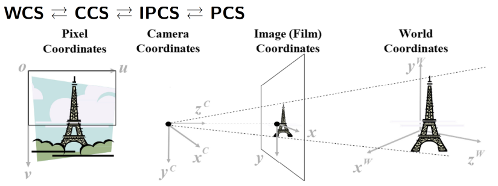

回顾 Lecture3，我们总结得到：

*   WCS $ \leftrightarrow  $CCS$ \leftrightarrow  $IPCS ，通过 小孔成像模型 Pinhole camera model

$ \bm p^C=\bm R \bm p^W +\bm t  $ or 齐次矩阵 $\widetilde{\bm p}^C = \bm P\widetilde{\bm p}^W$

齐次矩阵的意义（重点）

*   \$ \bm P\_1 =
    \left\[ \begin{array}
    {c|c}
    \bm R   & \bm t \\\hline
    \bm 0^T & \bm 1 \\

    \end {array}
    \right]  $:$ \bm P\_1 =
    \left\[ \begin{array}
    {c|c}
    \bm 1   & \bm t \\\hline
    \bm 0^T & \bm 1 \\
    \end {array}
    \right]
    \left\[ \begin{array}
    {c|c}
    \bm R   & \bm 0 \\\hline
    \bm 0^T & \bm 1 \\

    \end {array}
    \right]   \$旋转矩阵是左乘原矩阵，所以先旋转再平移

*   \$ \bm P\_2 =
    \left\[ \begin{array}
    {c|c}
    \bm R   & \bm -t \\\hline
    \bm 0^T & \bm 1 \\

    \end {array}
    \right]  $  : 同 $\bm P\_1\$，只是平移方向相反

*   \$ \bm P\_3 =
    \left\[ \begin{array}
    {c|c}
    \bm R   & \bm R\bm t \\\hline
    \bm 0^T & \bm 1 \\

    \end {array}
    \right]  $:$ \bm P\_1 =
    \left\[ \begin{array}
    {c|c}
    \bm R   & \bm 0 \\\hline
    \bm 0^T & \bm 1 \\
    \end {array}
    \right]
    \left\[ \begin{array}
    {c|c}
    \bm 1   & \bm t \\\hline
    \bm 0^T & \bm 1 \\

    \end {array}
    \right]   \$先平移再旋转

*   \$ \bm P\_4 =
    \left\[ \begin{array}
    {c|c}
    \bm R   & -\bm R\bm t \\\hline
    \bm 0^T & \bm 1 \\

    \end {array}
    \right]  $  : 同 $\bm P\_3\$，只是平移方向相反

*   IPCS$ \leftrightarrow  $PCS :内参矩阵 Intrinsic matrix

$u\_i=u\_o+s\_x x\_i\text{ and, }v\_i=v\_o+s\_y y\_i  \\$

定睛一看，这就是**相机坐标系到像素坐标系**的关系。可以写为：

$$
\widetilde{\bm p} = \frac {1}{z\_i^C}\bm K \bm p^C
$$

$\bm K$是内参矩阵：

$$
\bm K =
\left\[\begin{array}
{ccc}\
f\_x & 0 & u\_o \\
0 & f\_y & v\_o \\
0 & 0   & 1   \\
\end{array}
\right]\
$$

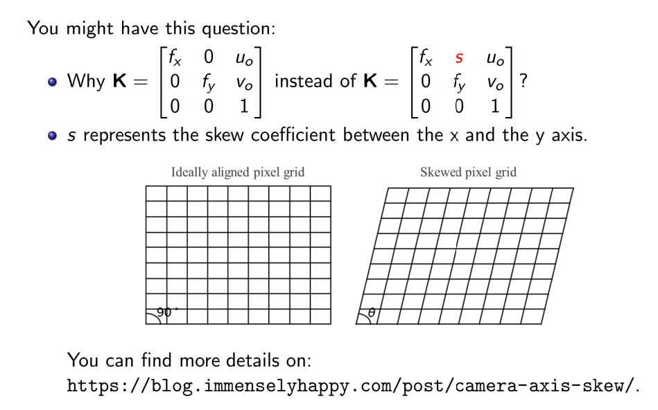

## 1.2 齐次坐标系 \widetilde{\bm p} = \[\bm p,1]^T

*   齐次坐标坐标或投影坐标是一种在射影几何中使用的坐标系统，就像在欧几里得几何中使用的笛卡尔坐标一样。

*   它们的优点是点的坐标（包括无穷远处的点）可以用有限的坐标来表示。

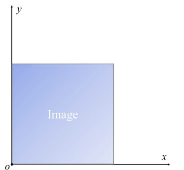

### 仿射变换 Affine transformation:

齐次坐标系：$\widetilde{\bm p} = \[\bm x,y,1]^T$

*   $\bm H = \left\[  \begin{array}{}
    \cos\theta & -\sin\theta & 0 \\
    \sin\theta & \cos\theta  & 0 \\
    0         & 0           & 1 \\
    \end{array} \right]$，$\bm p\`=\bm H \bm p$

旋转，\$\bm H = \left\[  \begin{array}{}
\cos\theta & -\sin\theta & 0 \\
\sin\theta & \cos\theta  & 0 \\
0         & 0           & 1 \\
\end{array} \right]
===================

\left\[  \begin{array}{c|c}
\bm R & \bm 0 \\\hline
\bm 0^T & 1\\
\end{array} \right]$，$\bm p\`=\bm H \bm p\$

*   $\bm H = \left\[  \begin{array}{}
    1 & 0 & t\_x \\
    0 & 1  & t\_y \\
    0         & 0           & 1 \\
    \end{array} \right]$，$\bm p\`=\bm H \bm p$

平移

*   $\bm H = \left\[  \begin{array}{}
    \cos\theta & -\sin\theta & t\_x \\
    \sin\theta & \cos\theta  & t\_y \\
    0         & 0           & 1 \\
    \end{array} \right]$，$\bm p\`=\bm H \bm p$

先旋转，再平移\$\bm H = \left\[  \begin{array}{}
\cos\theta & -\sin\theta & t\_x \\
\sin\theta & \cos\theta  & t\_y \\
0         & 0           & 1 \\
\end{array} \right]\$\$ =\left\[  \begin{array}{c|c}
\bm R & \bm t \\\hline
\bm 0^T & 1\\
\end{array} \right]
===================

\left\[  \begin{array}{c|c}
\bm I & \bm t \\\hline
\bm 0^T & 1\\
\end{array} \right]
\left\[  \begin{array}{c|c}
\bm R & \bm 0 \\\hline
\bm 0^T & 1\\
\end{array} \right]
$，$\bm p\`=\bm H \bm p\$

*   $\bm H = \left\[  \begin{array}{}
    a & -b & t\_x \\
    b & a  & t\_y \\
    0         & 0           & 1 \\
    \end{array} \right]$，$\bm p\`=\bm H \bm p$

旋转平移+缩放$ \bm H = \left\[  \begin{array}{}
a & -b & t\_x \\
b & a  & t\_y \\
0         & 0           & 1 \\
\end{array} \right]
\=\left\[  \begin{array}{c|c}
{\color{red}\lambda} \bm R & \bm t \\\hline
\bm 0^T & 1\\
\end{array} \right]  $，$\bm p\`=\bm H \bm p$

*   $\bm H = \left\[  \begin{array}{}
    \-1 & 0 & 0 \\
    0 & 1  & 0 \\
    0         & 0           & 1 \\
    \end{array} \right]$，$\bm p\`=\bm H \bm p$

沿Y轴镜像。这个怎么看呢，有个好办法。

我们说过，矩阵代表某种变换。**这个矩阵的第一列就是原来坐标系基向量**$\bm x$**对应的变换，第二列就是原来坐标系基向量**$\bm y$**对应的变换。** 原来的基向量$\bm x$$=\left\[  \begin{array}{}
1 \\
0  \\
0    \\
\end{array} \right]$,$\bm y$$=\left\[  \begin{array}{}
0\\
1 \\
0    \\
\end{array} \right]$，现在基向量$\bm x$变成了$\left\[  \begin{array}{}
\-1 \\
0  \\
0    \\
\end{array} \right]$，基向量$\bm y$没变。如下图所示，坐标系相当于对y轴做镜像。

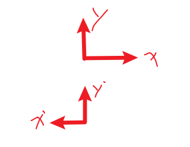

*   $\bm H = \left\[  \begin{array}{}
    1-a & 0 & 0 \\
    0 & 1+b  & 0 \\
    0         & 0           & 1 \\
    \end{array} \right]$，$\bm p\`=\bm H \bm p$

拉伸。还是上面的方法，x,y基向量方向没变，大小变了。

*   $\bm H = \left\[  \begin{array}{}
    1 & s/2 & 0 \\
    s/2 & 1  & 0 \\
    0         & 0           & 1 \\
    \end{array} \right]$，$\bm p\`=\bm H \bm p$

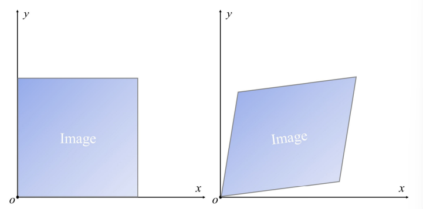

向斜右上方45度挤压（铁丝围成的长方形，沿着对角线往外拉，就这个效果）。同理，原来x=\[1，0]水平向右，现在纵向方向又有所改变。

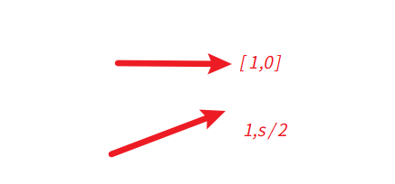

*   $\bm H = \left\[  \begin{array}{}
    1 & s' & 0 \\
    0 & 1  & 0 \\
    0         & 0           & 1 \\
    \end{array} \right]$，$\bm p'=\bm H \bm p$

横向拉伸。

*   $\bm H = \left\[  \begin{array}{}
    a & b & c \\
    d & e  & f \\
    0         & 0           & 1 \\
    \end{array} \right]$，$\bm p'=\bm H \bm p$

《蹂 躏》上面说过的，旋转，平移，拉伸，缩放都用上了。

### 利用齐次坐标系求过两点直线和两条直线的交点

让我们更好的理解齐次坐标系

*   如何求过两点的线 （2,0) ,(1,3)?

*   有两条线$\begin{cases}
    2x-y=3\\
    x+y=3\\
    \end{cases}$，试计算两条线的交点。

总结一下，齐次坐标系方法先升维再降维，有一个思维上的转换，带着投影的思路去想容易明白。

*   求过两点的线，可以从光源o点和这两个点分别连起来，就升维到了两条线。求这条线，实际上求这个透视平面（的法向量），这个透视平面和原来平面的交线就是所要求的线。

*   求两条直线的交点，升维后，实际上求这两条直线与透视点o所成的平面的交线，这条交线在原来平面上的投影就是所要求的交点。

这个是最开始学的时候的理解：

[最原始的想法](https://www.wolai.com/xrfv6aMyf62YLBEiBPgAab.md "最原始的想法")

[儒戈和cs的理论证明](https://www.wolai.com/wAweGXsYGWNgnu6i6B9p6F.md "儒戈和cs的理论证明")，nb!

## 1.3消失点

> baidu百科：**平行线的视觉相交点。** 如当你沿着铁路线去看两条铁轨，沿着公路线去看两边排列整齐的树木时，两条平行的铁轨或两排树木连线交与很远很远的某一**点**，这**点**在透视图中叫做**消失点**。

[艺术中的消失点是什么？ (eferrit.com)](https://zhcn.eferrit.com/艺术中的消失点是什么？/ "艺术中的消失点是什么？ (eferrit.com)")

*   左图，1个消失点

*   右图，2个消失点

### 给定两条平行线，求图像平面的消失点

### 下图中有多少个消失点

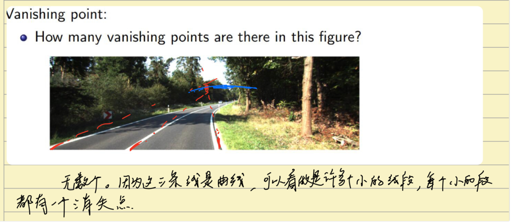

# 2 Lens Distortion 镜头畸变

> 由于透镜的固有特性（凸透镜汇聚光线、凹透镜发散光线）导致成像直线会变成曲线。

镜头畸变主要有两类:&#x20;

*   径向畸变（radial distortion）

*   切向畸变 (tangential distortion)

畸变特性：

*   径向畸变主要由于镜头的几何形状改变了直线的形状。

*   切向畸变主要由于镜头安装的时候没有与图像平面完美平行。

*   实际经验中，图像几何更加关注径向畸变，因此有时候 畸变图像校正 的过程可能会忽略切向畸变。

*   更多的内容可以看R.Fan的书：

[cvapp2022\_fan.pdf (ruirangerfan.com)](https://www.ruirangerfan.com/pdf/cvapp2022_fan.pdf "cvapp2022_fan.pdf (ruirangerfan.com)")

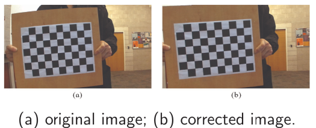

### 2.1径向畸变

径向畸变主要包括

*   桶形畸变  （barrel distortion）

*   枕形畸变  (pincushion distortion)

*   八字胡畸变 (mustache distortion)

可以看出，径向畸变图像的特点是

*   关于图像中心对称

*   直线不直

| 畸变    | 特点                                      | 场景                     |
| ----- | --------------------------------------- | ---------------------- |
| 桶形畸变  | 中心放大了，离光心越远，图像放大率越小。                    | 鱼眼镜头，广角/全景图片           |
| 枕形畸变  | 枕形畸变挤压了图片，（就像压扁的枕头）                     | 长焦镜头经常会出现枕形畸变，以消除球体效应。 |
| 八字胡畸变 | 上述两种类型的混合，它开始时是靠近光轴的桶形畸变，然后逐渐向图像边缘枕形畸变。 |                        |

### 2.2 径向畸变矫正

使用以下方法：

$$
x\_{undist}=x\_{dist}(1+k\_1r^2+k\_2r^4+k\_3r^6)  \\
y\_{undist}=y\_{dist}(1+k\_1r^2+k\_2r^4+k\_3r^6)
$$

where $x\_{dist}=\frac{x^C}{z^C}=\frac{u-u\_o}{f\_x}$and$y\_{dist}=\frac{y^C}{z^C}=\frac{v-v\_o}{f\_y}$可以从畸变的图像中得到（$x\_{dist}$  ,$ y\_{dist}  $ 是归一化后的相机坐标系的点），矫正后的点是

$$
\bm P *{undist}=\[x*{undist},y\_{undist}]^T
$$

$ r^2=x\_{dist}^2+y\_{dist}^2  $ $k\_1$$k\_2$$k\_3$是内参矩阵，可以用过棋盘格标定得到。

### 2.3切向畸变矫正

类似地，通过

$$
x\_{\text {undist }}=x\_{\text {dist }}+\left\[2 p\_{1} x\_{\text {dist }} y\_{\text {dist }}+p\_{2}\left(r^{2}+2 x\_{\text {dist }}^{2}\right)\right]\y\_{\text {undist }}=y\_{\text {dist }}+\left\[p\_{1}\left(r^{2}+2 y\_{\text {dist }}^{2}\right)+2 p\_{2} x\_{\text {dist }} y\_{\text {dist }}\right]
$$

$p\_1$ 和$  p\_2  $是内参，同样可以根据一堆带有平面检查板图案的图片估计出来。

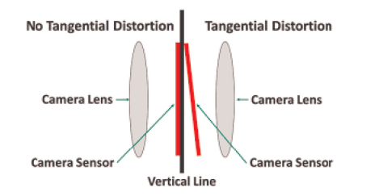

# 3 Camera Calibration相机标定

目的：移除镜头畸变对图像的影响。

*   摄像机标定是利用包含标定模式的图像来估计摄像机参数的过程。

*   相机标定包括相机内参矩阵，畸变系数，相机外参矩阵。

*   使用这些相机参数来移除镜头畸变的影响，实现测量平面物体，重构三维图像，或者其它的计算机视觉应用。

#### Step1:使用棋盘格图案定义真实世界坐标。

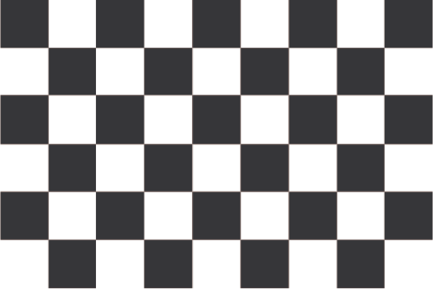

#### Step2：收集标定板的多张图片从不同的角度

#### Step3：找到标定板的二维坐标系

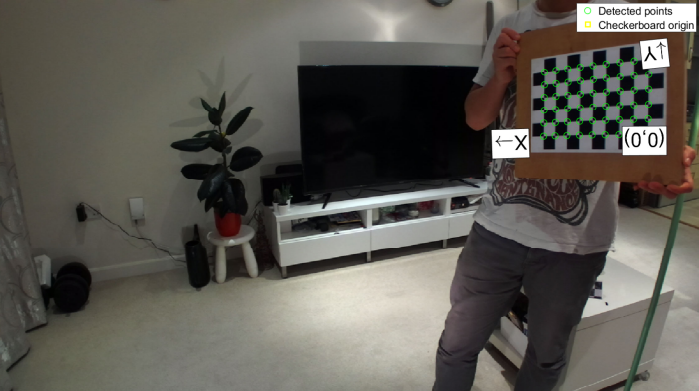

R.Fan 的三个提醒：

1.  检测corner ，做标定，相机离得近一点，这样看corner point会准确一点。

2.  如果这个平面不太平，对精度还是有影响。上能上的最平的板。

3.  标定纸打出来以后，设计尺寸和实际尺寸会有误差，建议用尺子量实际尺寸，用实际尺寸计算。

#### Step4：标定摄像机

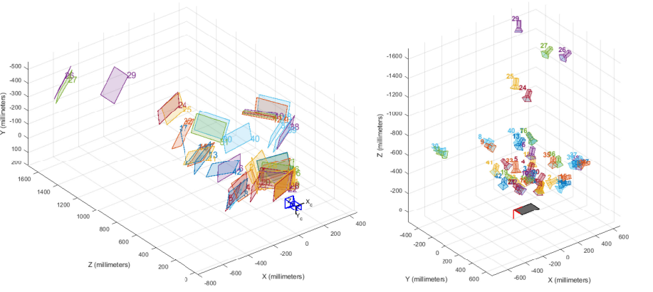

#### Step5：计算重投影误差并调整校准

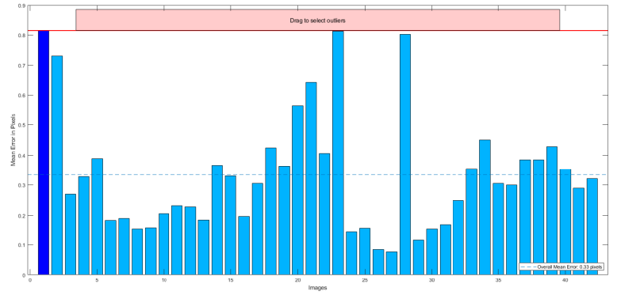

还记得Lecture3最后的故事吗？

[Lecture3\_Perspective\_Transformation](../Lecture3_Perspective_Transform/Lecture3_Perspective_Transformation.md "Lecture3_Perspective_Transformation")

由2.4知**相机坐标系到像素坐标系**的关系

$$
\widetilde{\bm p} = \frac {1}{z\_i^C}\bm K \bm p^C
$$

考虑**世界坐标系到相机坐标系**的关系

$$
\bm p\_i^C = \bm R \bm p\_i^W + \bm t
$$

我们可以很容易得出世界坐标系和像素坐标系的关系

$$
\bm p\_i^W=\bm R^{-1}(\bm K^{-1}\bm z\_i^C\widetilde{\bm p} - \bm t)
$$

变换一下，得到

$$
\hat{\bm p} =\frac{1}{\bm z\_i^C}\bm K(\bm R\bm p\_i^W +  \bm t)
$$

这里的$\bm R,\bm t$是外参，对应旋转和平移的关系，$\bm K$是内参，对应相机畸变矫正

计算重投影误差 （Re-projection error）：

$$
|| \bm p - g(\frac{1}{\bm z\_i^C}\bm K(\bm R\bm p\_i^W +  \bm t)) ||\_2
$$

where $g(\widetilde{\bm p})=\bm p$.全局误差最小化的封闭形式解法详见：[01-camera-models.pdf (stanford.edu)](http://web.stanford.edu/class/cs231a/course_notes/01-camera-models.pdf "01-camera-models.pdf (stanford.edu)")

然而，当我们介绍镜头畸变参数的时候，最小化的重投影误差

$$
E = \sum \_ { i = 1 } ^ { n } \sum \_ { j = 1 } ^ { m } || \bm p \_ { i j } - \pi ( K , R \_ { i } ,t\_i, k \_ { 1 } , k \_ { 2 } , k \_ { 3 } , p \_ { 1 } , p \_ { 2 } , p \_ { j } ^ { W } ) | | \_2^2
$$

只能通过非线性最优化方法解决，比如[Levenberg-Marquardt algorithm算法](en.wikipedia.org/wiki/Levenberg-Marquardt_algorithm "Levenberg-Marquardt algorithm算法")，其中$\pi ( ·)$是一个计算重投影坐标系$\hat{\bm p}$的方程。

## 总结

*这里写总结*

***

*   重要内容总结

    1.

    2.

    3.
