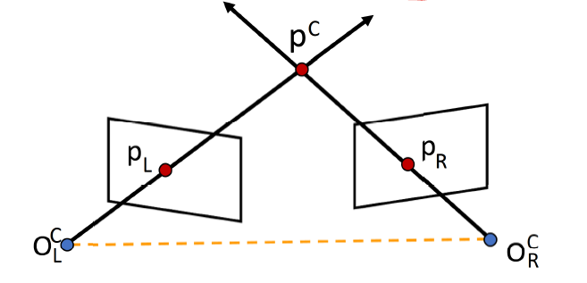
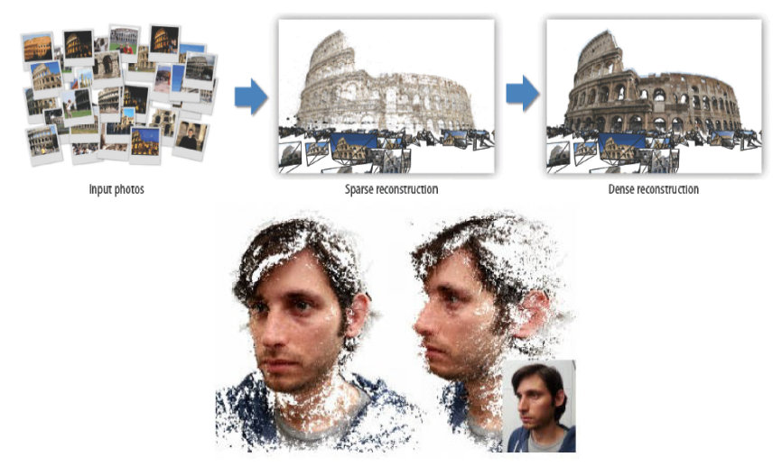
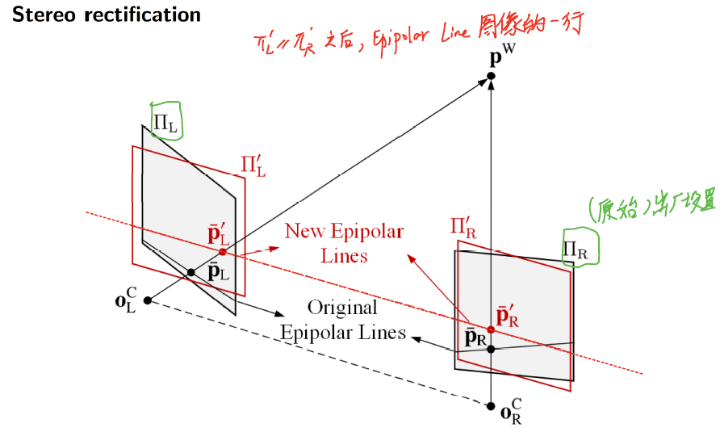
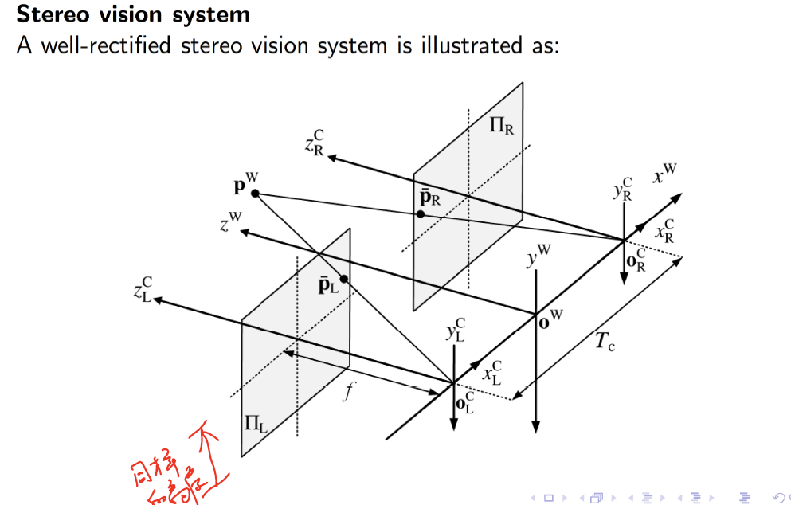
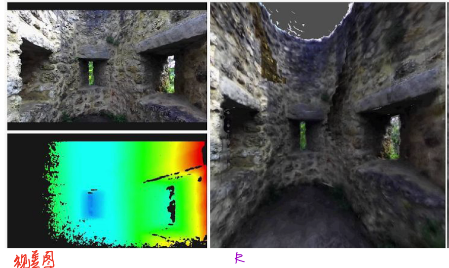

# Lecture6\_Epipolar\_Geometry\_(II)\_ 对极几何

## 目录

*   *   [线索](#线索)

    *   [笔记](#笔记)

*   [1Preliminaries](#1preliminaries)

*   [2 Triangulation 三角化](#2-triangulation-三角化)

    *   [2.1三角化引入](#21三角化引入)

    *   [2.2三角化推导](#22三角化推导)

*   [\$\$
    \left\[\begin{array}
    {}
    0 & -1 & v\_L \\
    1 & 0  &  -u\_L \\
    \-v\_L & u\_L & 0
    \end{array}\right\]
    \left\[\begin{array}
    {}
    \bm P\_L^1 \widetilde{\bm p}^C \\
    \bm P\_L^2 \widetilde{\bm p}^C \\
    \bm P\_L^3 \widetilde{\bm p}^C\\
    \end{array}\right\]](#leftbeginarray0---1--v_l-1--0-----u_l--v_l--u_l--0endarrayrightleftbeginarraybm-p_l1-widetildebm-pc-bm-p_l2-widetildebm-pc-bm-p_l3-widetildebm-pcendarrayright)

*   [\left\[\begin{array}
    {}
    u\_L\bm P\_L^3 & \bm -P\_L^1\\
    v\_L\bm P\_L^3 & \bm -P\_L^2\\
    \end{array}\right\]
    \widetilde{\bm p}^C](#leftbeginarrayu_lbm-p_l3--bm--p_l1v_lbm-p_l3--bm--p_l2endarrayrightwidetildebm-pc)

*   [\left\[\begin{array}
    {}
    u\_R\bm P\_R^3 & \bm -P\_R^1\\
    v\_R\bm P\_R^3 & \bm -P\_R^2\\
    \end{array}\right\]
    \widetilde{\bm p}^C](#leftbeginarrayu_rbm-p_r3--bm--p_r1v_rbm-p_r3--bm--p_r2endarrayrightwidetildebm-pc)

*   [\left\[\begin{array}
    {}
    u\_L\bm P\_L^3 & \bm -P\_L^1\\
    v\_L\bm P\_L^3 & \bm -P\_L^2\\
    u\_R\bm P\_R^3 & \bm -P\_R^1\\
    v\_R\bm P\_R^3 & \bm -P\_R^2\\
    \end{array}\right\]
    \widetilde{\bm p}^C](#leftbeginarrayu_lbm-p_l3--bm--p_l1v_lbm-p_l3--bm--p_l2u_rbm-p_r3--bm--p_r1v_rbm-p_r3--bm--p_r2endarrayrightwidetildebm-pc)

    *   [2.3三维重建效果图](#23三维重建效果图)

*   [3 Stereopsis 立体视觉](#3-stereopsis-立体视觉)

    *   [3.1双目相机校正步骤](#31双目相机校正步骤)

    *   [3.2校正好的系统](#32校正好的系统)

    *   [3.3校正的数学推导](#33校正的数学推导)

    *   [总结](#总结)

## 线索

*这里写主要线索*

***

1.

2.

3.

4.

5.

6.

<!---->

1.

## 笔记

*这里是主要的笔记内容*

***

author：Yi Yang & Zhengpu Wang

# 1Preliminaries

Lecture6 的预备知识基本上是 Lecture3、4、5的知识。可以去复习一下。

# 2 Triangulation 三角化

## 2.1三角化引入

计算机视觉中的三角化（三角测量），指的是**确定三维空间中的一个点的位置**，通过把其**投影**到两个或两个以上的图像上的过程。

为了处理这个问题，有必要知道摄像机投影函数从三维到二维的参数，在最简单的例子是用**相机矩阵**表示。

那么，我们需要什么呢？答案: $\bm R,\bm t,\bm p\_L,\bm p\_R,\bm K\_L,\bm K\_R$

## 2.2三角化推导

在Lecture 3 我们了解了透视变换矩阵（perspective&#x20;

transformation matrix）

$$
\bm P\_L=\bm K\_L\[\bm I,\bm 0] \in \mathbb{R}^{3 \times 4} \\
\bm P\_R=\bm K\_R\[\bm R,\bm t] \in \mathbb{R}^{3 \times 4}
$$

这里， $I$是单位矩阵，$\bm P\_L$目的是将左相机对齐世界坐标系， $\bm P\_R$是左相机和右相机的变换关系。

理想情况下，

$$
\widetilde{\bm p}\_L \times (\bm P\_L \widetilde{\bm p}^C) = \bm 0 \\
\widetilde{\bm p}\_R \times (\bm P\_R \widetilde{\bm p}^C) = \bm 0 \\
$$

写成反对称矩阵的形式，

$$
\left\[\begin{array}
{}
0 & -1 & v\_L \\
1 & 0  &  -u\_L \\
\-v\_L & u\_L & 0
\end{array}\right]
\left\[\begin{array}
{}
\bm P\_L^1 \widetilde{\bm p}^C \\
\bm P\_L^2 \widetilde{\bm p}^C \\
\bm P\_L^3 \widetilde{\bm p}^C\\
\end{array}\right]
==================

\bm 0
$$

where $\bm P\_L^k$代表$\bm P\_L$的第k行。

上式继续改写成方程组形式

$$

\begin{cases}
v\_L(\bm P\_L^3 \widetilde{\bm p}^C) - (\bm P\_L^2 \widetilde{\bm p}^C) =  0 \\
u\_L(\bm P\_L^3 \widetilde{\bm p}^C) - (\bm P\_L^1 \widetilde{\bm p}^C) =  0 \\
u\_L(\bm P\_L^2 \widetilde{\bm p}^C) - v\_L(\bm P\_L^1 \widetilde{\bm p}^C) =  0 \\
\end{cases}
$$

发现第2行乘以 v\_L ，减去第1行乘以u\_L，就得到第三行。所以上面矩阵的秩为2.也说明上面三个等式，只有2个是线性独立的，第三个可以用其他两个等式表示。

所以把上式写为，

$$

\begin{cases}
u\_L(\bm P\_L^3 \widetilde{\bm p}^C) - (\bm P\_L^1 \widetilde{\bm p}^C) =  0 \\
v\_L(\bm P\_L^3 \widetilde{\bm p}^C) - (\bm P\_L^2 \widetilde{\bm p}^C) =  0 \\

\end{cases}
$$

写为矩阵形式

$$

\left\[\begin{array}
{}
u\_L\bm P\_L^3 & \bm -P\_L^1\\
v\_L\bm P\_L^3 & \bm -P\_L^2\\
\end{array}\right]
\widetilde{\bm p}^C
===================

\bm 0
$$

类似地，

$$

\left\[\begin{array}
{}
u\_R\bm P\_R^3 & \bm -P\_R^1\\
v\_R\bm P\_R^3 & \bm -P\_R^2\\
\end{array}\right]
\widetilde{\bm p}^C
===================

\bm 0
$$

因此，我们得到，

$$

\left\[\begin{array}
{}
u\_L\bm P\_L^3 & \bm -P\_L^1\\
v\_L\bm P\_L^3 & \bm -P\_L^2\\
u\_R\bm P\_R^3 & \bm -P\_R^1\\
v\_R\bm P\_R^3 & \bm -P\_R^2\\
\end{array}\right]
\widetilde{\bm p}^C
===================

\bm 0
$$

重新表示为，

$$
\bm A \widetilde{\bm p}^C = 0
$$

可以使用SVD（奇异值分解）来解这个方程。为什么？

给定 $\bm A \bm x = \bm 0$，把问题转化为

$$
E = \left|\right|\bm A\bm x||^2\_2=(\bm A\bm x)^T\bm A\bm x=(\bm U \sum \bm V^T\bm x)^T\bm U \sum \bm V^T\bm x
\\=
x^T \bm V{\sum}^{T} \bm U^T  \bm U \sum \bm V^T\bm x
\\=
x^T \bm V{\sum}^{T} \sum \bm V^T\bm x
\\=
||\sum \bm V^T\bm x||\_2^2 , s.t.||x||^2\_2=1
$$

注意转置和 $\bm U$是单位正交阵，$\bm U^T  \bm U = \bm I$

定义 $\bm y =\bm V^T \bm x$

由于$||\bm x ||\_2^2 =1$，所以$||\bm y ||\_2^2 =1$为何?

$\bm V$是一个单位正交阵，模为1.（换个角度，$\bm V$的作用只是旋转，让$x$在一个球面上旋转，所以模还是1）

因此，$\bm E = || \sum \bm y ||\_2^2 = \sigma\_1^2y\_1^2+ \sigma\_2^2y\_2^2+...+ \sigma\_n^2y\_n^2,s.t.||\bm y||\_2^2=1$

因为$\sigma\_1 \geq \sigma\_2 \geq ...\geq \sigma\_n \geq 0$, 当 $\bm y = \[0 ,0,,,,1]^T$时，$\bm E$就可以取到最小值$\sigma\_n$.

所以$ \bm x=\bm V \bm y = \[\bm v\_1,\bm v\_2,...,v\_n]
\left\[\begin{array}
{}
\[0 \0\\.\\.\\.\1]
\end{array}\right]
\=\bm v\_n  $

## 2.3三维重建效果图

# 3 Stereopsis 立体视觉

三维场景几何重建是利用一对同步摄像机的左右图像之间对应的像素对来完成的，也就是说

> 三维重建的任务，就是研究**如何关联两个相机的图像平面。**

对于没有标定的立体视觉设备，寻找图像的对应点计算量非常大。而如果立体视觉设备被标定了，那么搜索过程就大大简化了，变成**沿着对极线的一维搜寻**过程。

> 判断同步精度可以同时拍手机秒表测试，看误差有多少。

所以使用双目相机，要注意两件事

*   左右相机要**同步**

*   到手之后先做**标定**

如图，黑色的对极平面$ \pi \_L,\pi \_R  $、对极线是未标定状态（原始出厂设置），而红色的对极平面、对极线是标定之后的，两个平面$ \pi ^`_L,\pi ^`\_R  $在同一个平面上，且对极线在同一条直线上，对极线真正成为图像的一行。

## 3.1双目相机校正步骤

1.  旋转左相机平面，和右相机平面对齐。by$\bm R$&#x20;

2.  旋转左右相机平面（by $\bm R\_{rect}$ ）使得图像平面和向量$ \bm t  $平行，也就是垂直于光轴

3.  调整左右图像标度，by 给两个相机设定一样的内参矩阵

$$
\bm R\_{rect} = \left\[\begin{array}
{}
\bm e\_1^T \\
\bm e\_2^T \\
\bm e\_3^T \\
\end{array}\right]
$$

这里 $ \bm e\_1 = \frac{\bm t}{||\bm t||\_2}，
\bm e\_2 = \frac{\[0,0,1]^T \times \bm t}{||\[0,0,1] ^T \times \bm t||\_2} ,
and \bm e\_3 =\bm e\_1 \times \bm e\_2  $

这里怎么**理解这个**$\bm R\_{rect}$**比较重要**

[(36 封私信 / 75 条消息) 线性变换的矩阵为什么要强调在这组基下? - 知乎 (zhihu.com)](https://www.zhihu.com/question/22218306/answer/88697757 "(36 封私信 / 75 条消息) 线性变换的矩阵为什么要强调在这组基下? - 知乎 (zhihu.com)")

用$\bm R\_{rect}$去左乘原来的坐标系，就是让原来的坐标系旋转。

> **横着看，每一行就是新坐标的x,y,z轴，由原来坐标系x,y,z轴线性组合而成，每一行就是线性组合的系数。比如第一行**$e\_1$**是**$\[1,0,0]$**，就意味着**$\bm x'=1 \bm x + 0 \bm y+ 0\bm  z$**，这里的字母都指向量。**

看[这一页理解](https://www.wolai.com/ntWn2m7P6GmTmtptWRrbYz.md "这一页理解")，动手写一写就明白了。豁然开朗很爽。

所以回过头来看，e1就是新坐标系的x轴方向就是 t的方向，e2是世界坐标系的z轴$\bm z^W=\[0,0,1]$和t叉乘，就得到方向向下的新y轴，然后新x轴和新y轴叉积就是新z轴，这里的z轴实际上就是$\bm z^W=\[0,0,1]$）

2022/05/17 update:这里每一行和每一列的理解要看旋转矩阵和坐标向量具体的定义形式。

## 3.2校正好的系统

校正好的系统特点有3个，

1.  左右图像就像是被**一对平行的、拥有相同内参矩阵**的相机拍的，

2.  每一对**对极线共线且平行于水平图像轴t**

3.  因此，寻找对应点就简化成了**一维搜索问题**

校正好的系统如下图所示

可以看到，两个平面的对极线在同样的高度。

*   这样的系统可以被看作特殊的对极几何系统，**左右相机互相完全平行**

*   $ x\_L^C  $和$  x\_R^C $ 轴是共线的。$o\_L^C$和$o\_R^C$是左右相机的光心。

*   立体视觉设备的**基线**$T\_c$,被定义为$o\_L^C$和$o\_R^C$之间的距离。可以理解为**瞳距**。

*   左右相机的内参矩阵给定为，

$$
\bm K\_L=\bm K\_L=\bm K=\left\[\begin{array}{}

f & 0 & u\_o \\
0 & f & v\_o \\
0 & 0 & 1 \\

\end{array}\right]
$$

## 3.3校正的数学推导

*   $ \bm p^W = \[x^W,y^W,z^W]^T  $是世界坐标系里的一个3维的点，投影在左右相机坐标系里坐标分别为$ \bm p\_L^C = \[x\_L^C,y\_L^C,z\_L^C]^T ，\bm p\_R^C= \[x\_R^C,y\_R^C,z\_R^C]^T  $

*   我们认为左右相机是完全一样的（在一个经过良好校正的立体视觉系统），$s\_x和s\_y$简单设成$1$，$f\_x=f\_y=f$

*   $p^W$ 在对极平面$\Pi \_L$ 、$\Pi \_R$的投影点;${\over {\bm p}}\_L = \[x\_L.y\_L,f]^T ,{\over {\bm p}}\_R = \[x\_R.y\_R,f]^T$&#x20;

*   世界坐标系的原点$o^W$，是线段L的中点，$  L = { t \bm o \_L^C + (1-t) \bm o\_R^C | t \in \[0,1]} $

*   $z^W$**轴和相机光轴平行，和对极平面**$\Pi \_L 、\Pi \_R$**垂直。**

因此，一个WCS的任意点$p^W$可以转换成$p\_L^C 和p\_R^C$通过：

$$
\bm p^C\_L = \bm I \bm p^W + \bm t\_L,\ \bm p^C\_R = \bm I \bm p^W + \bm t\_R,
$$

$where ，\bm t\_L=\[\frac{T\_c}{2},0,0]^T,\bm t\_R=\[-\frac{T\_c}{2},0,0]^T$

利用**WCS和IPCS**的转换关系，我们得到

$$

\begin{array}{rr}x\_{\mathrm{L}}=f \frac{x^{\mathrm{W}}+T\_{c} / 2}{z^{\mathrm{W}}}, & y\_{\mathrm{L}}=f \frac{y^{\mathrm{W}}}{z^{\mathrm{W}}} \ \ x\_{\mathrm{R}}=f \frac{x^{\mathrm{W}}-T\_{c} / 2}{z^{\mathrm{W}}}, & y\_{\mathrm{R}}=f \frac{y^{\mathrm{W}}}{z^{\mathrm{W}}}\end{array}
$$

再利用**CCS和PCS**的关系，把上式代入得

$$
\bm p\_L = \left\[\begin{array}{} u\_L \ v\_L \ \end{array}\right] = \left\[\begin{array}{} f \frac{x^{\mathrm{W}}+T\_{c} / 2}{z^{\mathrm{W}}} + u\_o\\\ f \frac{y^W}{z^W} + v\_o \ \end{array}\right] \， \ \bm p\_R = \left\[\begin{array}{} u\_R \ v\_R \ \end{array}\right] = \left\[\begin{array}{} f \frac{x^{\mathrm{W}}-T\_{c} / 2}{z^{\mathrm{W}}} + u\_o\\\ f \frac{y^W}{z^W} + v\_o \ \end{array}\right]
$$

忘了的同学去看一下Lecture3的我们现在得到了两个等式，

视差d（disparity）和深度$z^W$的关系写为：

$$
d= u\_L - u\_R = f\frac{Tc}{z^W}
$$

> 由于双目“瞳距”$T\_c$**是固定的，所以视差**$d$**和**$z^W$**成反比**。和生活经验一致。不信你试试看，分别睁一只眼闭一只眼，看近处物体的移动幅度是不是比远处的大。甚至远处的视差d为零，因为$z^W$趋于无穷大。

因此，**视差估计**可以看做由两个任务组成：

1.  找到**对应点（对）**，在两个图像的同一行

2.  产生两个**视差图像**，如下图所示

> R.Fan : CV可以做出很酷炫的demo效果

## 总结

*这里写总结*

***

*   重要内容总结

    1.

    2.

    3.

    $$
    \bm p\_L =
    \left\[\begin{array}{}
    u\_L \\
    v\_L \\
    \end{array}\right]
    ==================

    \left\[\begin{array}{}
    f \frac{x^{\mathrm{W}}+T\_{c} / 2}{z^{\mathrm{W}}} + u\_o\\\\
    f \frac{y^W}{z^W} + v\_o \\
    \end{array}\right]
    $$
