# Lecture8\_Image\_Pyramid\_图像金字塔

## 目录

*   *   [线索](#线索)

    *   [笔记](#笔记)

*   [Image pyramind 图像金字塔](#image-pyramind-图像金字塔)

*   [Image interpolation 图像插值](#image-interpolation-图像插值)

    *   [加权平均 Weighted mean](#加权平均-weighted-mean)

*   [Image down-sampling](#image-down-sampling)

    *   [原始的降采样Down-sample an image naively](#原始的降采样down-sample-an-image-naively)

    *   [经过高斯模糊的降采样Down-sample an image with Gaussian Blur](#经过高斯模糊的降采样down-sample-an-image-with-gaussian-blur)

    *   [降采样 v.s. 池化Image Down-sampling v.s. Pooling](#降采样-vs-池化image-down-sampling-vs-pooling)

*   [图像上采样Image up-sampling](#图像上采样image-up-sampling)

    *   [总结](#总结)

## 线索

*这里写主要线索*

***

1.

2.

3.

4.

5.

<!---->

1.

## 笔记

*这里是主要的笔记内容*

***

author：Yi Yang & Zhengpu Wang

# Image pyramind 图像金字塔

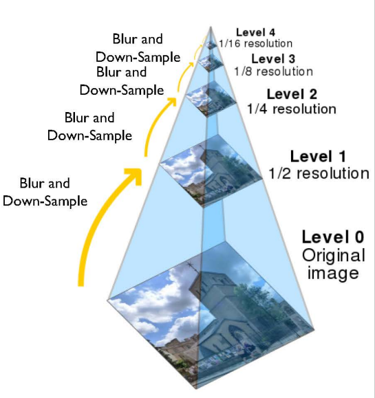

**图像金字塔**是图像**多尺度表达**的一种，是一种以**多分辨率**来解释图像的有效但概念简单的结构。

通常包括上采样（up-sampling operation）和降采样(down-sampling operation)。

$$
大图像，不断降采样，得到小图像
$$

$$
小图像，不断上采样，得到大图像
$$

本节我们主要介绍高斯金字塔（Gaussian pyramid）

# Image interpolation 图像插值

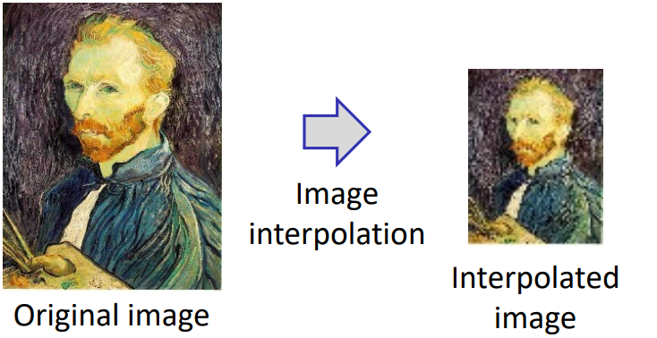

图像插值是降采样的主要手段，给定图片中相邻的4个点，如何用1个点去代替。假如我们想得到未知函数 f 在点 ${\displaystyle P=\left(x,y\right)}$ 的值，假设我们已知函数 f 在$  {\displaystyle Q\_{11}=\left(x\_{1},y\_{1}\right)} $, ${\displaystyle Q\_{12}=\left(x\_{1},y\_{2}\right)}$, ${\displaystyle Q\_{21}=\left(x\_{2},y\_{1}\right)}$, 及 ${\displaystyle Q\_{22}=\left(x\_{2},y\_{2}\right)}$ 四个点的值。

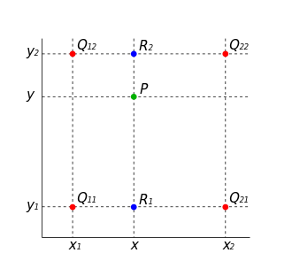

此处介绍两种计算方法，重复线性插值（Repeated linear interpolation） 、多项式拟合方法（Polynomial Fit）。

$$
重复线性插值 Repeated linear interpolation
$$

> **双线性插值**，又称为**双线性内插**。在[数学](https://zh.wikipedia.org/wiki/数学 "数学")上，**双线性插值**是对[线性插值](https://zh.wikipedia.org/wiki/线性插值 "线性插值")在二维[直角网格](https://zh.wikipedia.org/wiki/直角坐标系 "直角网格")上的扩展，用于对双变量函数（例如 *x* 和 *y*）进行[插值](https://zh.wikipedia.org/wiki/插值 "插值")。**其核心思想是在两个方向分别进行一次线性插值。**

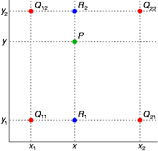

首先在 *x* 方向进行线性插值，得到

$$
{\displaystyle {\begin{aligned}f(x,y\_{1})&\approx {\frac {x\_{2}-x}{x\_{2}-x\_{1}}}f(Q\_{11})+{\frac {x-x\_{1}}{x\_{2}-x\_{1}}}f(Q\_{21}),\f(x,y\_{2})&\approx {\frac {x\_{2}-x}{x\_{2}-x\_{1}}}f(Q\_{12})+{\frac {x-x\_{1}}{x\_{2}-x\_{1}}}f(Q\_{22}).\end{aligned}}}
$$

然后在 *y* 方向进行线性插值，得到

$$
{\displaystyle {\begin{aligned}f(x,y)&\approx {\frac {y\_{2}-y}{y\_{2}-y\_{1}}}f(x,y\_{1})+{\frac {y-y\_{1}}{y\_{2}-y\_{1}}}f(x,y\_{2})\\&={\frac {1}{(x\_{2}-x\_{1})(y\_{2}-y\_{1})}}{\begin{bmatrix}x\_{2}-x\&x-x\_{1}\end{bmatrix}}{\begin{bmatrix}f(Q\_{11})\&f(Q\_{12})\f(Q\_{21})\&f(Q\_{22})\end{bmatrix}}{\begin{bmatrix}y\_{2}-y\y-y\_{1}\end{bmatrix}}.\end{aligned}}}
$$

上面公式可根据相似三角形理解，先去做横向，再去做纵向。先做纵向再做横向，结果是一样的。

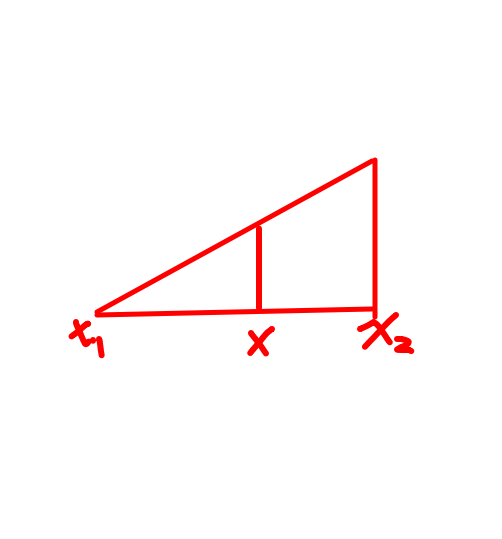

$$
多项式拟合 Polynomial Fit
$$

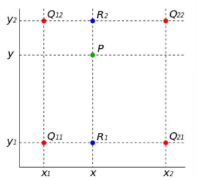

另一个可选的办法是把图像插值问题当成多项式拟合问题。

有多项式

$$
f(x,y)=a\_{00}+a\_{10}x+a\_{01}y+a\_{11}xy,

$$

4个系数可以通过解线性方程得到，

$$
{\displaystyle {\begin{aligned}{\begin{bmatrix}1\&x\_{1}\&y\_{1}\&x\_{1}y\_{1}\1\&x\_{1}\&y\_{2}\&x\_{1}y\_{2}\1\&x\_{2}\&y\_{1}\&x\_{2}y\_{1}\1\&x\_{2}\&y\_{2}\&x\_{2}y\_{2}\end{bmatrix}}{\begin{bmatrix}a\_{00}\a\_{10}\a\_{01}\a\_{11}\end{bmatrix}}={\begin{bmatrix}f(Q\_{11})\f(Q\_{12})\f(Q\_{21})\f(Q\_{22})\end{bmatrix}},\end{aligned}}}
$$

得

$$
{\displaystyle {\begin{aligned}{\begin{bmatrix}a\_{00}\a\_{10}\a\_{01}\a\_{11}\end{bmatrix}}={\frac {1}{(x\_{2}-x\_{1})(y\_{2}-y\_{1})}}{\begin{bmatrix}x\_{2}y\_{2}&-x\_{2}y\_{1}&-x\_{1}y\_{2}\&x\_{1}y\_{1}\\-y\_{2}\&y\_{1}\&y\_{2}&-y\_{1}\\-x\_{2}\&x\_{2}\&x\_{1}&-x\_{1}\1&-1&-1&1\end{bmatrix}}{\begin{bmatrix}f(Q\_{11})\f(Q\_{12})\f(Q\_{21})\f(Q\_{22})\end{bmatrix}}.\end{aligned}}}
$$

结果可以看成$f(Q)$的加权平均.

## 加权平均 Weighted mean

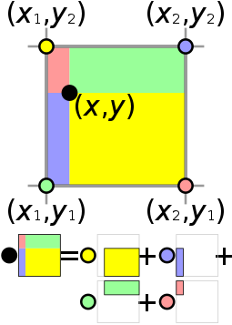

$$
{\displaystyle f(x,y)\approx w\_{11}f(Q\_{11})+w\_{12}f(Q\_{12})+w\_{21}f(Q\_{21})+w\_{22}f(Q\_{22}),}
$$

$$
{\displaystyle {\begin{bmatrix}1&1&1&1\x\_{1}\&x\_{1}\&x\_{2}\&x\_{2}\y\_{1}\&y\_{2}\&y\_{1}\&y\_{2}\x\_{1}y\_{1}\&x\_{1}y\_{2}\&x\_{2}y\_{1}\&x\_{2}y\_{2}\end{bmatrix}}{\begin{bmatrix}w\_{11}\w\_{12}\w\_{21}\w\_{22}\end{bmatrix}}={\begin{bmatrix}1\x\y\xy\end{bmatrix}},}
$$

yielding the result

$$
{\displaystyle {\begin{aligned}{\begin{bmatrix}w\_{11}\w\_{21}\w\_{12}\w\_{22}\end{bmatrix}}={\frac {1}{(x\_{2}-x\_{1})(y\_{2}-y\_{1})}}{\begin{bmatrix}x\_{2}y\_{2}&-y\_{2}&-x\_{2}&1\\-x\_{2}y\_{1}\&y\_{1}\&x\_{2}&-1\\-x\_{1}y\_{2}\&y\_{2}\&x\_{1}&-1\x\_{1}y\_{1}&-y\_{1}&-x\_{1}&1\end{bmatrix}}{\begin{bmatrix}1\x\y\xy\end{bmatrix}},\end{aligned}}}
$$

# Image down-sampling

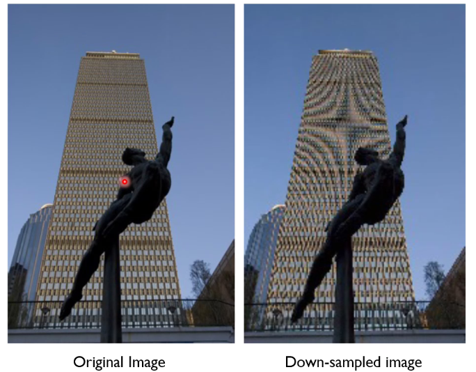

可以看到降采样得到的图像失真比较严重。

## 原始的降采样Down-sample an image naively

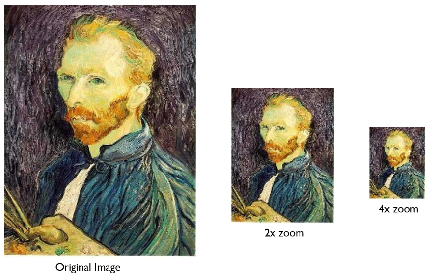

降采样以后，某些点更加明显了，比如这些白点。

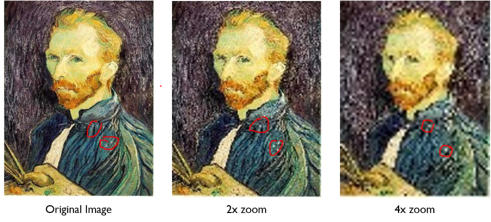

## 经过高斯模糊的降采样Down-sample an image with Gaussian Blur

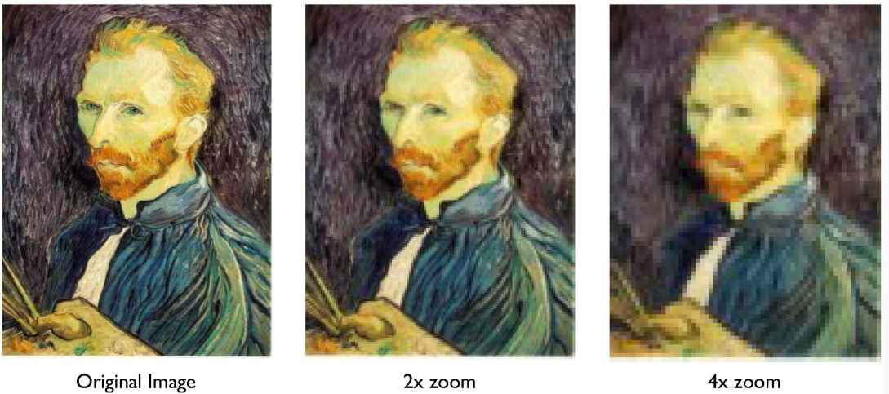

高斯金字塔——模糊-降采样-模糊-降采样...

***

***

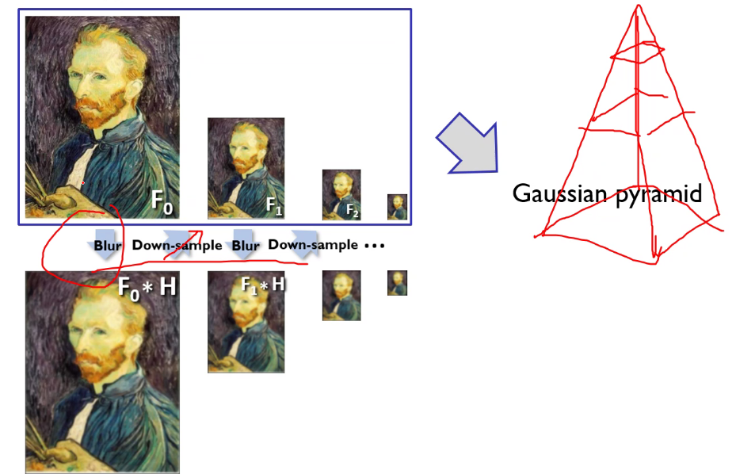

## 降采样 v.s. 池化Image Down-sampling v.s. Pooling

Pooling更多地用于机器学习，如4个像素得到1个像素。主要有Max Pooling 和 average pooling.顾名思义，前者得到4个像素中最大的值，后者得到其平均值。如下图。

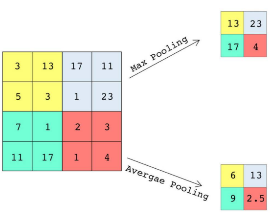

> **Max Pooling **选择数值比较大的像素，也就是比较**亮的区域**，比如手写数字识别的时候，可以更**突出前景**（字体）。这在背景比较暗，而我们对前景感兴趣的时候，有奇效。

> **Average pooling**常用于图像**降采样**。

> 两者**无法比较**，不能绝对的说谁更好，这个得看用途和场景。

# 图像上采样Image up-sampling

上采样是降采样的逆过程，可以增加图像的行数、列数。

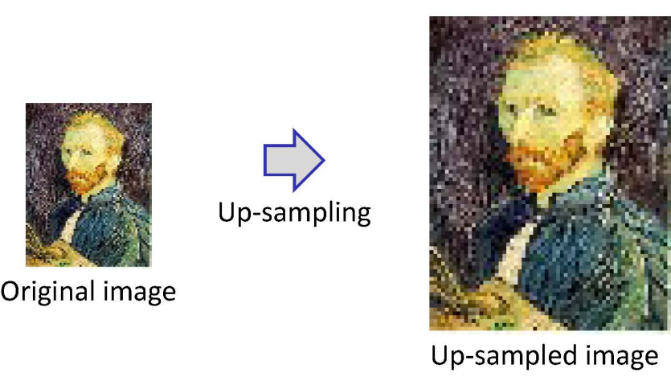

上采样会产生一个“模糊化”的图像，因此我们需要超分辨率算法（super-resolution algorithm）去得到高质量图像。其中GAN网络是最常用的技术。

> 超分辨率，要去猜插值

*   GAN 网络最常用

*   GAN网络并不总是好用的

如马赛克恢复，不同的图片经过马赛克后可能 得到同一张图，而一个马赛克图可能对应很多的原图。下图左上角这位，尽管很模糊，我们也可以一眼看出他是谁，但是GAN网络猜出来了一个截然不同的人。这很好理解，毕竟马赛克以后的图像信息是缺失的，有很多个解。

## 总结

*这里写总结*

***

*   重要内容总结

    1.

    2.

    3.
