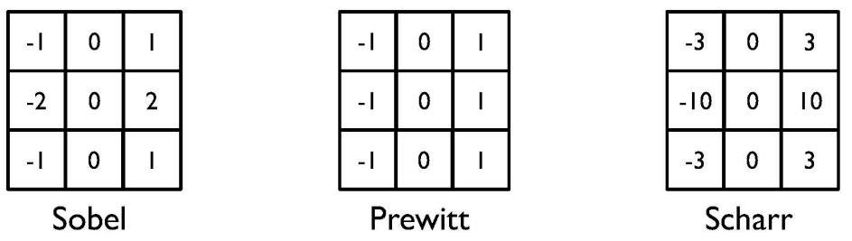

# Lecture9\_Edges\_&\_Lines

## 目录

*   *   [线索](#线索)

    *   [笔记](#笔记)

*   [1Edge detection 边缘检测](#1edge-detection-边缘检测)

    *   [边缘检测算子 Edge detection kernels](#边缘检测算子-edge-detection-kernels)

        *   [Sobel,Prewitt,and Scharr edge detectors](#sobelprewittand-scharr-edge-detectors)

        *   [Sobel v.s. Canny](#sobel-vs-canny)

        *   [Sobel v.s. Roberts](#sobel-vs-roberts)

    *   [总结](#总结)

        *   [附：Parallel processing](#附parallel-processing)

    *   [应用](#应用)

        *   [Edge detection with deep learning](#edge-detection-with-deep-learning)

        *   [基于深度/视差图像的表面法线估计Surface normal estimation from depth/disparity images](#基于深度视差图像的表面法线估计surface-normal-estimation-from-depthdisparity-images)

*   [2线检测Line detection](#2线检测line-detection)

    *   [霍夫变换算法](#霍夫变换算法)

    *   [霍夫变换应用](#霍夫变换应用)

*   [3扩展阅读](#3扩展阅读)

    *   [总结](#总结-1)

## 线索

*这里写主要线索*

***

1.

2.

3.

4.

5.

<!---->

1.

## 笔记

*这里是主要的笔记内容*

***

author：Yi Yang & Zhengpu Wang

# 1Edge detection 边缘检测

*   **边缘检测**（英语：Edge detection）是[**图像处理**](https://zh.wikipedia.org/wiki/图像处理 "图像处理")和[**计算机视觉**](https://zh.wikipedia.org/wiki/计算机视觉 "计算机视觉")中的基本问题。

*   **边缘检测**的目的是标识[数字图像](https://zh.wikipedia.org/wiki/数字图像 "数字图像")中[**亮度**](https://zh.wikipedia.org/wiki/亮度 "亮度")**变化明显的点**。

*   图像属性中的显著变化通常反映了属性的重要事件和变化。

    1.  深度上的不连续、

    2.  表面方向不连续、

    3.  物质属性变化

    4.  场景照明变化。

在Lecture 7里我们简单介绍过，

*   图像语义分割

## 边缘检测算子 Edge detection kernels

有许多的边缘检测算子：

*   一阶：[Roberts Cross算子](https://zh.wikipedia.org/w/index.php?title=Roberts_Cross算子\&action=edit\&redlink=1 "Roberts Cross算子"), [Prewitt算子](https://zh.wikipedia.org/w/index.php?title=Prewitt算子\&action=edit\&redlink=1 "Prewitt算子"), [Sobel算子](https://zh.wikipedia.org/wiki/Sobel算子 "Sobel算子"), [Canny算子](https://zh.wikipedia.org/wiki/Canny算子 "Canny算子")，[罗盘算子](https://zh.wikipedia.org/w/index.php?title=罗盘算子\&action=edit\&redlink=1 "罗盘算子")

*   二阶：[Marr-Hildreth](https://zh.wikipedia.org/w/index.php?title=Marr-Hildreth_algorithm\&action=edit\&redlink=1 "Marr-Hildreth"),在梯度方向的二阶导数[过零点](https://zh.wikipedia.org/w/index.php?title=Zero-crossing\&action=edit\&redlink=1 "过零点")。

边缘检测三步走：

1.  计算横向和纵向的梯度。

2.  计算这些梯度的幅值

3.  设置一个阈值用来提取边缘

### Sobel,Prewitt,and Scharr edge detectors

算子长这样，

要处理的图片长这样，我们来比较下这些方法的差异。

阈值设100

阈值设400

阈值设50

可以看出，阈值设的大，检测出来的线就少，甚至人物轮廓不完整。阈值设的小，检测出来的线就多，甚至有一些杂线。

### Sobel v.s. Canny

可以看出，Canny效果更好一些，因为Canny两步走：先高斯滤波，再边缘检测。

模糊以后，梯度幅值就小了，自然一些边缘就莫得了

### Sobel v.s. Roberts

Roberts  45度方向的边缘

## 总结

每个算子、每幅图，阈值要单独设置

算子之间没有绝对的谁好谁坏，要看具体场景和参数设置。但是**Sobel**相比Prewitt和Scharr要**更常用**。

我们已经学习了双边滤波，这是一种能够保留边缘的图像模糊方法。因此，在进行边缘检测之前，我们也可以使用双边滤波去除图像噪声。

边缘检测已经是一个可以很好的被解决的问题，特别是随着DL的发展。

卷积对图片的每一部分操作都是一样的，所以可以用CUDA之类的并行计算加速。

### 附：Parallel processing

加速方法通常有多线程如OpenMP、单指令多数据如AVX256、GPU如CUDA等。

可以看看我和@王小反的并行计算的笔记

<https://www.wolai.com/eFDPiHY2Uug2TssTkuyfzR>

## 应用

### Edge detection with deep learning

### 基于深度/视差图像的表面法线估计Surface normal estimation from depth/disparity images

# 2线检测Line detection

## 霍夫变换算法

> **霍夫变换**是一种[**特征提取**](https://zh.wikipedia.org/wiki/特徵提取 "特征提取")**方法**，被广泛应用在[图像分析](https://zh.wikipedia.org/wiki/图像分析 "图像分析")、[电脑视觉](https://zh.wikipedia.org/wiki/電腦視覺 "电脑视觉")以及[数位影像处理](https://zh.wikipedia.org/w/index.php?title=數位影像處理\&action=edit\&redlink=1 "数位影像处理")[\[1\]](https://zh.wikipedia.org/wiki/霍夫变换#cite_note-1 "\[1]")。 霍夫变换是用来辨别找出**物件中的特征，如线条**。他的[算法](https://zh.wikipedia.org/wiki/演算法 "算法")流程大致如下，给定一个物件、要辨别的形状的种类，算法会在[参数空间](https://zh.wikipedia.org/w/index.php?title=參數空間\&action=edit\&redlink=1 "参数空间")中执行**投票**来决定物体的形状，而这是由**累加空间（accumulator space）** 里的[**局部最大值**](https://zh.wikipedia.org/wiki/极值 "局部最大值")来决定。

（这里不太懂）

经典的霍夫变换是侦测图片中的[**直线**](https://zh.wikipedia.org/wiki/直線 "直线")，之后，霍夫变换不仅能识别直线，也能够识别任何形状，常见的有**圆形**、**椭圆形**。

$\theta$ 从0 取到 180度

## 霍夫变换应用

如检测车道线，

# 3扩展阅读

[Week 5: Hough Transform (Line and Circle Detection) (sbme-tutorials.github.io)](https://sbme-tutorials.github.io/2018/cv/notes/5_week5.html "Week 5: Hough Transform (Line and Circle Detection) (sbme-tutorials.github.io)")

[Circle Hough Transform - Wikipedia](https://en.wikipedia.org/wiki/Circle_Hough_Transform "Circle Hough Transform - Wikipedia")

[OpenCV: Hough Circle Transform](https://docs.opencv.org/3.4/d4/d70/tutorial_hough_circle.html "OpenCV: Hough Circle Transform")

[Radon Transform -- from Wolfram MathWorld](https://mathworld.wolfram.com/RadonTransform.html "Radon Transform -- from Wolfram MathWorld")

## 总结

*这里写总结*

***

*   重要内容总结

    1.

    2.

    3.

    author：Yi Yang & Zhengpu Wang

    
