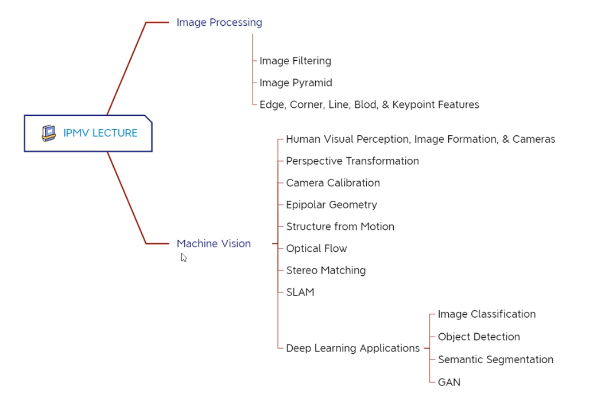

# Summary

author：Yi Yang & Zhengpu Wang

时间：%DATE% %TIME%

## 线索

*这里写主要线索*

***

1.

2.

3.

4.

5.

<!---->

1.

## 笔记

*这里是主要的笔记内容*

***

author：Yi Yang & Zhengpu Wang

最核心的三门课，

*   Perspective Transformation

*   Camera Calibration

*   Epipolar Geometry

比较独立的课

*   Optical Flow

*   Stereo Matching

目前CV顶会深度学习内容占95%以上，所以讲了

*   Deep Learning Applications

比较传统、基础的一些课

*   Image Filtering

*   Image Pyramid

*   Edge,Corner,Line,BLod, & Keypoint Features

没讲到的一些内容

*   Fourier transform

*   Wavelet transform

*   Superpixel clustering 超像素聚类（一些区域的像素相近，所以这一块看成超像素）

*   Image/video compression

*   Image restoration

*   Surface normal estimation

*   Photometric stereo

> 🧑‍🍳愿你找到自己愿意为之奋斗一生的事业！

## 总结

*这里写总结*

***

*   重要内容总结

    1.

    2.

    3.
